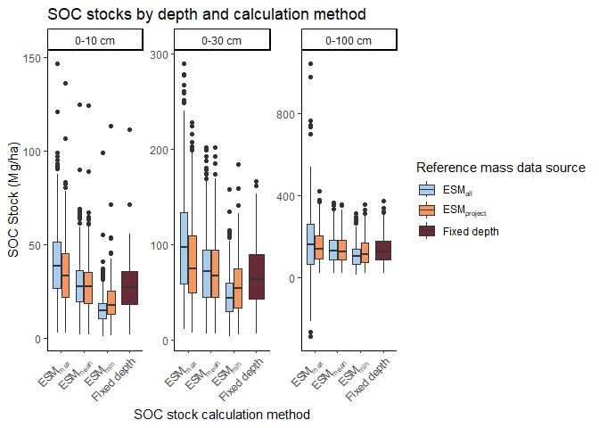
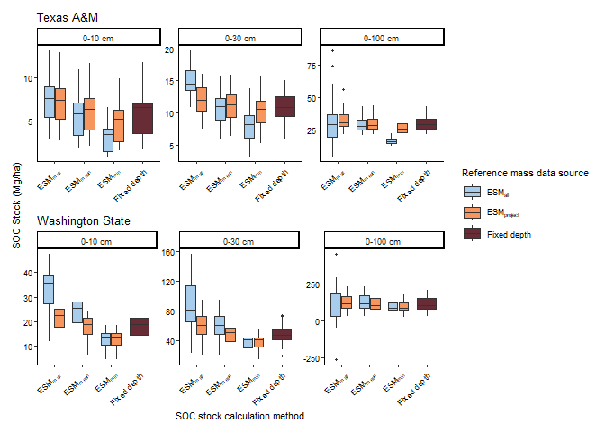
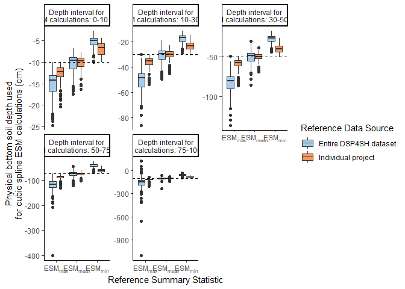
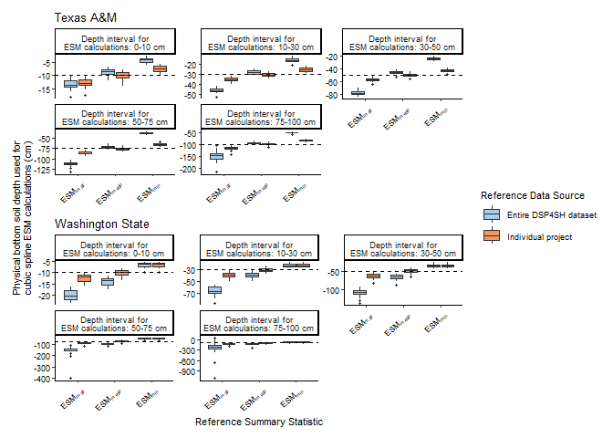
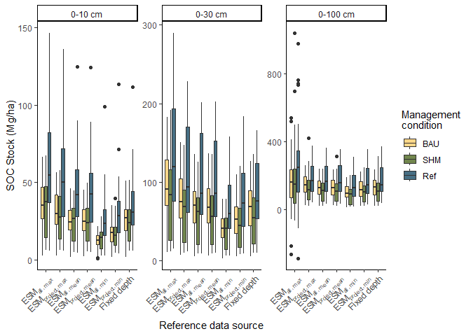
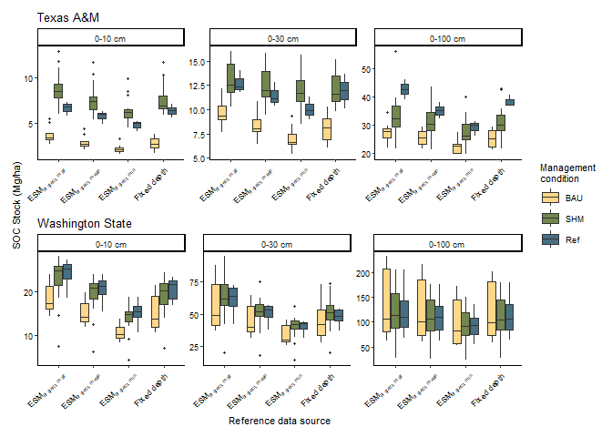
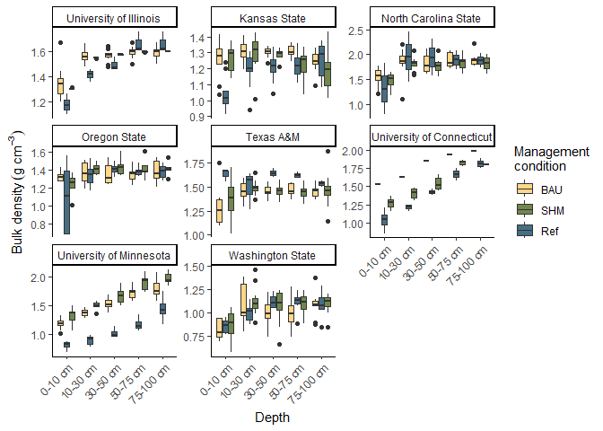
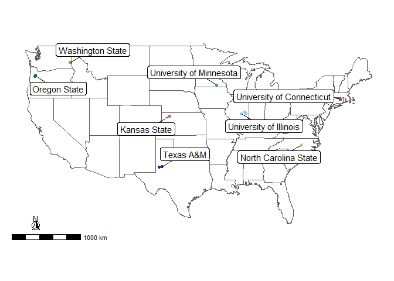
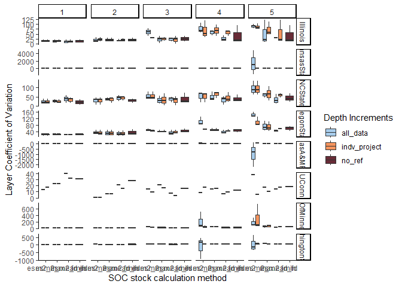
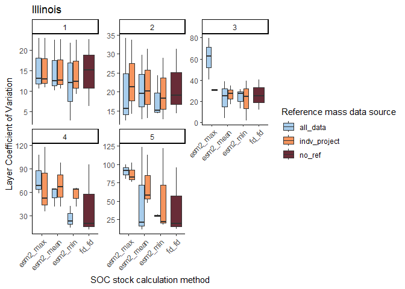

# How does ESM choice influence total calculated SOC stocks?

### Compare ESM(all) to ESM(project)

Calculate SOC stock totals for all scenarios:


``` r
# Calculate SOC stock totals for all scenarios
esm_stock_compare <- esm_all_clean %>%
  filter(depth_increments == "standard") %>%
  group_by(project, depth_increments, method_longest, method_long, method, ref_stat, ref_data, label, dsp_pedon_id) %>%
  summarize(soc_0to10 = sum(soc[apparent_depth=="0-10 cm"]),
            soc_0to30 = sum(soc[apparent_depth=="0-10 cm" | apparent_depth=="10-30 cm"]),
            soc_0to100 = sum(soc)) 
```

```
## `summarise()` has grouped output by 'project', 'depth_increments',
## 'method_longest', 'method_long', 'method', 'ref_stat', 'ref_data', 'label'. You
## can override using the `.groups` argument.
```

``` r
# Pivot depths to longer format
esm_stock_compare_longer <- esm_stock_compare %>%
  pivot_longer(cols=soc_0to10:soc_0to100,
               names_to = c(".value", "depth"),
               names_sep="_") %>%
  mutate(label=factor(label, levels=c("BAU", "SHM", "Ref")),
         depth=factor(depth, levels=c("0to10", "0to30", "0to100")))
```
Plot total SOC stocks calculated using each method:


``` r
ggplot(esm_stock_compare_longer,
       aes(x=method_long, y=soc, fill=ref_data)) +
  geom_boxplot() +
  facet_wrap(~depth, scales="free", labeller=labeller(depth=stock_depth_labels)) +
  labs(y="SOC Stock (Mg/ha)",
       x="SOC stock calculation method",
       title="SOC stocks by depth and calculation method") +
  scale_x_discrete(breaks = c("fd_fd", "esm2_max", "esm2_mean", "esm2_min"),
                   labels=c("Fixed depth", expression("ESM"["max"]), expression("ESM"["mean"]), 
                            expression("ESM"["min"]))) +
  scale_fill_paletteer_d("nationalparkcolors::Arches", 
                         name="Reference mass data source", 
                         labels=c(expression("ESM"["all"]), expression("ESM"["project"]), "Fixed depth")) +
  theme_classic() +
  theme(axis.text.x=element_text(hjust=1, angle=45))
```

<!-- -->

``` r
ggsave(here("figs", "ms_figs", "suppfig2_all_soc_stock_totals.png"),
       width=7.75, height=6.5, dpi=400)
```
Make version for each project:


```
## [[1]]
## [1] "C:/Users/Katherine.Dynarski/Documents/R Projects/esm/figs/ms_figs/suppfig_soc_stocks_Illinois.png"
## 
## [[2]]
## [1] "C:/Users/Katherine.Dynarski/Documents/R Projects/esm/figs/ms_figs/suppfig_soc_stocks_KansasState.png"
## 
## [[3]]
## [1] "C:/Users/Katherine.Dynarski/Documents/R Projects/esm/figs/ms_figs/suppfig_soc_stocks_NCState.png"
## 
## [[4]]
## [1] "C:/Users/Katherine.Dynarski/Documents/R Projects/esm/figs/ms_figs/suppfig_soc_stocks_OregonState.png"
## 
## [[5]]
## [1] "C:/Users/Katherine.Dynarski/Documents/R Projects/esm/figs/ms_figs/suppfig_soc_stocks_TexasA&MPt-1.png"
## 
## [[6]]
## [1] "C:/Users/Katherine.Dynarski/Documents/R Projects/esm/figs/ms_figs/suppfig_soc_stocks_UConn.png"
## 
## [[7]]
## [1] "C:/Users/Katherine.Dynarski/Documents/R Projects/esm/figs/ms_figs/suppfig_soc_stocks_UnivOfMinnesota.png"
## 
## [[8]]
## [1] "C:/Users/Katherine.Dynarski/Documents/R Projects/esm/figs/ms_figs/suppfig_soc_stocks_WashingtonState.png"
```

Alternate version with Washington State and Texas A&M (sites with highest and lowest bulk density:


``` r
soc_stocks_all[[5]] / soc_stocks_all[[8]] + plot_layout(axes="collect", guides="collect")
```

<!-- -->

``` r
ggsave(here("figs", "ms_figs", "fig2_soc_stock_totals_wsu_tam1.pdf"),
       width=150, height=150, units="mm",dpi=1000)
```

Also want to know what is the difference between the smallest and largest SOC stocks calculated for a particular pedon using these different methods?


``` r
stock_diff <- esm_stock_compare_longer %>%
  group_by(project, label, dsp_pedon_id, depth) %>%
  summarize(min_soc_stock = min(soc),
            max_soc_stock = max(soc),
            diff = max_soc_stock - min_soc_stock)
```

```
## `summarise()` has grouped output by 'project', 'label', 'dsp_pedon_id'. You can
## override using the `.groups` argument.
```

``` r
mean_diff_project <- stock_diff %>%
  ungroup() %>%
  group_by(project, depth) %>%
  summarize(mean_diff_soc_stock = mean(diff),
            min_diff_soc_stock = min(diff),
            max_diff_soc_stock = max(diff))
```

```
## `summarise()` has grouped output by 'project'. You can override using the
## `.groups` argument.
```

``` r
flextable(mean_diff_project)
```

```{=html}
<div class="tabwid"><style>.cl-ce2a20c2{}.cl-ce1fd572{font-family:'Arial';font-size:11pt;font-weight:normal;font-style:normal;text-decoration:none;color:rgba(0, 0, 0, 1.00);background-color:transparent;}.cl-ce25419c{margin:0;text-align:left;border-bottom: 0 solid rgba(0, 0, 0, 1.00);border-top: 0 solid rgba(0, 0, 0, 1.00);border-left: 0 solid rgba(0, 0, 0, 1.00);border-right: 0 solid rgba(0, 0, 0, 1.00);padding-bottom:5pt;padding-top:5pt;padding-left:5pt;padding-right:5pt;line-height: 1;background-color:transparent;}.cl-ce2541a6{margin:0;text-align:right;border-bottom: 0 solid rgba(0, 0, 0, 1.00);border-top: 0 solid rgba(0, 0, 0, 1.00);border-left: 0 solid rgba(0, 0, 0, 1.00);border-right: 0 solid rgba(0, 0, 0, 1.00);padding-bottom:5pt;padding-top:5pt;padding-left:5pt;padding-right:5pt;line-height: 1;background-color:transparent;}.cl-ce255c4a{width:0.75in;background-color:transparent;vertical-align: middle;border-bottom: 1.5pt solid rgba(102, 102, 102, 1.00);border-top: 1.5pt solid rgba(102, 102, 102, 1.00);border-left: 0 solid rgba(0, 0, 0, 1.00);border-right: 0 solid rgba(0, 0, 0, 1.00);margin-bottom:0;margin-top:0;margin-left:0;margin-right:0;}.cl-ce255c4b{width:0.75in;background-color:transparent;vertical-align: middle;border-bottom: 1.5pt solid rgba(102, 102, 102, 1.00);border-top: 1.5pt solid rgba(102, 102, 102, 1.00);border-left: 0 solid rgba(0, 0, 0, 1.00);border-right: 0 solid rgba(0, 0, 0, 1.00);margin-bottom:0;margin-top:0;margin-left:0;margin-right:0;}.cl-ce255c4c{width:0.75in;background-color:transparent;vertical-align: middle;border-bottom: 0 solid rgba(0, 0, 0, 1.00);border-top: 0 solid rgba(0, 0, 0, 1.00);border-left: 0 solid rgba(0, 0, 0, 1.00);border-right: 0 solid rgba(0, 0, 0, 1.00);margin-bottom:0;margin-top:0;margin-left:0;margin-right:0;}.cl-ce255c54{width:0.75in;background-color:transparent;vertical-align: middle;border-bottom: 0 solid rgba(0, 0, 0, 1.00);border-top: 0 solid rgba(0, 0, 0, 1.00);border-left: 0 solid rgba(0, 0, 0, 1.00);border-right: 0 solid rgba(0, 0, 0, 1.00);margin-bottom:0;margin-top:0;margin-left:0;margin-right:0;}.cl-ce255c55{width:0.75in;background-color:transparent;vertical-align: middle;border-bottom: 1.5pt solid rgba(102, 102, 102, 1.00);border-top: 0 solid rgba(0, 0, 0, 1.00);border-left: 0 solid rgba(0, 0, 0, 1.00);border-right: 0 solid rgba(0, 0, 0, 1.00);margin-bottom:0;margin-top:0;margin-left:0;margin-right:0;}.cl-ce255c5e{width:0.75in;background-color:transparent;vertical-align: middle;border-bottom: 1.5pt solid rgba(102, 102, 102, 1.00);border-top: 0 solid rgba(0, 0, 0, 1.00);border-left: 0 solid rgba(0, 0, 0, 1.00);border-right: 0 solid rgba(0, 0, 0, 1.00);margin-bottom:0;margin-top:0;margin-left:0;margin-right:0;}</style><table data-quarto-disable-processing='true' class='cl-ce2a20c2'><thead><tr style="overflow-wrap:break-word;"><th class="cl-ce255c4a"><p class="cl-ce25419c"><span class="cl-ce1fd572">project</span></p></th><th class="cl-ce255c4a"><p class="cl-ce25419c"><span class="cl-ce1fd572">depth</span></p></th><th class="cl-ce255c4b"><p class="cl-ce2541a6"><span class="cl-ce1fd572">mean_diff_soc_stock</span></p></th><th class="cl-ce255c4b"><p class="cl-ce2541a6"><span class="cl-ce1fd572">min_diff_soc_stock</span></p></th><th class="cl-ce255c4b"><p class="cl-ce2541a6"><span class="cl-ce1fd572">max_diff_soc_stock</span></p></th></tr></thead><tbody><tr style="overflow-wrap:break-word;"><td class="cl-ce255c4c"><p class="cl-ce25419c"><span class="cl-ce1fd572">Illinois</span></p></td><td class="cl-ce255c4c"><p class="cl-ce25419c"><span class="cl-ce1fd572">0to10</span></p></td><td class="cl-ce255c54"><p class="cl-ce2541a6"><span class="cl-ce1fd572">31.048910</span></p></td><td class="cl-ce255c54"><p class="cl-ce2541a6"><span class="cl-ce1fd572">22.543195</span></p></td><td class="cl-ce255c54"><p class="cl-ce2541a6"><span class="cl-ce1fd572">46.753363</span></p></td></tr><tr style="overflow-wrap:break-word;"><td class="cl-ce255c4c"><p class="cl-ce25419c"><span class="cl-ce1fd572">Illinois</span></p></td><td class="cl-ce255c4c"><p class="cl-ce25419c"><span class="cl-ce1fd572">0to30</span></p></td><td class="cl-ce255c54"><p class="cl-ce2541a6"><span class="cl-ce1fd572">69.915257</span></p></td><td class="cl-ce255c54"><p class="cl-ce2541a6"><span class="cl-ce1fd572">47.189895</span></p></td><td class="cl-ce255c54"><p class="cl-ce2541a6"><span class="cl-ce1fd572">97.309363</span></p></td></tr><tr style="overflow-wrap:break-word;"><td class="cl-ce255c4c"><p class="cl-ce25419c"><span class="cl-ce1fd572">Illinois</span></p></td><td class="cl-ce255c4c"><p class="cl-ce25419c"><span class="cl-ce1fd572">0to100</span></p></td><td class="cl-ce255c54"><p class="cl-ce2541a6"><span class="cl-ce1fd572">204.075725</span></p></td><td class="cl-ce255c54"><p class="cl-ce2541a6"><span class="cl-ce1fd572">38.180827</span></p></td><td class="cl-ce255c54"><p class="cl-ce2541a6"><span class="cl-ce1fd572">937.285872</span></p></td></tr><tr style="overflow-wrap:break-word;"><td class="cl-ce255c4c"><p class="cl-ce25419c"><span class="cl-ce1fd572">KansasState</span></p></td><td class="cl-ce255c4c"><p class="cl-ce25419c"><span class="cl-ce1fd572">0to10</span></p></td><td class="cl-ce255c54"><p class="cl-ce2541a6"><span class="cl-ce1fd572">18.756503</span></p></td><td class="cl-ce255c54"><p class="cl-ce2541a6"><span class="cl-ce1fd572">11.246406</span></p></td><td class="cl-ce255c54"><p class="cl-ce2541a6"><span class="cl-ce1fd572">39.142072</span></p></td></tr><tr style="overflow-wrap:break-word;"><td class="cl-ce255c4c"><p class="cl-ce25419c"><span class="cl-ce1fd572">KansasState</span></p></td><td class="cl-ce255c4c"><p class="cl-ce25419c"><span class="cl-ce1fd572">0to30</span></p></td><td class="cl-ce255c54"><p class="cl-ce2541a6"><span class="cl-ce1fd572">39.196921</span></p></td><td class="cl-ce255c54"><p class="cl-ce2541a6"><span class="cl-ce1fd572">26.579548</span></p></td><td class="cl-ce255c54"><p class="cl-ce2541a6"><span class="cl-ce1fd572">72.046813</span></p></td></tr><tr style="overflow-wrap:break-word;"><td class="cl-ce255c4c"><p class="cl-ce25419c"><span class="cl-ce1fd572">KansasState</span></p></td><td class="cl-ce255c4c"><p class="cl-ce25419c"><span class="cl-ce1fd572">0to100</span></p></td><td class="cl-ce255c54"><p class="cl-ce2541a6"><span class="cl-ce1fd572">171.619577</span></p></td><td class="cl-ce255c54"><p class="cl-ce2541a6"><span class="cl-ce1fd572">39.357902</span></p></td><td class="cl-ce255c54"><p class="cl-ce2541a6"><span class="cl-ce1fd572">405.423063</span></p></td></tr><tr style="overflow-wrap:break-word;"><td class="cl-ce255c4c"><p class="cl-ce25419c"><span class="cl-ce1fd572">NCState</span></p></td><td class="cl-ce255c4c"><p class="cl-ce25419c"><span class="cl-ce1fd572">0to10</span></p></td><td class="cl-ce255c54"><p class="cl-ce2541a6"><span class="cl-ce1fd572">17.172654</span></p></td><td class="cl-ce255c54"><p class="cl-ce2541a6"><span class="cl-ce1fd572">3.258113</span></p></td><td class="cl-ce255c54"><p class="cl-ce2541a6"><span class="cl-ce1fd572">27.822316</span></p></td></tr><tr style="overflow-wrap:break-word;"><td class="cl-ce255c4c"><p class="cl-ce25419c"><span class="cl-ce1fd572">NCState</span></p></td><td class="cl-ce255c4c"><p class="cl-ce25419c"><span class="cl-ce1fd572">0to30</span></p></td><td class="cl-ce255c54"><p class="cl-ce2541a6"><span class="cl-ce1fd572">34.036724</span></p></td><td class="cl-ce255c54"><p class="cl-ce2541a6"><span class="cl-ce1fd572">19.704635</span></p></td><td class="cl-ce255c54"><p class="cl-ce2541a6"><span class="cl-ce1fd572">73.742046</span></p></td></tr><tr style="overflow-wrap:break-word;"><td class="cl-ce255c4c"><p class="cl-ce25419c"><span class="cl-ce1fd572">NCState</span></p></td><td class="cl-ce255c4c"><p class="cl-ce25419c"><span class="cl-ce1fd572">0to100</span></p></td><td class="cl-ce255c54"><p class="cl-ce2541a6"><span class="cl-ce1fd572">47.255651</span></p></td><td class="cl-ce255c54"><p class="cl-ce2541a6"><span class="cl-ce1fd572">12.396592</span></p></td><td class="cl-ce255c54"><p class="cl-ce2541a6"><span class="cl-ce1fd572">100.450960</span></p></td></tr><tr style="overflow-wrap:break-word;"><td class="cl-ce255c4c"><p class="cl-ce25419c"><span class="cl-ce1fd572">OregonState</span></p></td><td class="cl-ce255c4c"><p class="cl-ce25419c"><span class="cl-ce1fd572">0to10</span></p></td><td class="cl-ce255c54"><p class="cl-ce2541a6"><span class="cl-ce1fd572">31.189659</span></p></td><td class="cl-ce255c54"><p class="cl-ce2541a6"><span class="cl-ce1fd572">16.282433</span></p></td><td class="cl-ce255c54"><p class="cl-ce2541a6"><span class="cl-ce1fd572">65.397691</span></p></td></tr><tr style="overflow-wrap:break-word;"><td class="cl-ce255c4c"><p class="cl-ce25419c"><span class="cl-ce1fd572">OregonState</span></p></td><td class="cl-ce255c4c"><p class="cl-ce25419c"><span class="cl-ce1fd572">0to30</span></p></td><td class="cl-ce255c54"><p class="cl-ce2541a6"><span class="cl-ce1fd572">68.761166</span></p></td><td class="cl-ce255c54"><p class="cl-ce2541a6"><span class="cl-ce1fd572">21.360972</span></p></td><td class="cl-ce255c54"><p class="cl-ce2541a6"><span class="cl-ce1fd572">164.537131</span></p></td></tr><tr style="overflow-wrap:break-word;"><td class="cl-ce255c4c"><p class="cl-ce25419c"><span class="cl-ce1fd572">OregonState</span></p></td><td class="cl-ce255c4c"><p class="cl-ce25419c"><span class="cl-ce1fd572">0to100</span></p></td><td class="cl-ce255c54"><p class="cl-ce2541a6"><span class="cl-ce1fd572">158.457155</span></p></td><td class="cl-ce255c54"><p class="cl-ce2541a6"><span class="cl-ce1fd572">17.696692</span></p></td><td class="cl-ce255c54"><p class="cl-ce2541a6"><span class="cl-ce1fd572">780.865448</span></p></td></tr><tr style="overflow-wrap:break-word;"><td class="cl-ce255c4c"><p class="cl-ce25419c"><span class="cl-ce1fd572">TexasA&amp;MPt-1</span></p></td><td class="cl-ce255c4c"><p class="cl-ce25419c"><span class="cl-ce1fd572">0to10</span></p></td><td class="cl-ce255c54"><p class="cl-ce2541a6"><span class="cl-ce1fd572">4.043336</span></p></td><td class="cl-ce255c54"><p class="cl-ce2541a6"><span class="cl-ce1fd572">1.918972</span></p></td><td class="cl-ce255c54"><p class="cl-ce2541a6"><span class="cl-ce1fd572">6.594526</span></p></td></tr><tr style="overflow-wrap:break-word;"><td class="cl-ce255c4c"><p class="cl-ce25419c"><span class="cl-ce1fd572">TexasA&amp;MPt-1</span></p></td><td class="cl-ce255c4c"><p class="cl-ce25419c"><span class="cl-ce1fd572">0to30</span></p></td><td class="cl-ce255c54"><p class="cl-ce2541a6"><span class="cl-ce1fd572">6.987006</span></p></td><td class="cl-ce255c54"><p class="cl-ce2541a6"><span class="cl-ce1fd572">3.912683</span></p></td><td class="cl-ce255c54"><p class="cl-ce2541a6"><span class="cl-ce1fd572">9.555082</span></p></td></tr><tr style="overflow-wrap:break-word;"><td class="cl-ce255c4c"><p class="cl-ce25419c"><span class="cl-ce1fd572">TexasA&amp;MPt-1</span></p></td><td class="cl-ce255c4c"><p class="cl-ce25419c"><span class="cl-ce1fd572">0to100</span></p></td><td class="cl-ce255c54"><p class="cl-ce2541a6"><span class="cl-ce1fd572">21.921445</span></p></td><td class="cl-ce255c54"><p class="cl-ce2541a6"><span class="cl-ce1fd572">8.097350</span></p></td><td class="cl-ce255c54"><p class="cl-ce2541a6"><span class="cl-ce1fd572">66.973991</span></p></td></tr><tr style="overflow-wrap:break-word;"><td class="cl-ce255c4c"><p class="cl-ce25419c"><span class="cl-ce1fd572">UConn</span></p></td><td class="cl-ce255c4c"><p class="cl-ce25419c"><span class="cl-ce1fd572">0to10</span></p></td><td class="cl-ce255c54"><p class="cl-ce2541a6"><span class="cl-ce1fd572">41.641556</span></p></td><td class="cl-ce255c54"><p class="cl-ce2541a6"><span class="cl-ce1fd572">24.764333</span></p></td><td class="cl-ce255c54"><p class="cl-ce2541a6"><span class="cl-ce1fd572">65.873588</span></p></td></tr><tr style="overflow-wrap:break-word;"><td class="cl-ce255c4c"><p class="cl-ce25419c"><span class="cl-ce1fd572">UConn</span></p></td><td class="cl-ce255c4c"><p class="cl-ce25419c"><span class="cl-ce1fd572">0to30</span></p></td><td class="cl-ce255c54"><p class="cl-ce2541a6"><span class="cl-ce1fd572">45.023389</span></p></td><td class="cl-ce255c54"><p class="cl-ce2541a6"><span class="cl-ce1fd572">29.116980</span></p></td><td class="cl-ce255c54"><p class="cl-ce2541a6"><span class="cl-ce1fd572">61.182136</span></p></td></tr><tr style="overflow-wrap:break-word;"><td class="cl-ce255c4c"><p class="cl-ce25419c"><span class="cl-ce1fd572">UConn</span></p></td><td class="cl-ce255c4c"><p class="cl-ce25419c"><span class="cl-ce1fd572">0to100</span></p></td><td class="cl-ce255c54"><p class="cl-ce2541a6"><span class="cl-ce1fd572">44.678759</span></p></td><td class="cl-ce255c54"><p class="cl-ce2541a6"><span class="cl-ce1fd572">35.217469</span></p></td><td class="cl-ce255c54"><p class="cl-ce2541a6"><span class="cl-ce1fd572">57.035950</span></p></td></tr><tr style="overflow-wrap:break-word;"><td class="cl-ce255c4c"><p class="cl-ce25419c"><span class="cl-ce1fd572">UnivOfMinnesota</span></p></td><td class="cl-ce255c4c"><p class="cl-ce25419c"><span class="cl-ce1fd572">0to10</span></p></td><td class="cl-ce255c54"><p class="cl-ce2541a6"><span class="cl-ce1fd572">43.043790</span></p></td><td class="cl-ce255c54"><p class="cl-ce2541a6"><span class="cl-ce1fd572">30.395914</span></p></td><td class="cl-ce255c54"><p class="cl-ce2541a6"><span class="cl-ce1fd572">61.048208</span></p></td></tr><tr style="overflow-wrap:break-word;"><td class="cl-ce255c4c"><p class="cl-ce25419c"><span class="cl-ce1fd572">UnivOfMinnesota</span></p></td><td class="cl-ce255c4c"><p class="cl-ce25419c"><span class="cl-ce1fd572">0to30</span></p></td><td class="cl-ce255c54"><p class="cl-ce2541a6"><span class="cl-ce1fd572">96.343372</span></p></td><td class="cl-ce255c54"><p class="cl-ce2541a6"><span class="cl-ce1fd572">40.893899</span></p></td><td class="cl-ce255c54"><p class="cl-ce2541a6"><span class="cl-ce1fd572">182.960725</span></p></td></tr><tr style="overflow-wrap:break-word;"><td class="cl-ce255c4c"><p class="cl-ce25419c"><span class="cl-ce1fd572">UnivOfMinnesota</span></p></td><td class="cl-ce255c4c"><p class="cl-ce25419c"><span class="cl-ce1fd572">0to100</span></p></td><td class="cl-ce255c54"><p class="cl-ce2541a6"><span class="cl-ce1fd572">103.711319</span></p></td><td class="cl-ce255c54"><p class="cl-ce2541a6"><span class="cl-ce1fd572">26.347054</span></p></td><td class="cl-ce255c54"><p class="cl-ce2541a6"><span class="cl-ce1fd572">303.719852</span></p></td></tr><tr style="overflow-wrap:break-word;"><td class="cl-ce255c4c"><p class="cl-ce25419c"><span class="cl-ce1fd572">WashingtonState</span></p></td><td class="cl-ce255c4c"><p class="cl-ce25419c"><span class="cl-ce1fd572">0to10</span></p></td><td class="cl-ce255c54"><p class="cl-ce2541a6"><span class="cl-ce1fd572">19.923245</span></p></td><td class="cl-ce255c54"><p class="cl-ce2541a6"><span class="cl-ce1fd572">7.633712</span></p></td><td class="cl-ce255c54"><p class="cl-ce2541a6"><span class="cl-ce1fd572">32.918626</span></p></td></tr><tr style="overflow-wrap:break-word;"><td class="cl-ce255c4c"><p class="cl-ce25419c"><span class="cl-ce1fd572">WashingtonState</span></p></td><td class="cl-ce255c4c"><p class="cl-ce25419c"><span class="cl-ce1fd572">0to30</span></p></td><td class="cl-ce255c54"><p class="cl-ce2541a6"><span class="cl-ce1fd572">51.068479</span></p></td><td class="cl-ce255c54"><p class="cl-ce2541a6"><span class="cl-ce1fd572">8.618055</span></p></td><td class="cl-ce255c54"><p class="cl-ce2541a6"><span class="cl-ce1fd572">111.998244</span></p></td></tr><tr style="overflow-wrap:break-word;"><td class="cl-ce255c55"><p class="cl-ce25419c"><span class="cl-ce1fd572">WashingtonState</span></p></td><td class="cl-ce255c55"><p class="cl-ce25419c"><span class="cl-ce1fd572">0to100</span></p></td><td class="cl-ce255c5e"><p class="cl-ce2541a6"><span class="cl-ce1fd572">108.752239</span></p></td><td class="cl-ce255c5e"><p class="cl-ce2541a6"><span class="cl-ce1fd572">4.580557</span></p></td><td class="cl-ce255c5e"><p class="cl-ce2541a6"><span class="cl-ce1fd572">492.962155</span></p></td></tr></tbody></table></div>
```

``` r
mean_diff <- stock_diff %>%
  ungroup() %>%
  group_by(depth) %>%
  summarize(mean_diff_soc_stock = mean(diff),
            min_diff_soc_stock = min(diff),
            max_diff_soc_stock = max(diff))

flextable(mean_diff)
```

```{=html}
<div class="tabwid"><style>.cl-ce39e962{}.cl-ce329716{font-family:'Arial';font-size:11pt;font-weight:normal;font-style:normal;text-decoration:none;color:rgba(0, 0, 0, 1.00);background-color:transparent;}.cl-ce353c0a{margin:0;text-align:left;border-bottom: 0 solid rgba(0, 0, 0, 1.00);border-top: 0 solid rgba(0, 0, 0, 1.00);border-left: 0 solid rgba(0, 0, 0, 1.00);border-right: 0 solid rgba(0, 0, 0, 1.00);padding-bottom:5pt;padding-top:5pt;padding-left:5pt;padding-right:5pt;line-height: 1;background-color:transparent;}.cl-ce353c14{margin:0;text-align:right;border-bottom: 0 solid rgba(0, 0, 0, 1.00);border-top: 0 solid rgba(0, 0, 0, 1.00);border-left: 0 solid rgba(0, 0, 0, 1.00);border-right: 0 solid rgba(0, 0, 0, 1.00);padding-bottom:5pt;padding-top:5pt;padding-left:5pt;padding-right:5pt;line-height: 1;background-color:transparent;}.cl-ce354ee8{width:0.75in;background-color:transparent;vertical-align: middle;border-bottom: 1.5pt solid rgba(102, 102, 102, 1.00);border-top: 1.5pt solid rgba(102, 102, 102, 1.00);border-left: 0 solid rgba(0, 0, 0, 1.00);border-right: 0 solid rgba(0, 0, 0, 1.00);margin-bottom:0;margin-top:0;margin-left:0;margin-right:0;}.cl-ce354ef2{width:0.75in;background-color:transparent;vertical-align: middle;border-bottom: 1.5pt solid rgba(102, 102, 102, 1.00);border-top: 1.5pt solid rgba(102, 102, 102, 1.00);border-left: 0 solid rgba(0, 0, 0, 1.00);border-right: 0 solid rgba(0, 0, 0, 1.00);margin-bottom:0;margin-top:0;margin-left:0;margin-right:0;}.cl-ce354efc{width:0.75in;background-color:transparent;vertical-align: middle;border-bottom: 0 solid rgba(0, 0, 0, 1.00);border-top: 0 solid rgba(0, 0, 0, 1.00);border-left: 0 solid rgba(0, 0, 0, 1.00);border-right: 0 solid rgba(0, 0, 0, 1.00);margin-bottom:0;margin-top:0;margin-left:0;margin-right:0;}.cl-ce354efd{width:0.75in;background-color:transparent;vertical-align: middle;border-bottom: 0 solid rgba(0, 0, 0, 1.00);border-top: 0 solid rgba(0, 0, 0, 1.00);border-left: 0 solid rgba(0, 0, 0, 1.00);border-right: 0 solid rgba(0, 0, 0, 1.00);margin-bottom:0;margin-top:0;margin-left:0;margin-right:0;}.cl-ce354f06{width:0.75in;background-color:transparent;vertical-align: middle;border-bottom: 1.5pt solid rgba(102, 102, 102, 1.00);border-top: 0 solid rgba(0, 0, 0, 1.00);border-left: 0 solid rgba(0, 0, 0, 1.00);border-right: 0 solid rgba(0, 0, 0, 1.00);margin-bottom:0;margin-top:0;margin-left:0;margin-right:0;}.cl-ce354f07{width:0.75in;background-color:transparent;vertical-align: middle;border-bottom: 1.5pt solid rgba(102, 102, 102, 1.00);border-top: 0 solid rgba(0, 0, 0, 1.00);border-left: 0 solid rgba(0, 0, 0, 1.00);border-right: 0 solid rgba(0, 0, 0, 1.00);margin-bottom:0;margin-top:0;margin-left:0;margin-right:0;}</style><table data-quarto-disable-processing='true' class='cl-ce39e962'><thead><tr style="overflow-wrap:break-word;"><th class="cl-ce354ee8"><p class="cl-ce353c0a"><span class="cl-ce329716">depth</span></p></th><th class="cl-ce354ef2"><p class="cl-ce353c14"><span class="cl-ce329716">mean_diff_soc_stock</span></p></th><th class="cl-ce354ef2"><p class="cl-ce353c14"><span class="cl-ce329716">min_diff_soc_stock</span></p></th><th class="cl-ce354ef2"><p class="cl-ce353c14"><span class="cl-ce329716">max_diff_soc_stock</span></p></th></tr></thead><tbody><tr style="overflow-wrap:break-word;"><td class="cl-ce354efc"><p class="cl-ce353c0a"><span class="cl-ce329716">0to10</span></p></td><td class="cl-ce354efd"><p class="cl-ce353c14"><span class="cl-ce329716">24.74154</span></p></td><td class="cl-ce354efd"><p class="cl-ce353c14"><span class="cl-ce329716">1.918972</span></p></td><td class="cl-ce354efd"><p class="cl-ce353c14"><span class="cl-ce329716">65.87359</span></p></td></tr><tr style="overflow-wrap:break-word;"><td class="cl-ce354efc"><p class="cl-ce353c0a"><span class="cl-ce329716">0to30</span></p></td><td class="cl-ce354efd"><p class="cl-ce353c14"><span class="cl-ce329716">54.03933</span></p></td><td class="cl-ce354efd"><p class="cl-ce353c14"><span class="cl-ce329716">3.912683</span></p></td><td class="cl-ce354efd"><p class="cl-ce353c14"><span class="cl-ce329716">182.96073</span></p></td></tr><tr style="overflow-wrap:break-word;"><td class="cl-ce354f06"><p class="cl-ce353c0a"><span class="cl-ce329716">0to100</span></p></td><td class="cl-ce354f07"><p class="cl-ce353c14"><span class="cl-ce329716">118.26248</span></p></td><td class="cl-ce354f07"><p class="cl-ce353c14"><span class="cl-ce329716">4.580557</span></p></td><td class="cl-ce354f07"><p class="cl-ce353c14"><span class="cl-ce329716">937.28587</span></p></td></tr></tbody></table></div>
```

## Effect of overall method

Test for significant differences between stocks calculated via different methods using linear mixed model:


``` r
# Fixed effect is overall method, random effect is nested project and label

# For 0-10 cm stocks
method_0to10_lmer <- lmer(soc_0to10 ~ method_longest + (1|project/label), data = esm_stock_compare)
summary(method_0to10_lmer)
```

```
## Linear mixed model fit by REML. t-tests use Satterthwaite's method [
## lmerModLmerTest]
## Formula: soc_0to10 ~ method_longest + (1 | project/label)
##    Data: esm_stock_compare
## 
## REML criterion at convergence: 9983.7
## 
## Scaled residuals: 
##     Min      1Q  Median      3Q     Max 
## -4.4820 -0.5959 -0.0486  0.5391  5.2905 
## 
## Random effects:
##  Groups        Name        Variance Std.Dev.
##  label:project (Intercept) 268.62   16.390  
##  project       (Intercept) 162.62   12.752  
##  Residual                   65.11    8.069  
## Number of obs: 1407, groups:  label:project, 24; project, 8
## 
## Fixed effects:
##                                       Estimate Std. Error        df t value
## (Intercept)                            43.5382     5.6471    7.0952    7.71
## method_longestesm2_max_indv_project    -5.8517     0.8049 1376.7118   -7.27
## method_longestesm2_mean_all_data      -11.6716     0.8049 1376.7118  -14.50
## method_longestesm2_mean_indv_project  -12.2201     0.8049 1376.7118  -15.18
## method_longestesm2_min_all_data       -24.7185     0.8049 1376.7118  -30.71
## method_longestesm2_min_indv_project   -20.6236     0.8049 1376.7118  -25.62
## method_longestfd_fd_no_ref            -13.5276     0.8049 1376.7118  -16.81
##                                      Pr(>|t|)    
## (Intercept)                          0.000108 ***
## method_longestesm2_max_indv_project  5.99e-13 ***
## method_longestesm2_mean_all_data      < 2e-16 ***
## method_longestesm2_mean_indv_project  < 2e-16 ***
## method_longestesm2_min_all_data       < 2e-16 ***
## method_longestesm2_min_indv_project   < 2e-16 ***
## method_longestfd_fd_no_ref            < 2e-16 ***
## ---
## Signif. codes:  0 '***' 0.001 '**' 0.01 '*' 0.05 '.' 0.1 ' ' 1
## 
## Correlation of Fixed Effects:
##                                  (Intr) mthd_lngstsm2_mx__
## mthd_lngstsm2_mx__               -0.071                   
## method_longestesm2_men_ll_dt     -0.071  0.500            
## method_longestesm2_men_ndv_prjct -0.071  0.500            
## method_longestesm2_min_ll_dt     -0.071  0.500            
## method_longestesm2_min_ndv_prjct -0.071  0.500            
## mthd_lng___                      -0.071  0.500            
##                                  method_longestesm2_men_ll_dt
## mthd_lngstsm2_mx__                                           
## method_longestesm2_men_ll_dt                                 
## method_longestesm2_men_ndv_prjct  0.500                      
## method_longestesm2_min_ll_dt      0.500                      
## method_longestesm2_min_ndv_prjct  0.500                      
## mthd_lng___                       0.500                      
##                                  method_longestesm2_men_ndv_prjct
## mthd_lngstsm2_mx__                                               
## method_longestesm2_men_ll_dt                                     
## method_longestesm2_men_ndv_prjct                                 
## method_longestesm2_min_ll_dt      0.500                          
## method_longestesm2_min_ndv_prjct  0.500                          
## mthd_lng___                       0.500                          
##                                  method_longestesm2_min_ll_dt
## mthd_lngstsm2_mx__                                           
## method_longestesm2_men_ll_dt                                 
## method_longestesm2_men_ndv_prjct                             
## method_longestesm2_min_ll_dt                                 
## method_longestesm2_min_ndv_prjct  0.500                      
## mthd_lng___                       0.500                      
##                                  method_longestesm2_min_ndv_prjct
## mthd_lngstsm2_mx__                                               
## method_longestesm2_men_ll_dt                                     
## method_longestesm2_men_ndv_prjct                                 
## method_longestesm2_min_ll_dt                                     
## method_longestesm2_min_ndv_prjct                                 
## mthd_lng___                       0.500
```

``` r
# Is reference data choice significant overall?
drop1(lmer(soc_0to10 ~ method_longest + (1|project/label), data = esm_stock_compare, REML=FALSE), test = "Chisq")
```

```
## Single term deletions using Satterthwaite's method:
## 
## Model:
## soc_0to10 ~ method_longest + (1 | project/label)
##                Sum Sq Mean Sq NumDF  DenDF F value    Pr(>F)    
## method_longest  83893   13982     6 1382.7  215.69 < 2.2e-16 ***
## ---
## Signif. codes:  0 '***' 0.001 '**' 0.01 '*' 0.05 '.' 0.1 ' ' 1
```

``` r
# Significantly different pairs
summary(glht(method_0to10_lmer, linfct = mcp(method_longest = 'Tukey')))
```

```
## 
## 	 Simultaneous Tests for General Linear Hypotheses
## 
## Multiple Comparisons of Means: Tukey Contrasts
## 
## 
## Fit: lmer(formula = soc_0to10 ~ method_longest + (1 | project/label), 
##     data = esm_stock_compare)
## 
## Linear Hypotheses:
##                                                     Estimate Std. Error z value
## esm2_max_indv_project - esm2_max_all_data == 0       -5.8517     0.8049  -7.270
## esm2_mean_all_data - esm2_max_all_data == 0         -11.6716     0.8049 -14.501
## esm2_mean_indv_project - esm2_max_all_data == 0     -12.2201     0.8049 -15.183
## esm2_min_all_data - esm2_max_all_data == 0          -24.7185     0.8049 -30.711
## esm2_min_indv_project - esm2_max_all_data == 0      -20.6236     0.8049 -25.623
## fd_fd_no_ref - esm2_max_all_data == 0               -13.5276     0.8049 -16.807
## esm2_mean_all_data - esm2_max_indv_project == 0      -5.8199     0.8049  -7.231
## esm2_mean_indv_project - esm2_max_indv_project == 0  -6.3684     0.8049  -7.912
## esm2_min_all_data - esm2_max_indv_project == 0      -18.8668     0.8049 -23.441
## esm2_min_indv_project - esm2_max_indv_project == 0  -14.7719     0.8049 -18.353
## fd_fd_no_ref - esm2_max_indv_project == 0            -7.6759     0.8049  -9.537
## esm2_mean_indv_project - esm2_mean_all_data == 0     -0.5485     0.8049  -0.681
## esm2_min_all_data - esm2_mean_all_data == 0         -13.0470     0.8049 -16.210
## esm2_min_indv_project - esm2_mean_all_data == 0      -8.9520     0.8049 -11.122
## fd_fd_no_ref - esm2_mean_all_data == 0               -1.8560     0.8049  -2.306
## esm2_min_all_data - esm2_mean_indv_project == 0     -12.4984     0.8049 -15.528
## esm2_min_indv_project - esm2_mean_indv_project == 0  -8.4035     0.8049 -10.441
## fd_fd_no_ref - esm2_mean_indv_project == 0           -1.3075     0.8049  -1.624
## esm2_min_indv_project - esm2_min_all_data == 0        4.0949     0.8049   5.088
## fd_fd_no_ref - esm2_min_all_data == 0                11.1909     0.8049  13.904
## fd_fd_no_ref - esm2_min_indv_project == 0             7.0960     0.8049   8.816
##                                                     Pr(>|z|)    
## esm2_max_indv_project - esm2_max_all_data == 0        <0.001 ***
## esm2_mean_all_data - esm2_max_all_data == 0           <0.001 ***
## esm2_mean_indv_project - esm2_max_all_data == 0       <0.001 ***
## esm2_min_all_data - esm2_max_all_data == 0            <0.001 ***
## esm2_min_indv_project - esm2_max_all_data == 0        <0.001 ***
## fd_fd_no_ref - esm2_max_all_data == 0                 <0.001 ***
## esm2_mean_all_data - esm2_max_indv_project == 0       <0.001 ***
## esm2_mean_indv_project - esm2_max_indv_project == 0   <0.001 ***
## esm2_min_all_data - esm2_max_indv_project == 0        <0.001 ***
## esm2_min_indv_project - esm2_max_indv_project == 0    <0.001 ***
## fd_fd_no_ref - esm2_max_indv_project == 0             <0.001 ***
## esm2_mean_indv_project - esm2_mean_all_data == 0       0.994    
## esm2_min_all_data - esm2_mean_all_data == 0           <0.001 ***
## esm2_min_indv_project - esm2_mean_all_data == 0       <0.001 ***
## fd_fd_no_ref - esm2_mean_all_data == 0                 0.241    
## esm2_min_all_data - esm2_mean_indv_project == 0       <0.001 ***
## esm2_min_indv_project - esm2_mean_indv_project == 0   <0.001 ***
## fd_fd_no_ref - esm2_mean_indv_project == 0             0.667    
## esm2_min_indv_project - esm2_min_all_data == 0        <0.001 ***
## fd_fd_no_ref - esm2_min_all_data == 0                 <0.001 ***
## fd_fd_no_ref - esm2_min_indv_project == 0             <0.001 ***
## ---
## Signif. codes:  0 '***' 0.001 '**' 0.01 '*' 0.05 '.' 0.1 ' ' 1
## (Adjusted p values reported -- single-step method)
```

``` r
# For 0-30 cm stocks
method_0to30_lmer <- lmer(soc_0to30 ~ method_longest + (1|project/label), data = esm_stock_compare)
summary(method_0to30_lmer)
```

```
## Linear mixed model fit by REML. t-tests use Satterthwaite's method [
## lmerModLmerTest]
## Formula: soc_0to30 ~ method_longest + (1 | project/label)
##    Data: esm_stock_compare
## 
## REML criterion at convergence: 12728
## 
## Scaled residuals: 
##     Min      1Q  Median      3Q     Max 
## -3.4346 -0.5525 -0.0510  0.5045  6.6773 
## 
## Random effects:
##  Groups        Name        Variance Std.Dev.
##  label:project (Intercept)  606.3   24.62   
##  project       (Intercept) 1190.1   34.50   
##  Residual                   469.0   21.66   
## Number of obs: 1407, groups:  label:project, 24; project, 8
## 
## Fixed effects:
##                                      Estimate Std. Error       df t value
## (Intercept)                           103.161     13.292    7.155   7.761
## method_longestesm2_max_indv_project   -19.103      2.160 1376.417  -8.842
## method_longestesm2_mean_all_data      -27.409      2.160 1376.417 -12.687
## method_longestesm2_mean_indv_project  -28.732      2.160 1376.417 -13.300
## method_longestesm2_min_all_data       -54.030      2.160 1376.417 -25.010
## method_longestesm2_min_indv_project   -43.365      2.160 1376.417 -20.073
## method_longestfd_fd_no_ref            -33.599      2.160 1376.417 -15.553
##                                      Pr(>|t|)    
## (Intercept)                          9.86e-05 ***
## method_longestesm2_max_indv_project   < 2e-16 ***
## method_longestesm2_mean_all_data      < 2e-16 ***
## method_longestesm2_mean_indv_project  < 2e-16 ***
## method_longestesm2_min_all_data       < 2e-16 ***
## method_longestesm2_min_indv_project   < 2e-16 ***
## method_longestfd_fd_no_ref            < 2e-16 ***
## ---
## Signif. codes:  0 '***' 0.001 '**' 0.01 '*' 0.05 '.' 0.1 ' ' 1
## 
## Correlation of Fixed Effects:
##                                  (Intr) mthd_lngstsm2_mx__
## mthd_lngstsm2_mx__               -0.081                   
## method_longestesm2_men_ll_dt     -0.081  0.500            
## method_longestesm2_men_ndv_prjct -0.081  0.500            
## method_longestesm2_min_ll_dt     -0.081  0.500            
## method_longestesm2_min_ndv_prjct -0.081  0.500            
## mthd_lng___                      -0.081  0.500            
##                                  method_longestesm2_men_ll_dt
## mthd_lngstsm2_mx__                                           
## method_longestesm2_men_ll_dt                                 
## method_longestesm2_men_ndv_prjct  0.500                      
## method_longestesm2_min_ll_dt      0.500                      
## method_longestesm2_min_ndv_prjct  0.500                      
## mthd_lng___                       0.500                      
##                                  method_longestesm2_men_ndv_prjct
## mthd_lngstsm2_mx__                                               
## method_longestesm2_men_ll_dt                                     
## method_longestesm2_men_ndv_prjct                                 
## method_longestesm2_min_ll_dt      0.500                          
## method_longestesm2_min_ndv_prjct  0.500                          
## mthd_lng___                       0.500                          
##                                  method_longestesm2_min_ll_dt
## mthd_lngstsm2_mx__                                           
## method_longestesm2_men_ll_dt                                 
## method_longestesm2_men_ndv_prjct                             
## method_longestesm2_min_ll_dt                                 
## method_longestesm2_min_ndv_prjct  0.500                      
## mthd_lng___                       0.500                      
##                                  method_longestesm2_min_ndv_prjct
## mthd_lngstsm2_mx__                                               
## method_longestesm2_men_ll_dt                                     
## method_longestesm2_men_ndv_prjct                                 
## method_longestesm2_min_ll_dt                                     
## method_longestesm2_min_ndv_prjct                                 
## mthd_lng___                       0.500
```

``` r
# Is reference data choice significant overall?
drop1(lmer(soc_0to30 ~ method_longest + (1|project/label), data = esm_stock_compare, REML=FALSE), test = "Chisq")
```

```
## Single term deletions using Satterthwaite's method:
## 
## Model:
## soc_0to30 ~ method_longest + (1 | project/label)
##                Sum Sq Mean Sq NumDF  DenDF F value    Pr(>F)    
## method_longest 360609   60101     6 1382.4   128.7 < 2.2e-16 ***
## ---
## Signif. codes:  0 '***' 0.001 '**' 0.01 '*' 0.05 '.' 0.1 ' ' 1
```

``` r
# Significantly different pairs
summary(glht(method_0to30_lmer, linfct = mcp(method_longest = 'Tukey')))
```

```
## 
## 	 Simultaneous Tests for General Linear Hypotheses
## 
## Multiple Comparisons of Means: Tukey Contrasts
## 
## 
## Fit: lmer(formula = soc_0to30 ~ method_longest + (1 | project/label), 
##     data = esm_stock_compare)
## 
## Linear Hypotheses:
##                                                     Estimate Std. Error z value
## esm2_max_indv_project - esm2_max_all_data == 0       -19.103      2.160  -8.842
## esm2_mean_all_data - esm2_max_all_data == 0          -27.409      2.160 -12.687
## esm2_mean_indv_project - esm2_max_all_data == 0      -28.732      2.160 -13.300
## esm2_min_all_data - esm2_max_all_data == 0           -54.030      2.160 -25.010
## esm2_min_indv_project - esm2_max_all_data == 0       -43.365      2.160 -20.073
## fd_fd_no_ref - esm2_max_all_data == 0                -33.599      2.160 -15.553
## esm2_mean_all_data - esm2_max_indv_project == 0       -8.306      2.160  -3.845
## esm2_mean_indv_project - esm2_max_indv_project == 0   -9.630      2.160  -4.458
## esm2_min_all_data - esm2_max_indv_project == 0       -34.927      2.160 -16.167
## esm2_min_indv_project - esm2_max_indv_project == 0   -24.262      2.160 -11.231
## fd_fd_no_ref - esm2_max_indv_project == 0            -14.497      2.160  -6.710
## esm2_mean_indv_project - esm2_mean_all_data == 0      -1.324      2.160  -0.613
## esm2_min_all_data - esm2_mean_all_data == 0          -26.621      2.160 -12.323
## esm2_min_indv_project - esm2_mean_all_data == 0      -15.956      2.160  -7.386
## fd_fd_no_ref - esm2_mean_all_data == 0                -6.191      2.160  -2.866
## esm2_min_all_data - esm2_mean_indv_project == 0      -25.298      2.160 -11.710
## esm2_min_indv_project - esm2_mean_indv_project == 0  -14.633      2.160  -6.773
## fd_fd_no_ref - esm2_mean_indv_project == 0            -4.867      2.160  -2.253
## esm2_min_indv_project - esm2_min_all_data == 0        10.665      2.160   4.937
## fd_fd_no_ref - esm2_min_all_data == 0                 20.431      2.160   9.457
## fd_fd_no_ref - esm2_min_indv_project == 0              9.766      2.160   4.520
##                                                     Pr(>|z|)    
## esm2_max_indv_project - esm2_max_all_data == 0       < 0.001 ***
## esm2_mean_all_data - esm2_max_all_data == 0          < 0.001 ***
## esm2_mean_indv_project - esm2_max_all_data == 0      < 0.001 ***
## esm2_min_all_data - esm2_max_all_data == 0           < 0.001 ***
## esm2_min_indv_project - esm2_max_all_data == 0       < 0.001 ***
## fd_fd_no_ref - esm2_max_all_data == 0                < 0.001 ***
## esm2_mean_all_data - esm2_max_indv_project == 0      0.00229 ** 
## esm2_mean_indv_project - esm2_max_indv_project == 0  < 0.001 ***
## esm2_min_all_data - esm2_max_indv_project == 0       < 0.001 ***
## esm2_min_indv_project - esm2_max_indv_project == 0   < 0.001 ***
## fd_fd_no_ref - esm2_max_indv_project == 0            < 0.001 ***
## esm2_mean_indv_project - esm2_mean_all_data == 0     0.99644    
## esm2_min_all_data - esm2_mean_all_data == 0          < 0.001 ***
## esm2_min_indv_project - esm2_mean_all_data == 0      < 0.001 ***
## fd_fd_no_ref - esm2_mean_all_data == 0               0.06332 .  
## esm2_min_all_data - esm2_mean_indv_project == 0      < 0.001 ***
## esm2_min_indv_project - esm2_mean_indv_project == 0  < 0.001 ***
## fd_fd_no_ref - esm2_mean_indv_project == 0           0.26738    
## esm2_min_indv_project - esm2_min_all_data == 0       < 0.001 ***
## fd_fd_no_ref - esm2_min_all_data == 0                < 0.001 ***
## fd_fd_no_ref - esm2_min_indv_project == 0            < 0.001 ***
## ---
## Signif. codes:  0 '***' 0.001 '**' 0.01 '*' 0.05 '.' 0.1 ' ' 1
## (Adjusted p values reported -- single-step method)
```

``` r
# For 0-100 cm stocks
method_0to100_lmer <- lmer(soc_0to100 ~ method_longest + (1|project/label), data = esm_stock_compare)
summary(method_0to100_lmer)
```

```
## Linear mixed model fit by REML. t-tests use Satterthwaite's method [
## lmerModLmerTest]
## Formula: soc_0to100 ~ method_longest + (1 | project/label)
##    Data: esm_stock_compare
## 
## REML criterion at convergence: 15964.3
## 
## Scaled residuals: 
##     Min      1Q  Median      3Q     Max 
## -6.6580 -0.3744 -0.0031  0.2791 10.8903 
## 
## Random effects:
##  Groups        Name        Variance Std.Dev.
##  label:project (Intercept) 1333     36.52   
##  project       (Intercept) 3661     60.51   
##  Residual                  4843     69.59   
## Number of obs: 1407, groups:  label:project, 24; project, 8
## 
## Fixed effects:
##                                      Estimate Std. Error       df t value
## (Intercept)                           187.552     23.247    7.617   8.068
## method_longestesm2_max_indv_project   -40.738      6.942 1376.793  -5.869
## method_longestesm2_mean_all_data      -52.539      6.942 1376.793  -7.569
## method_longestesm2_mean_indv_project  -52.843      6.942 1376.793  -7.612
## method_longestesm2_min_all_data       -82.837      6.942 1376.793 -11.934
## method_longestesm2_min_indv_project   -64.924      6.942 1376.793  -9.353
## method_longestfd_fd_no_ref            -55.542      6.942 1376.793  -8.001
##                                      Pr(>|t|)    
## (Intercept)                          5.42e-05 ***
## method_longestesm2_max_indv_project  5.50e-09 ***
## method_longestesm2_mean_all_data     6.87e-14 ***
## method_longestesm2_mean_indv_project 4.97e-14 ***
## method_longestesm2_min_all_data       < 2e-16 ***
## method_longestesm2_min_indv_project   < 2e-16 ***
## method_longestfd_fd_no_ref           2.59e-15 ***
## ---
## Signif. codes:  0 '***' 0.001 '**' 0.01 '*' 0.05 '.' 0.1 ' ' 1
## 
## Correlation of Fixed Effects:
##                                  (Intr) mthd_lngstsm2_mx__
## mthd_lngstsm2_mx__               -0.149                   
## method_longestesm2_men_ll_dt     -0.149  0.500            
## method_longestesm2_men_ndv_prjct -0.149  0.500            
## method_longestesm2_min_ll_dt     -0.149  0.500            
## method_longestesm2_min_ndv_prjct -0.149  0.500            
## mthd_lng___                      -0.149  0.500            
##                                  method_longestesm2_men_ll_dt
## mthd_lngstsm2_mx__                                           
## method_longestesm2_men_ll_dt                                 
## method_longestesm2_men_ndv_prjct  0.500                      
## method_longestesm2_min_ll_dt      0.500                      
## method_longestesm2_min_ndv_prjct  0.500                      
## mthd_lng___                       0.500                      
##                                  method_longestesm2_men_ndv_prjct
## mthd_lngstsm2_mx__                                               
## method_longestesm2_men_ll_dt                                     
## method_longestesm2_men_ndv_prjct                                 
## method_longestesm2_min_ll_dt      0.500                          
## method_longestesm2_min_ndv_prjct  0.500                          
## mthd_lng___                       0.500                          
##                                  method_longestesm2_min_ll_dt
## mthd_lngstsm2_mx__                                           
## method_longestesm2_men_ll_dt                                 
## method_longestesm2_men_ndv_prjct                             
## method_longestesm2_min_ll_dt                                 
## method_longestesm2_min_ndv_prjct  0.500                      
## mthd_lng___                       0.500                      
##                                  method_longestesm2_min_ndv_prjct
## mthd_lngstsm2_mx__                                               
## method_longestesm2_men_ll_dt                                     
## method_longestesm2_men_ndv_prjct                                 
## method_longestesm2_min_ll_dt                                     
## method_longestesm2_min_ndv_prjct                                 
## mthd_lng___                       0.500
```

``` r
# Is reference data choice significant overall?
drop1(lmer(soc_0to100 ~ method_longest + (1|project/label), data = esm_stock_compare, REML=FALSE), test = "Chisq")
```

```
## Single term deletions using Satterthwaite's method:
## 
## Model:
## soc_0to100 ~ method_longest + (1 | project/label)
##                Sum Sq Mean Sq NumDF  DenDF F value    Pr(>F)    
## method_longest 790331  131722     6 1382.8  27.319 < 2.2e-16 ***
## ---
## Signif. codes:  0 '***' 0.001 '**' 0.01 '*' 0.05 '.' 0.1 ' ' 1
```

``` r
# Significantly different pairs
summary(glht(method_0to100_lmer, linfct = mcp(method_longest = 'Tukey')))
```

```
## 
## 	 Simultaneous Tests for General Linear Hypotheses
## 
## Multiple Comparisons of Means: Tukey Contrasts
## 
## 
## Fit: lmer(formula = soc_0to100 ~ method_longest + (1 | project/label), 
##     data = esm_stock_compare)
## 
## Linear Hypotheses:
##                                                     Estimate Std. Error z value
## esm2_max_indv_project - esm2_max_all_data == 0      -40.7380     6.9416  -5.869
## esm2_mean_all_data - esm2_max_all_data == 0         -52.5390     6.9416  -7.569
## esm2_mean_indv_project - esm2_max_all_data == 0     -52.8428     6.9416  -7.612
## esm2_min_all_data - esm2_max_all_data == 0          -82.8374     6.9416 -11.934
## esm2_min_indv_project - esm2_max_all_data == 0      -64.9241     6.9416  -9.353
## fd_fd_no_ref - esm2_max_all_data == 0               -55.5418     6.9416  -8.001
## esm2_mean_all_data - esm2_max_indv_project == 0     -11.8010     6.9416  -1.700
## esm2_mean_indv_project - esm2_max_indv_project == 0 -12.1047     6.9416  -1.744
## esm2_min_all_data - esm2_max_indv_project == 0      -42.0993     6.9416  -6.065
## esm2_min_indv_project - esm2_max_indv_project == 0  -24.1861     6.9416  -3.484
## fd_fd_no_ref - esm2_max_indv_project == 0           -14.8037     6.9416  -2.133
## esm2_mean_indv_project - esm2_mean_all_data == 0     -0.3037     6.9416  -0.044
## esm2_min_all_data - esm2_mean_all_data == 0         -30.2983     6.9416  -4.365
## esm2_min_indv_project - esm2_mean_all_data == 0     -12.3850     6.9416  -1.784
## fd_fd_no_ref - esm2_mean_all_data == 0               -3.0027     6.9416  -0.433
## esm2_min_all_data - esm2_mean_indv_project == 0     -29.9946     6.9416  -4.321
## esm2_min_indv_project - esm2_mean_indv_project == 0 -12.0813     6.9416  -1.740
## fd_fd_no_ref - esm2_mean_indv_project == 0           -2.6990     6.9416  -0.389
## esm2_min_indv_project - esm2_min_all_data == 0       17.9133     6.9416   2.581
## fd_fd_no_ref - esm2_min_all_data == 0                27.2956     6.9416   3.932
## fd_fd_no_ref - esm2_min_indv_project == 0             9.3823     6.9416   1.352
##                                                     Pr(>|z|)    
## esm2_max_indv_project - esm2_max_all_data == 0       < 0.001 ***
## esm2_mean_all_data - esm2_max_all_data == 0          < 0.001 ***
## esm2_mean_indv_project - esm2_max_all_data == 0      < 0.001 ***
## esm2_min_all_data - esm2_max_all_data == 0           < 0.001 ***
## esm2_min_indv_project - esm2_max_all_data == 0       < 0.001 ***
## fd_fd_no_ref - esm2_max_all_data == 0                < 0.001 ***
## esm2_mean_all_data - esm2_max_indv_project == 0      0.61616    
## esm2_mean_indv_project - esm2_max_indv_project == 0  0.58648    
## esm2_min_all_data - esm2_max_indv_project == 0       < 0.001 ***
## esm2_min_indv_project - esm2_max_indv_project == 0   0.00903 ** 
## fd_fd_no_ref - esm2_max_indv_project == 0            0.33345    
## esm2_mean_indv_project - esm2_mean_all_data == 0     1.00000    
## esm2_min_all_data - esm2_mean_all_data == 0          < 0.001 ***
## esm2_min_indv_project - esm2_mean_all_data == 0      0.55881    
## fd_fd_no_ref - esm2_mean_all_data == 0               0.99950    
## esm2_min_all_data - esm2_mean_indv_project == 0      < 0.001 ***
## esm2_min_indv_project - esm2_mean_indv_project == 0  0.58897    
## fd_fd_no_ref - esm2_mean_indv_project == 0           0.99973    
## esm2_min_indv_project - esm2_min_all_data == 0       0.13171    
## fd_fd_no_ref - esm2_min_all_data == 0                0.00169 ** 
## fd_fd_no_ref - esm2_min_indv_project == 0            0.82733    
## ---
## Signif. codes:  0 '***' 0.001 '**' 0.01 '*' 0.05 '.' 0.1 ' ' 1
## (Adjusted p values reported -- single-step method)
```

Different methods result in significantly different SOC stocks!

-  For 0-10 cm and 0-30 cm depths, most methods result in significantly different SOC stocks. ESM-mean tends to be most comparable to fixed depth.

-   For 0-100 cm depth, there are fewer significant differences between methods. Fixed depth vs. ESM-mean and ESM-min are comparable. All other methods result in significantly different stocks. 

## Effect of ESM versus FD

Test specifically for significant differences due to ESM versus FD using linear mixed model:


``` r
# Fixed effect is reference data choice, random effect is nested project, label, and method

# For 0-10 cm stocks
method_broad_0to10_lmer <- lmer(soc_0to10 ~ method + (1|project/label) + (1|ref_stat) + (1|ref_data), data = esm_stock_compare)
summary(method_broad_0to10_lmer)
```

```
## Linear mixed model fit by REML. t-tests use Satterthwaite's method [
## lmerModLmerTest]
## Formula: soc_0to10 ~ method + (1 | project/label) + (1 | ref_stat) + (1 |  
##     ref_data)
##    Data: esm_stock_compare
## 
## REML criterion at convergence: 10080.3
## 
## Scaled residuals: 
##     Min      1Q  Median      3Q     Max 
## -4.6370 -0.6434 -0.0443  0.5395  5.4800 
## 
## Random effects:
##  Groups        Name        Variance Std.Dev.
##  label:project (Intercept) 268.2244 16.3776 
##  project       (Intercept) 162.5784 12.7506 
##  ref_stat      (Intercept)  97.5592  9.8772 
##  ref_data      (Intercept)   0.1814  0.4259 
##  Residual                   68.6238  8.2839 
## Number of obs: 1407, groups:  
## label:project, 24; project, 8; ref_stat, 4; ref_data, 3
## 
## Fixed effects:
##             Estimate Std. Error     df t value Pr(>|t|)   
## (Intercept)   31.024      8.013  6.119   3.872  0.00794 **
## methodfd      -1.013     11.435  2.013  -0.089  0.93741   
## ---
## Signif. codes:  0 '***' 0.001 '**' 0.01 '*' 0.05 '.' 0.1 ' ' 1
## 
## Correlation of Fixed Effects:
##          (Intr)
## methodfd -0.357
```

``` r
# Is reference data choice significant overall?
drop1(lmer(soc_0to10 ~ method + (1|project/label) + (1|ref_stat) + (1|ref_data), 
           data = esm_stock_compare, REML=FALSE), test = "Chisq")
```

```
## Single term deletions using Satterthwaite's method:
## 
## Model:
## soc_0to10 ~ method + (1 | project/label) + (1 | ref_stat) + (1 | ref_data)
##         Sum Sq Mean Sq NumDF  DenDF F value Pr(>F)
## method 0.89596 0.89596     1 3.5937  0.0131 0.9151
```

``` r
# For 0-30 cm stocks
method_broad_0to30_lmer <- lmer(soc_0to30 ~ method + (1|project/label) + (1|ref_stat) + (1|ref_data), data = esm_stock_compare)
summary(method_broad_0to30_lmer)
```

```
## Linear mixed model fit by REML. t-tests use Satterthwaite's method [
## lmerModLmerTest]
## Formula: soc_0to30 ~ method + (1 | project/label) + (1 | ref_stat) + (1 |  
##     ref_data)
##    Data: esm_stock_compare
## 
## REML criterion at convergence: 12852.8
## 
## Scaled residuals: 
##     Min      1Q  Median      3Q     Max 
## -3.2676 -0.6490 -0.0445  0.5106  6.8289 
## 
## Random effects:
##  Groups        Name        Variance Std.Dev.
##  label:project (Intercept)  603.637 24.569  
##  project       (Intercept) 1191.028 34.511  
##  ref_stat      (Intercept)  382.339 19.553  
##  ref_data      (Intercept)    4.465  2.113  
##  Residual                   501.071 22.385  
## Number of obs: 1407, groups:  
## label:project, 24; project, 8; ref_stat, 4; ref_data, 3
## 
## Fixed effects:
##             Estimate Std. Error     df t value Pr(>|t|)   
## (Intercept)   74.393     17.449  7.387   4.263   0.0033 **
## methodfd      -4.826     22.790  2.061  -0.212   0.8514   
## ---
## Signif. codes:  0 '***' 0.001 '**' 0.01 '*' 0.05 '.' 0.1 ' ' 1
## 
## Correlation of Fixed Effects:
##          (Intr)
## methodfd -0.327
```

``` r
# Is reference data choice significant overall?
drop1(lmer(soc_0to30 ~ method + (1|project/label) + (1|ref_stat) + (1|ref_data), 
           data = esm_stock_compare, REML=FALSE), test = "Chisq")
```

```
## Single term deletions using Satterthwaite's method:
## 
## Model:
## soc_0to30 ~ method + (1 | project/label) + (1 | ref_stat) + (1 | ref_data)
##        Sum Sq Mean Sq NumDF  DenDF F value Pr(>F)
## method 36.169  36.169     1 3.6214  0.0722 0.8028
```

``` r
# For 0-100 cm stocks
method_broad_0to100_lmer <- lmer(soc_0to100 ~ method + (1|project/label) + (1|ref_stat) + (1|ref_data), data = esm_stock_compare)
summary(method_broad_0to100_lmer)
```

```
## Linear mixed model fit by REML. t-tests use Satterthwaite's method [
## lmerModLmerTest]
## Formula: soc_0to100 ~ method + (1 | project/label) + (1 | ref_stat) +  
##     (1 | ref_data)
##    Data: esm_stock_compare
## 
## REML criterion at convergence: 16040.6
## 
## Scaled residuals: 
##     Min      1Q  Median      3Q     Max 
## -6.3175 -0.4068 -0.0318  0.2900 11.0111 
## 
## Random effects:
##  Groups        Name        Variance Std.Dev.
##  label:project (Intercept) 1328.97  36.455  
##  project       (Intercept) 3661.34  60.509  
##  ref_stat      (Intercept)  713.90  26.719  
##  ref_data      (Intercept)   21.48   4.634  
##  Residual                  4966.99  70.477  
## Number of obs: 1407, groups:  
## label:project, 24; project, 8; ref_stat, 4; ref_data, 3
## 
## Fixed effects:
##             Estimate Std. Error      df t value Pr(>|t|)    
## (Intercept)  138.581     27.732   8.716   4.997 0.000817 ***
## methodfd      -6.562     31.826   2.179  -0.206 0.854340    
## ---
## Signif. codes:  0 '***' 0.001 '**' 0.01 '*' 0.05 '.' 0.1 ' ' 1
## 
## Correlation of Fixed Effects:
##          (Intr)
## methodfd -0.286
```

``` r
# Is reference data choice significant overall?
drop1(lmer(soc_0to100 ~ method + (1|project/label) + (1|ref_stat) + (1|ref_data), data = esm_stock_compare, REML=FALSE), test = "Chisq")
```

```
## Single term deletions using Satterthwaite's method:
## 
## Model:
## soc_0to100 ~ method + (1 | project/label) + (1 | ref_stat) + (1 | ref_data)
##        Sum Sq Mean Sq NumDF  DenDF F value Pr(>F)
## method 324.46  324.46     1 3.7326  0.0653 0.8117
```
When accounting for variation in project/treatment, reference statistic used, and reference data source used, there is overall no significant difference between ESM and FD in any depth examined.

## Effect of reference data source

Test specifically for significant differences due to reference data source using linear mixed model:


``` r
# Fixed effect is reference data choice, random effect is nested project, label, and method

# For 0-10 cm stocks
esm_ref_data_0to10_lmer <- lmer(soc_0to10 ~ ref_data + (1|project/label/method_long), data = esm_stock_compare)
summary(esm_ref_data_0to10_lmer)
```

```
## Linear mixed model fit by REML. t-tests use Satterthwaite's method [
## lmerModLmerTest]
## Formula: soc_0to10 ~ ref_data + (1 | project/label/method_long)
##    Data: esm_stock_compare
## 
## REML criterion at convergence: 9870.1
## 
## Scaled residuals: 
##     Min      1Q  Median      3Q     Max 
## -4.5456 -0.4794 -0.0444  0.3886  5.5031 
## 
## Random effects:
##  Groups                    Name        Variance Std.Dev.
##  method_long:label:project (Intercept)  88.06    9.384  
##  label:project             (Intercept) 233.94   15.295  
##  project                   (Intercept) 163.01   12.768  
##  Residual                               51.14    7.151  
## Number of obs: 1407, groups:  
## method_long:label:project, 96; label:project, 24; project, 8
## 
## Fixed effects:
##                       Estimate Std. Error        df t value Pr(>|t|)    
## (Intercept)            31.4027     5.6100    7.1358   5.598 0.000765 ***
## ref_dataindv_project   -0.7684     0.4119 1311.7361  -1.866 0.062296 .  
## ref_datano_ref         -1.3615     2.3369   76.5263  -0.583 0.561874    
## ---
## Signif. codes:  0 '***' 0.001 '**' 0.01 '*' 0.05 '.' 0.1 ' ' 1
## 
## Correlation of Fixed Effects:
##             (Intr) rf_dtnd_
## rf_dtndv_pr -0.037         
## ref_datn_rf -0.102  0.088
```

``` r
# Is reference data choice significant overall?
drop1(lmer(soc_0to10 ~ ref_data + (1|project/label/method_long), data = esm_stock_compare, REML=FALSE), test = "Chisq")
```

```
## Single term deletions using Satterthwaite's method:
## 
## Model:
## soc_0to10 ~ ref_data + (1 | project/label/method_long)
##          Sum Sq Mean Sq NumDF  DenDF F value Pr(>F)
## ref_data 187.19  93.596     2 143.56  1.8316 0.1639
```

``` r
# For 0-30 cm stocks
esm_ref_data_0to30_lmer <- lmer(soc_0to30 ~ ref_data + (1|project/label/method_long), data = esm_stock_compare)
summary(esm_ref_data_0to30_lmer)
```

```
## Linear mixed model fit by REML. t-tests use Satterthwaite's method [
## lmerModLmerTest]
## Formula: soc_0to30 ~ ref_data + (1 | project/label/method_long)
##    Data: esm_stock_compare
## 
## REML criterion at convergence: 12750.5
## 
## Scaled residuals: 
##     Min      1Q  Median      3Q     Max 
## -3.8922 -0.4827 -0.0343  0.3282  7.1296 
## 
## Random effects:
##  Groups                    Name        Variance Std.Dev.
##  method_long:label:project (Intercept)  340.4   18.45   
##  label:project             (Intercept)  485.0   22.02   
##  project                   (Intercept) 1183.9   34.41   
##  Residual                               418.6   20.46   
## Number of obs: 1407, groups:  
## method_long:label:project, 96; label:project, 24; project, 8
## 
## Fixed effects:
##                      Estimate Std. Error       df t value Pr(>|t|)    
## (Intercept)            75.943     13.188    7.119   5.758 0.000652 ***
## ref_dataindv_project   -3.254      1.178 1316.589  -2.762 0.005833 ** 
## ref_datano_ref         -5.970      4.821   84.592  -1.238 0.219012    
## ---
## Signif. codes:  0 '***' 0.001 '**' 0.01 '*' 0.05 '.' 0.1 ' ' 1
## 
## Correlation of Fixed Effects:
##             (Intr) rf_dtnd_
## rf_dtndv_pr -0.045         
## ref_datn_rf -0.089  0.122
```

``` r
# Is reference data choice significant overall?
drop1(lmer(soc_0to30 ~ ref_data + (1|project/label/method_long), data = esm_stock_compare, REML=FALSE), test = "Chisq")
```

```
## Single term deletions using Satterthwaite's method:
## 
## Model:
## soc_0to30 ~ ref_data + (1 | project/label/method_long)
##          Sum Sq Mean Sq NumDF  DenDF F value  Pr(>F)  
## ref_data 3541.4  1770.7     2 156.67  4.2338 0.01619 *
## ---
## Signif. codes:  0 '***' 0.001 '**' 0.01 '*' 0.05 '.' 0.1 ' ' 1
```

``` r
# For 0-100 cm stocks
esm_ref_data_0to100_lmer <- lmer(soc_0to100 ~ ref_data + (1|project/label/method_long), data = esm_stock_compare)
summary(esm_ref_data_0to100_lmer)
```

```
## Linear mixed model fit by REML. t-tests use Satterthwaite's method [
## lmerModLmerTest]
## Formula: soc_0to100 ~ ref_data + (1 | project/label/method_long)
##    Data: esm_stock_compare
## 
## REML criterion at convergence: 16059.9
## 
## Scaled residuals: 
##     Min      1Q  Median      3Q     Max 
## -6.2283 -0.3804 -0.0500  0.2677 10.3779 
## 
## Random effects:
##  Groups                    Name        Variance Std.Dev.
##  method_long:label:project (Intercept)  677.4   26.03   
##  label:project             (Intercept) 1136.7   33.71   
##  project                   (Intercept) 3617.6   60.15   
##  Residual                              4838.8   69.56   
## Number of obs: 1407, groups:  
## method_long:label:project, 96; label:project, 24; project, 8
## 
## Fixed effects:
##                      Estimate Std. Error       df t value Pr(>|t|)    
## (Intercept)           142.284     22.810    7.237   6.238 0.000375 ***
## ref_dataindv_project   -7.709      4.006 1320.477  -1.924 0.054516 .  
## ref_datano_ref         -9.364      8.809   96.118  -1.063 0.290436    
## ---
## Signif. codes:  0 '***' 0.001 '**' 0.01 '*' 0.05 '.' 0.1 ' ' 1
## 
## Correlation of Fixed Effects:
##             (Intr) rf_dtnd_
## rf_dtndv_pr -0.088         
## ref_datn_rf -0.093  0.227
```

``` r
# Is reference data choice significant overall?
drop1(lmer(soc_0to100 ~ ref_data + (1|project/label/method_long), data = esm_stock_compare, REML=FALSE), test = "Chisq")
```

```
## Single term deletions using Satterthwaite's method:
## 
## Model:
## soc_0to100 ~ ref_data + (1 | project/label/method_long)
##          Sum Sq Mean Sq NumDF  DenDF F value Pr(>F)
## ref_data  19939  9969.5     2 171.06  2.0622 0.1303
```

When accounting for variation due to project, label, and other method choices (ESM vs fixed depth, summary statistic), choice of reference data source (all data or individual project) significantly influences calculated SOC stocks only for 0-30 cm depth.

## Effect of reference summary statistic

Test specifically for significant differences due to ref_stat using linear mixed model:


``` r
# Fixed effect is ref_stat, random effects are nested project/label, method, and ref_data

# For 0-10 cm stocks
ref_stat_0to10_lmer <- lmer(soc_0to10 ~ ref_stat + (1|project/label) + (1|method) + (1|ref_data), data = esm_stock_compare)
summary(ref_stat_0to10_lmer)
```

```
## Linear mixed model fit by REML. t-tests use Satterthwaite's method [
## lmerModLmerTest]
## Formula: soc_0to10 ~ ref_stat + (1 | project/label) + (1 | method) + (1 |  
##     ref_data)
##    Data: esm_stock_compare
## 
## REML criterion at convergence: 10064.4
## 
## Scaled residuals: 
##     Min      1Q  Median      3Q     Max 
## -4.6349 -0.6449 -0.0439  0.5409  5.4780 
## 
## Random effects:
##  Groups        Name        Variance Std.Dev.
##  label:project (Intercept) 268.2345 16.378  
##  project       (Intercept) 162.7326 12.757  
##  ref_data      (Intercept)   0.1815  0.426  
##  method        (Intercept) 170.2798 13.049  
##  Residual                   68.6236  8.284  
## Number of obs: 1407, groups:  
## label:project, 24; project, 8; ref_data, 3; method, 2
## 
## Fixed effects:
##                Estimate Std. Error         df t value Pr(>|t|)
## (Intercept)   3.001e+01  1.423e+01  4.192e-07   2.110        1
## ref_statmax   1.060e+01  1.848e+01  2.981e-07   0.574        1
## ref_statmean  1.582e+00  1.848e+01  2.981e-07   0.086        1
## ref_statmin  -9.143e+00  1.848e+01  2.981e-07  -0.495        1
## 
## Correlation of Fixed Effects:
##             (Intr) rf_sttmx ref_statmen
## ref_statmax -0.650                     
## ref_statmen -0.650  0.999              
## ref_statmin -0.650  0.999    0.999
```

``` r
# Is reference data choice significant overall?
drop1(lmer(soc_0to10 ~ ref_stat + (1|project/label) + (1|method) + (1|ref_data), 
           data = esm_stock_compare, REML=FALSE), test = "Chisq")
```

```
## boundary (singular) fit: see help('isSingular')
```

```
## Single term deletions using Satterthwaite's method:
## 
## Model:
## soc_0to10 ~ ref_stat + (1 | project/label) + (1 | method) + (1 | ref_data)
##          Sum Sq Mean Sq NumDF  DenDF F value    Pr(>F)    
## ref_stat  78697   26232     3 18.368  382.94 < 2.2e-16 ***
## ---
## Signif. codes:  0 '***' 0.001 '**' 0.01 '*' 0.05 '.' 0.1 ' ' 1
```

``` r
# Significantly different pairs
summary(glht(ref_stat_0to10_lmer, linfct = mcp(ref_stat = 'Tukey')))
```

```
## 
## 	 Simultaneous Tests for General Linear Hypotheses
## 
## Multiple Comparisons of Means: Tukey Contrasts
## 
## 
## Fit: lmer(formula = soc_0to10 ~ ref_stat + (1 | project/label) + (1 | 
##     method) + (1 | ref_data), data = esm_stock_compare)
## 
## Linear Hypotheses:
##                 Estimate Std. Error z value Pr(>|z|)    
## max - fd == 0    10.6017    18.4755   0.574    0.929    
## mean - fd == 0    1.5818    18.4755   0.086    1.000    
## min - fd == 0    -9.1435    18.4755  -0.495    0.953    
## mean - max == 0  -9.0200     0.5843 -15.437   <1e-04 ***
## min - max == 0  -19.7452     0.5843 -33.793   <1e-04 ***
## min - mean == 0 -10.7252     0.5843 -18.356   <1e-04 ***
## ---
## Signif. codes:  0 '***' 0.001 '**' 0.01 '*' 0.05 '.' 0.1 ' ' 1
## (Adjusted p values reported -- single-step method)
```

``` r
tidy(cld(glht(ref_stat_0to10_lmer, linfct = mcp(ref_stat = 'Tukey'))))
```

```
## # A tibble: 4 × 2
##   ref_stat letters
##   <chr>    <chr>  
## 1 fd       abc    
## 2 max      a      
## 3 mean     b      
## 4 min      c
```

``` r
# For 0-30 cm stocks
ref_stat_0to30_lmer <- lmer(soc_0to30 ~ ref_stat + (1|project/label) + (1|method) + (1|ref_data), data = esm_stock_compare)
```

```
## Warning in checkConv(attr(opt, "derivs"), opt$par, ctrl = control$checkConv, :
## unable to evaluate scaled gradient
```

```
## Warning in checkConv(attr(opt, "derivs"), opt$par, ctrl = control$checkConv, :
## Model failed to converge: degenerate Hessian with 1 negative eigenvalues
```

```
## Warning: Model failed to converge with 1 negative eigenvalue: -2.3e-07
```

``` r
summary(ref_stat_0to30_lmer)
```

```
## Linear mixed model fit by REML. t-tests use Satterthwaite's method [
## lmerModLmerTest]
## Formula: soc_0to30 ~ ref_stat + (1 | project/label) + (1 | method) + (1 |  
##     ref_data)
##    Data: esm_stock_compare
## 
## REML criterion at convergence: 12834.1
## 
## Scaled residuals: 
##     Min      1Q  Median      3Q     Max 
## -3.2704 -0.6472 -0.0424  0.5099  6.8261 
## 
## Random effects:
##  Groups        Name        Variance Std.Dev.
##  label:project (Intercept)  603.554 24.567  
##  project       (Intercept) 1191.354 34.516  
##  ref_data      (Intercept)    4.464  2.113  
##  method        (Intercept)  855.825 29.254  
##  Residual                   501.072 22.385  
## Number of obs: 1407, groups:  
## label:project, 24; project, 8; ref_data, 3; method, 2
## 
## Fixed effects:
##              Estimate Std. Error       df t value Pr(>|t|)  
## (Intercept)    69.567     32.205  218.206   2.160   0.0319 *
## ref_statmax    24.048     41.498 1351.188   0.580   0.5623  
## ref_statmean    5.529     41.498 1351.188   0.133   0.8940  
## ref_statmin   -15.098     41.498 1351.188  -0.364   0.7160  
## ---
## Signif. codes:  0 '***' 0.001 '**' 0.01 '*' 0.05 '.' 0.1 ' ' 1
## 
## Correlation of Fixed Effects:
##             (Intr) rf_sttmx ref_statmen
## ref_statmax -0.646                     
## ref_statmen -0.646  0.999              
## ref_statmin -0.646  0.999    0.999     
## optimizer (nloptwrap) convergence code: 0 (OK)
## unable to evaluate scaled gradient
## Model failed to converge: degenerate  Hessian with 1 negative eigenvalues
```

``` r
# Is reference data choice significant overall?
drop1(lmer(soc_0to30 ~ ref_stat + (1|project/label) + (1|method) + (1|ref_data), 
           data = esm_stock_compare, REML=FALSE), test = "Chisq")
```

```
## boundary (singular) fit: see help('isSingular')
```

```
## Single term deletions using Satterthwaite's method:
## 
## Model:
## soc_0to30 ~ ref_stat + (1 | project/label) + (1 | method) + (1 | ref_data)
##          Sum Sq Mean Sq NumDF  DenDF F value    Pr(>F)    
## ref_stat 310188  103396     3 7.8142  206.69 8.742e-08 ***
## ---
## Signif. codes:  0 '***' 0.001 '**' 0.01 '*' 0.05 '.' 0.1 ' ' 1
```

``` r
# Significantly different pairs
summary(glht(ref_stat_0to30_lmer, linfct = mcp(ref_stat = 'Tukey')))
```

```
## 
## 	 Simultaneous Tests for General Linear Hypotheses
## 
## Multiple Comparisons of Means: Tukey Contrasts
## 
## 
## Fit: lmer(formula = soc_0to30 ~ ref_stat + (1 | project/label) + (1 | 
##     method) + (1 | ref_data), data = esm_stock_compare)
## 
## Linear Hypotheses:
##                 Estimate Std. Error z value Pr(>|z|)    
## max - fd == 0     24.048     41.498   0.580    0.927    
## mean - fd == 0     5.529     41.498   0.133    0.999    
## min - fd == 0    -15.098     41.498  -0.364    0.980    
## mean - max == 0  -18.519      1.579 -11.729   <1e-05 ***
## min - max == 0   -39.146      1.579 -24.793   <1e-05 ***
## min - mean == 0  -20.627      1.579 -13.064   <1e-05 ***
## ---
## Signif. codes:  0 '***' 0.001 '**' 0.01 '*' 0.05 '.' 0.1 ' ' 1
## (Adjusted p values reported -- single-step method)
```

``` r
# For 0-100 cm stocks
ref_stat_0to100_lmer <- lmer(soc_0to100 ~ ref_stat + (1|project/label) + (1|method) + (1|ref_data), data = esm_stock_compare)
```

```
## Warning in checkConv(attr(opt, "derivs"), opt$par, ctrl = control$checkConv, :
## unable to evaluate scaled gradient
```

```
## Warning in checkConv(attr(opt, "derivs"), opt$par, ctrl = control$checkConv, :
## Hessian is numerically singular: parameters are not uniquely determined
```

``` r
summary(ref_stat_0to100_lmer)
```

```
## Linear mixed model fit by REML. t-tests use Satterthwaite's method [
## lmerModLmerTest]
## Formula: soc_0to100 ~ ref_stat + (1 | project/label) + (1 | method) +  
##     (1 | ref_data)
##    Data: esm_stock_compare
## 
## REML criterion at convergence: 16020.7
## 
## Scaled residuals: 
##     Min      1Q  Median      3Q     Max 
## -6.3244 -0.4108 -0.0306  0.2914 11.0042 
## 
## Random effects:
##  Groups        Name        Variance Std.Dev.
##  label:project (Intercept) 1329.137 36.457  
##  project       (Intercept) 3661.378 60.509  
##  ref_data      (Intercept)   21.511  4.638  
##  method        (Intercept)    9.369  3.061  
##  Residual                  4966.980 70.477  
## Number of obs: 1407, groups:  
## label:project, 24; project, 8; ref_data, 3; method, 2
## 
## Fixed effects:
##                Estimate Std. Error         df t value Pr(>|t|)
## (Intercept)   1.320e+02  2.391e+01  1.442e-05   5.521        1
## ref_statmax   3.517e+01  9.385e+00  8.551e-08   3.748        1
## ref_statmean  2.851e+00  9.385e+00  8.551e-08   0.304        1
## ref_statmin  -1.834e+01  9.385e+00  8.551e-08  -1.954        1
## 
## Correlation of Fixed Effects:
##             (Intr) rf_sttmx ref_statmen
## ref_statmax -0.248                     
## ref_statmen -0.248  0.860              
## ref_statmin -0.248  0.860    0.860     
## optimizer (nloptwrap) convergence code: 0 (OK)
## unable to evaluate scaled gradient
##  Hessian is numerically singular: parameters are not uniquely determined
```

``` r
# Is reference data choice significant overall?
drop1(lmer(soc_0to100 ~ ref_stat + (1|project/label) + (1|method) + (1|ref_data), 
           data = esm_stock_compare, REML=FALSE), test = "Chisq")
```

```
## boundary (singular) fit: see help('isSingular')
```

```
## Single term deletions using Satterthwaite's method:
## 
## Model:
## soc_0to100 ~ ref_stat + (1 | project/label) + (1 | method) + (1 | ref_data)
##          Sum Sq Mean Sq NumDF  DenDF F value    Pr(>F)    
## ref_stat 588756  196252     3 13.214  39.579 7.298e-07 ***
## ---
## Signif. codes:  0 '***' 0.001 '**' 0.01 '*' 0.05 '.' 0.1 ' ' 1
```

``` r
# Significantly different pairs
summary(glht(ref_stat_0to100_lmer, linfct = mcp(ref_stat = 'Tukey')))
```

```
## 
## 	 Simultaneous Tests for General Linear Hypotheses
## 
## Multiple Comparisons of Means: Tukey Contrasts
## 
## 
## Fit: lmer(formula = soc_0to100 ~ ref_stat + (1 | project/label) + 
##     (1 | method) + (1 | ref_data), data = esm_stock_compare)
## 
## Linear Hypotheses:
##                 Estimate Std. Error z value Pr(>|z|)    
## max - fd == 0     35.173      9.385   3.748   <0.001 ***
## mean - fd == 0     2.851      9.385   0.304    0.990    
## min - fd == 0    -18.339      9.385  -1.954    0.194    
## mean - max == 0  -32.322      4.971  -6.502   <0.001 ***
## min - max == 0   -53.512      4.971 -10.765   <0.001 ***
## min - mean == 0  -21.190      4.971  -4.263   <0.001 ***
## ---
## Signif. codes:  0 '***' 0.001 '**' 0.01 '*' 0.05 '.' 0.1 ' ' 1
## (Adjusted p values reported -- single-step method)
```
Reference summary statistic choice does drive significant differences in SOC stocks. In the 0-10 cm and 0-30 cm depths, no ESM method is significantly different from fixed depth. However, min, mean, and max are all significantly different from each other. In 0-100 cm depth, min, mean, and max are all significantly different from each other, and max and fd are significantly different from each other. 

# Other issues with ESM(all)

## Depth of data used


``` r
esm_all_depth_plot <- esm_all_clean %>%
  mutate(apparent_depth = str_remove(apparent_depth, " cm")) %>%
  separate_wider_delim(apparent_depth, delim="-", names=c("apparent_top_depth", "apparent_bottom_depth")) %>%
  mutate(apparent_bottom_depth = -(as.numeric(apparent_bottom_depth))) %>%
  filter(depth_increments=="standard", method=="esm2")

# Save plots for supplement
purrr::map(.x = projects,
           .f = ~{
             esm_all_depth_plot %>% 
               filter(project==.x) %>%
               ggplot(aes(x=ref_stat, y=depth, fill=ref_data)) +
               geom_boxplot() +
               geom_hline(aes(yintercept = apparent_bottom_depth), linetype="dashed") +
               facet_wrap(~layer, scales="free_y", labeller=labeller(layer=depth_labels2)) +
               labs(x="Reference Summary Statistic",
                    y="Physical bottom soil depth used for\ncubic spline ESM calculations (cm)", 
                    title=glue::glue({filter(project_labels_esm_df, rowname==.x)$project_labels_esm})) +
               scale_x_discrete(labels=c(expression("ESM"["max"]), expression("ESM"["mean"]), expression("ESM"["min"]))) +
               scale_fill_paletteer_d("nationalparkcolors::Arches", 
                                      name="Reference Data Source", 
                                      labels=c("Entire DSP4SH dataset", "Individual project")) +
               theme_classic() +
               theme(axis.text.x=element_text(angle=45, hjust=1))
             
              ggsave(here("figs", "ms_figs", glue::glue("suppfig_depth_plot_", .x, ".png")), 
                                              width=10, height=10, units="in", dpi=400)
           })
```

```
## [[1]]
## [1] "C:/Users/Katherine.Dynarski/Documents/R Projects/esm/figs/ms_figs/suppfig_depth_plot_Illinois.png"
## 
## [[2]]
## [1] "C:/Users/Katherine.Dynarski/Documents/R Projects/esm/figs/ms_figs/suppfig_depth_plot_KansasState.png"
## 
## [[3]]
## [1] "C:/Users/Katherine.Dynarski/Documents/R Projects/esm/figs/ms_figs/suppfig_depth_plot_NCState.png"
## 
## [[4]]
## [1] "C:/Users/Katherine.Dynarski/Documents/R Projects/esm/figs/ms_figs/suppfig_depth_plot_OregonState.png"
## 
## [[5]]
## [1] "C:/Users/Katherine.Dynarski/Documents/R Projects/esm/figs/ms_figs/suppfig_depth_plot_TexasA&MPt-1.png"
## 
## [[6]]
## [1] "C:/Users/Katherine.Dynarski/Documents/R Projects/esm/figs/ms_figs/suppfig_depth_plot_UConn.png"
## 
## [[7]]
## [1] "C:/Users/Katherine.Dynarski/Documents/R Projects/esm/figs/ms_figs/suppfig_depth_plot_UnivOfMinnesota.png"
## 
## [[8]]
## [1] "C:/Users/Katherine.Dynarski/Documents/R Projects/esm/figs/ms_figs/suppfig_depth_plot_WashingtonState.png"
```

``` r
# Save as object 
depth_plots_all <- purrr::map(.x = projects,
           .f = ~{
             esm_all_depth_plot %>% 
               filter(project==.x) %>%
               ggplot(aes(x=ref_stat, y=depth, fill=ref_data)) +
               geom_boxplot(fatten=1.5, lwd=0.3, outlier.size=0.8) +
               geom_hline(aes(yintercept = apparent_bottom_depth), linetype="dashed") +
               facet_wrap(~layer, scales="free_y", labeller=labeller(layer=depth_labels2)) +
               labs(x="Reference Summary Statistic",
                    y="Physical bottom soil depth used for\ncubic spline ESM calculations (cm)", 
                    title=glue::glue({filter(project_labels_esm_df, rowname==.x)$project_labels_esm})) +
               scale_x_discrete(labels=c(expression("ESM"["max"]), expression("ESM"["mean"]), expression("ESM"["min"]))) +
               scale_fill_paletteer_d("nationalparkcolors::Arches", 
                                      name="Reference Data Source", 
                                      labels=c("Entire DSP4SH dataset", "Individual project")) +
               theme_katy() +
               theme(axis.text.x=element_text(angle=45, hjust=1))
           })

# everything plotted together with no separation by project
ggplot(esm_all_depth_plot, aes(x=ref_stat, y=depth, fill=ref_data)) +
  geom_boxplot() +
  geom_hline(aes(yintercept = apparent_bottom_depth), linetype="dashed") +
  facet_wrap(~layer, scales="free_y", labeller=labeller(layer=depth_labels2)) +
  labs(x="Reference Summary Statistic",
       y="Physical bottom soil depth used\nfor cubic spline ESM calculations (cm)") + 
  scale_x_discrete(labels=c(expression("ESM"["max"]), expression("ESM"["mean"]), expression("ESM"["min"]))) +
  scale_fill_paletteer_d("nationalparkcolors::Arches", 
                         name="Reference Data Source", 
                         labels=c("Entire DSP4SH dataset", "Individual project")) +
  theme_classic() +
  theme(plot.title=element_text(hjust=0.5))
```

<!-- -->

``` r
ggsave(here("figs", "ms_figs", "suppfig9_depth_plot.png"), 
       width=10, height=10, units="in", dpi=400)
```

Plot with just Washington State and TAM for manuscript:


``` r
depth_plots_all[[5]] / depth_plots_all[[8]] + plot_layout(axes="collect", guides="collect")
```

<!-- -->

``` r
ggsave(here("figs", "ms_figs", "fig3_depth_plots_wsu_tam1.pdf"),
       width=160, height=200, units="mm",dpi=1000)
```

## Observed differences between management conditions

We will focus on standard depth increments here because we know there is no significant difference in SOC stocks based on depth increment method selection, and standard depth increments are easier to compare between projects.

First, we will examine how ESM method selection influences our ability to detect management effects in total SOC stocks.

Run linear mixed models for each method/depth combination and extract significance:


``` r
# Make a big ol' nested dataframe with the mixed effects models, significance test for model, significance letters, and tidy model output
esm_group_comp <- esm_stock_compare_longer %>%
  group_by(ref_data, method_long, method_longest, depth) %>%
  nest() %>%
  mutate(lmer = purrr::map(data, ~lmer(soc ~ label + (1|project), data = .x)),
  drop1 = purrr::map(data, .f = ~{
    drop1(lmer(soc ~ label + (1|project), REML=FALSE, data = .x))
    }),
  letters = purrr::map(lmer, .f = ~{
    glht <- glht(.x, linfct = mcp(label = "Tukey"))
    cld <- cld(glht)
    tidy(cld)
    }),
  tidy_lmer = purrr::map(lmer, broom.mixed::tidy),
  tidy_drop = purrr::map(drop1, broom.mixed::tidy)) 
```

```
## Warning: There were 21 warnings in `mutate()`.
## The first warning was:
## ℹ In argument: `tidy_drop = purrr::map(drop1, broom.mixed::tidy)`.
## ℹ In group 1: `ref_data = "all_data"`, `method_long = "esm2_max"`,
##   `method_longest = "esm2_max_all_data"`, `depth = 0to10`.
## Caused by warning in `tidy.anova()`:
## ! The following column names in ANOVA output were not recognized or transformed: NumDF, DenDF
## ℹ Run `dplyr::last_dplyr_warnings()` to see the 20 remaining warnings.
```

``` r
# Extract table of F-values and p-values for each method
mgmt_drop_table <- esm_group_comp %>%
  select(method_longest, method_long, ref_data, depth, tidy_drop) %>%
  unnest(cols=c(tidy_drop), names_sep="_") %>%
  mutate(sig = case_when(tidy_drop_p.value < 0.05 ~ "significant",
                         tidy_drop_p.value > 0.05 ~ "not_significant")) %>%
  select(method_longest, depth, tidy_drop_statistic, tidy_drop_p.value, sig) %>%
  distinct() %>%
  mutate(across(where(is.numeric), ~round(.x, 2)))
```

```
## Adding missing grouping variables: `ref_data`, `method_long`
```

``` r
flextable(mgmt_drop_table)
```

```{=html}
<div class="tabwid"><style>.cl-d92dc442{}.cl-d9264172{font-family:'Arial';font-size:11pt;font-weight:normal;font-style:normal;text-decoration:none;color:rgba(0, 0, 0, 1.00);background-color:transparent;}.cl-d9290c04{margin:0;text-align:left;border-bottom: 0 solid rgba(0, 0, 0, 1.00);border-top: 0 solid rgba(0, 0, 0, 1.00);border-left: 0 solid rgba(0, 0, 0, 1.00);border-right: 0 solid rgba(0, 0, 0, 1.00);padding-bottom:5pt;padding-top:5pt;padding-left:5pt;padding-right:5pt;line-height: 1;background-color:transparent;}.cl-d9290c0e{margin:0;text-align:right;border-bottom: 0 solid rgba(0, 0, 0, 1.00);border-top: 0 solid rgba(0, 0, 0, 1.00);border-left: 0 solid rgba(0, 0, 0, 1.00);border-right: 0 solid rgba(0, 0, 0, 1.00);padding-bottom:5pt;padding-top:5pt;padding-left:5pt;padding-right:5pt;line-height: 1;background-color:transparent;}.cl-d9291e60{width:0.75in;background-color:transparent;vertical-align: middle;border-bottom: 1.5pt solid rgba(102, 102, 102, 1.00);border-top: 1.5pt solid rgba(102, 102, 102, 1.00);border-left: 0 solid rgba(0, 0, 0, 1.00);border-right: 0 solid rgba(0, 0, 0, 1.00);margin-bottom:0;margin-top:0;margin-left:0;margin-right:0;}.cl-d9291e6a{width:0.75in;background-color:transparent;vertical-align: middle;border-bottom: 1.5pt solid rgba(102, 102, 102, 1.00);border-top: 1.5pt solid rgba(102, 102, 102, 1.00);border-left: 0 solid rgba(0, 0, 0, 1.00);border-right: 0 solid rgba(0, 0, 0, 1.00);margin-bottom:0;margin-top:0;margin-left:0;margin-right:0;}.cl-d9291e74{width:0.75in;background-color:transparent;vertical-align: middle;border-bottom: 0 solid rgba(0, 0, 0, 1.00);border-top: 0 solid rgba(0, 0, 0, 1.00);border-left: 0 solid rgba(0, 0, 0, 1.00);border-right: 0 solid rgba(0, 0, 0, 1.00);margin-bottom:0;margin-top:0;margin-left:0;margin-right:0;}.cl-d9291e75{width:0.75in;background-color:transparent;vertical-align: middle;border-bottom: 0 solid rgba(0, 0, 0, 1.00);border-top: 0 solid rgba(0, 0, 0, 1.00);border-left: 0 solid rgba(0, 0, 0, 1.00);border-right: 0 solid rgba(0, 0, 0, 1.00);margin-bottom:0;margin-top:0;margin-left:0;margin-right:0;}.cl-d9291e7e{width:0.75in;background-color:transparent;vertical-align: middle;border-bottom: 1.5pt solid rgba(102, 102, 102, 1.00);border-top: 0 solid rgba(0, 0, 0, 1.00);border-left: 0 solid rgba(0, 0, 0, 1.00);border-right: 0 solid rgba(0, 0, 0, 1.00);margin-bottom:0;margin-top:0;margin-left:0;margin-right:0;}.cl-d9291e7f{width:0.75in;background-color:transparent;vertical-align: middle;border-bottom: 1.5pt solid rgba(102, 102, 102, 1.00);border-top: 0 solid rgba(0, 0, 0, 1.00);border-left: 0 solid rgba(0, 0, 0, 1.00);border-right: 0 solid rgba(0, 0, 0, 1.00);margin-bottom:0;margin-top:0;margin-left:0;margin-right:0;}</style><table data-quarto-disable-processing='true' class='cl-d92dc442'><thead><tr style="overflow-wrap:break-word;"><th class="cl-d9291e60"><p class="cl-d9290c04"><span class="cl-d9264172">ref_data</span></p></th><th class="cl-d9291e60"><p class="cl-d9290c04"><span class="cl-d9264172">method_long</span></p></th><th class="cl-d9291e60"><p class="cl-d9290c04"><span class="cl-d9264172">method_longest</span></p></th><th class="cl-d9291e60"><p class="cl-d9290c04"><span class="cl-d9264172">depth</span></p></th><th class="cl-d9291e6a"><p class="cl-d9290c0e"><span class="cl-d9264172">tidy_drop_statistic</span></p></th><th class="cl-d9291e6a"><p class="cl-d9290c0e"><span class="cl-d9264172">tidy_drop_p.value</span></p></th><th class="cl-d9291e60"><p class="cl-d9290c04"><span class="cl-d9264172">sig</span></p></th></tr></thead><tbody><tr style="overflow-wrap:break-word;"><td class="cl-d9291e74"><p class="cl-d9290c04"><span class="cl-d9264172">all_data</span></p></td><td class="cl-d9291e74"><p class="cl-d9290c04"><span class="cl-d9264172">esm2_max</span></p></td><td class="cl-d9291e74"><p class="cl-d9290c04"><span class="cl-d9264172">esm2_max_all_data</span></p></td><td class="cl-d9291e74"><p class="cl-d9290c04"><span class="cl-d9264172">0to10</span></p></td><td class="cl-d9291e75"><p class="cl-d9290c0e"><span class="cl-d9264172">42.19</span></p></td><td class="cl-d9291e75"><p class="cl-d9290c0e"><span class="cl-d9264172">0.00</span></p></td><td class="cl-d9291e74"><p class="cl-d9290c04"><span class="cl-d9264172">significant</span></p></td></tr><tr style="overflow-wrap:break-word;"><td class="cl-d9291e74"><p class="cl-d9290c04"><span class="cl-d9264172">all_data</span></p></td><td class="cl-d9291e74"><p class="cl-d9290c04"><span class="cl-d9264172">esm2_max</span></p></td><td class="cl-d9291e74"><p class="cl-d9290c04"><span class="cl-d9264172">esm2_max_all_data</span></p></td><td class="cl-d9291e74"><p class="cl-d9290c04"><span class="cl-d9264172">0to30</span></p></td><td class="cl-d9291e75"><p class="cl-d9290c0e"><span class="cl-d9264172">21.95</span></p></td><td class="cl-d9291e75"><p class="cl-d9290c0e"><span class="cl-d9264172">0.00</span></p></td><td class="cl-d9291e74"><p class="cl-d9290c04"><span class="cl-d9264172">significant</span></p></td></tr><tr style="overflow-wrap:break-word;"><td class="cl-d9291e74"><p class="cl-d9290c04"><span class="cl-d9264172">all_data</span></p></td><td class="cl-d9291e74"><p class="cl-d9290c04"><span class="cl-d9264172">esm2_max</span></p></td><td class="cl-d9291e74"><p class="cl-d9290c04"><span class="cl-d9264172">esm2_max_all_data</span></p></td><td class="cl-d9291e74"><p class="cl-d9290c04"><span class="cl-d9264172">0to100</span></p></td><td class="cl-d9291e75"><p class="cl-d9290c0e"><span class="cl-d9264172">4.69</span></p></td><td class="cl-d9291e75"><p class="cl-d9290c0e"><span class="cl-d9264172">0.01</span></p></td><td class="cl-d9291e74"><p class="cl-d9290c04"><span class="cl-d9264172">significant</span></p></td></tr><tr style="overflow-wrap:break-word;"><td class="cl-d9291e74"><p class="cl-d9290c04"><span class="cl-d9264172">indv_project</span></p></td><td class="cl-d9291e74"><p class="cl-d9290c04"><span class="cl-d9264172">esm2_max</span></p></td><td class="cl-d9291e74"><p class="cl-d9290c04"><span class="cl-d9264172">esm2_max_indv_project</span></p></td><td class="cl-d9291e74"><p class="cl-d9290c04"><span class="cl-d9264172">0to10</span></p></td><td class="cl-d9291e75"><p class="cl-d9290c0e"><span class="cl-d9264172">44.66</span></p></td><td class="cl-d9291e75"><p class="cl-d9290c0e"><span class="cl-d9264172">0.00</span></p></td><td class="cl-d9291e74"><p class="cl-d9290c04"><span class="cl-d9264172">significant</span></p></td></tr><tr style="overflow-wrap:break-word;"><td class="cl-d9291e74"><p class="cl-d9290c04"><span class="cl-d9264172">indv_project</span></p></td><td class="cl-d9291e74"><p class="cl-d9290c04"><span class="cl-d9264172">esm2_max</span></p></td><td class="cl-d9291e74"><p class="cl-d9290c04"><span class="cl-d9264172">esm2_max_indv_project</span></p></td><td class="cl-d9291e74"><p class="cl-d9290c04"><span class="cl-d9264172">0to30</span></p></td><td class="cl-d9291e75"><p class="cl-d9290c0e"><span class="cl-d9264172">26.42</span></p></td><td class="cl-d9291e75"><p class="cl-d9290c0e"><span class="cl-d9264172">0.00</span></p></td><td class="cl-d9291e74"><p class="cl-d9290c04"><span class="cl-d9264172">significant</span></p></td></tr><tr style="overflow-wrap:break-word;"><td class="cl-d9291e74"><p class="cl-d9290c04"><span class="cl-d9264172">indv_project</span></p></td><td class="cl-d9291e74"><p class="cl-d9290c04"><span class="cl-d9264172">esm2_max</span></p></td><td class="cl-d9291e74"><p class="cl-d9290c04"><span class="cl-d9264172">esm2_max_indv_project</span></p></td><td class="cl-d9291e74"><p class="cl-d9290c04"><span class="cl-d9264172">0to100</span></p></td><td class="cl-d9291e75"><p class="cl-d9290c0e"><span class="cl-d9264172">9.39</span></p></td><td class="cl-d9291e75"><p class="cl-d9290c0e"><span class="cl-d9264172">0.00</span></p></td><td class="cl-d9291e74"><p class="cl-d9290c04"><span class="cl-d9264172">significant</span></p></td></tr><tr style="overflow-wrap:break-word;"><td class="cl-d9291e74"><p class="cl-d9290c04"><span class="cl-d9264172">all_data</span></p></td><td class="cl-d9291e74"><p class="cl-d9290c04"><span class="cl-d9264172">esm2_mean</span></p></td><td class="cl-d9291e74"><p class="cl-d9290c04"><span class="cl-d9264172">esm2_mean_all_data</span></p></td><td class="cl-d9291e74"><p class="cl-d9290c04"><span class="cl-d9264172">0to10</span></p></td><td class="cl-d9291e75"><p class="cl-d9290c0e"><span class="cl-d9264172">50.18</span></p></td><td class="cl-d9291e75"><p class="cl-d9290c0e"><span class="cl-d9264172">0.00</span></p></td><td class="cl-d9291e74"><p class="cl-d9290c04"><span class="cl-d9264172">significant</span></p></td></tr><tr style="overflow-wrap:break-word;"><td class="cl-d9291e74"><p class="cl-d9290c04"><span class="cl-d9264172">all_data</span></p></td><td class="cl-d9291e74"><p class="cl-d9290c04"><span class="cl-d9264172">esm2_mean</span></p></td><td class="cl-d9291e74"><p class="cl-d9290c04"><span class="cl-d9264172">esm2_mean_all_data</span></p></td><td class="cl-d9291e74"><p class="cl-d9290c04"><span class="cl-d9264172">0to30</span></p></td><td class="cl-d9291e75"><p class="cl-d9290c0e"><span class="cl-d9264172">29.53</span></p></td><td class="cl-d9291e75"><p class="cl-d9290c0e"><span class="cl-d9264172">0.00</span></p></td><td class="cl-d9291e74"><p class="cl-d9290c04"><span class="cl-d9264172">significant</span></p></td></tr><tr style="overflow-wrap:break-word;"><td class="cl-d9291e74"><p class="cl-d9290c04"><span class="cl-d9264172">all_data</span></p></td><td class="cl-d9291e74"><p class="cl-d9290c04"><span class="cl-d9264172">esm2_mean</span></p></td><td class="cl-d9291e74"><p class="cl-d9290c04"><span class="cl-d9264172">esm2_mean_all_data</span></p></td><td class="cl-d9291e74"><p class="cl-d9290c04"><span class="cl-d9264172">0to100</span></p></td><td class="cl-d9291e75"><p class="cl-d9290c0e"><span class="cl-d9264172">12.51</span></p></td><td class="cl-d9291e75"><p class="cl-d9290c0e"><span class="cl-d9264172">0.00</span></p></td><td class="cl-d9291e74"><p class="cl-d9290c04"><span class="cl-d9264172">significant</span></p></td></tr><tr style="overflow-wrap:break-word;"><td class="cl-d9291e74"><p class="cl-d9290c04"><span class="cl-d9264172">indv_project</span></p></td><td class="cl-d9291e74"><p class="cl-d9290c04"><span class="cl-d9264172">esm2_mean</span></p></td><td class="cl-d9291e74"><p class="cl-d9290c04"><span class="cl-d9264172">esm2_mean_indv_project</span></p></td><td class="cl-d9291e74"><p class="cl-d9290c04"><span class="cl-d9264172">0to10</span></p></td><td class="cl-d9291e75"><p class="cl-d9290c0e"><span class="cl-d9264172">48.28</span></p></td><td class="cl-d9291e75"><p class="cl-d9290c0e"><span class="cl-d9264172">0.00</span></p></td><td class="cl-d9291e74"><p class="cl-d9290c04"><span class="cl-d9264172">significant</span></p></td></tr><tr style="overflow-wrap:break-word;"><td class="cl-d9291e74"><p class="cl-d9290c04"><span class="cl-d9264172">indv_project</span></p></td><td class="cl-d9291e74"><p class="cl-d9290c04"><span class="cl-d9264172">esm2_mean</span></p></td><td class="cl-d9291e74"><p class="cl-d9290c04"><span class="cl-d9264172">esm2_mean_indv_project</span></p></td><td class="cl-d9291e74"><p class="cl-d9290c04"><span class="cl-d9264172">0to30</span></p></td><td class="cl-d9291e75"><p class="cl-d9290c0e"><span class="cl-d9264172">28.38</span></p></td><td class="cl-d9291e75"><p class="cl-d9290c0e"><span class="cl-d9264172">0.00</span></p></td><td class="cl-d9291e74"><p class="cl-d9290c04"><span class="cl-d9264172">significant</span></p></td></tr><tr style="overflow-wrap:break-word;"><td class="cl-d9291e74"><p class="cl-d9290c04"><span class="cl-d9264172">indv_project</span></p></td><td class="cl-d9291e74"><p class="cl-d9290c04"><span class="cl-d9264172">esm2_mean</span></p></td><td class="cl-d9291e74"><p class="cl-d9290c04"><span class="cl-d9264172">esm2_mean_indv_project</span></p></td><td class="cl-d9291e74"><p class="cl-d9290c04"><span class="cl-d9264172">0to100</span></p></td><td class="cl-d9291e75"><p class="cl-d9290c0e"><span class="cl-d9264172">12.43</span></p></td><td class="cl-d9291e75"><p class="cl-d9290c0e"><span class="cl-d9264172">0.00</span></p></td><td class="cl-d9291e74"><p class="cl-d9290c04"><span class="cl-d9264172">significant</span></p></td></tr><tr style="overflow-wrap:break-word;"><td class="cl-d9291e74"><p class="cl-d9290c04"><span class="cl-d9264172">all_data</span></p></td><td class="cl-d9291e74"><p class="cl-d9290c04"><span class="cl-d9264172">esm2_min</span></p></td><td class="cl-d9291e74"><p class="cl-d9290c04"><span class="cl-d9264172">esm2_min_all_data</span></p></td><td class="cl-d9291e74"><p class="cl-d9290c04"><span class="cl-d9264172">0to10</span></p></td><td class="cl-d9291e75"><p class="cl-d9290c0e"><span class="cl-d9264172">52.85</span></p></td><td class="cl-d9291e75"><p class="cl-d9290c0e"><span class="cl-d9264172">0.00</span></p></td><td class="cl-d9291e74"><p class="cl-d9290c04"><span class="cl-d9264172">significant</span></p></td></tr><tr style="overflow-wrap:break-word;"><td class="cl-d9291e74"><p class="cl-d9290c04"><span class="cl-d9264172">all_data</span></p></td><td class="cl-d9291e74"><p class="cl-d9290c04"><span class="cl-d9264172">esm2_min</span></p></td><td class="cl-d9291e74"><p class="cl-d9290c04"><span class="cl-d9264172">esm2_min_all_data</span></p></td><td class="cl-d9291e74"><p class="cl-d9290c04"><span class="cl-d9264172">0to30</span></p></td><td class="cl-d9291e75"><p class="cl-d9290c0e"><span class="cl-d9264172">39.42</span></p></td><td class="cl-d9291e75"><p class="cl-d9290c0e"><span class="cl-d9264172">0.00</span></p></td><td class="cl-d9291e74"><p class="cl-d9290c04"><span class="cl-d9264172">significant</span></p></td></tr><tr style="overflow-wrap:break-word;"><td class="cl-d9291e74"><p class="cl-d9290c04"><span class="cl-d9264172">all_data</span></p></td><td class="cl-d9291e74"><p class="cl-d9290c04"><span class="cl-d9264172">esm2_min</span></p></td><td class="cl-d9291e74"><p class="cl-d9290c04"><span class="cl-d9264172">esm2_min_all_data</span></p></td><td class="cl-d9291e74"><p class="cl-d9290c04"><span class="cl-d9264172">0to100</span></p></td><td class="cl-d9291e75"><p class="cl-d9290c0e"><span class="cl-d9264172">20.52</span></p></td><td class="cl-d9291e75"><p class="cl-d9290c0e"><span class="cl-d9264172">0.00</span></p></td><td class="cl-d9291e74"><p class="cl-d9290c04"><span class="cl-d9264172">significant</span></p></td></tr><tr style="overflow-wrap:break-word;"><td class="cl-d9291e74"><p class="cl-d9290c04"><span class="cl-d9264172">indv_project</span></p></td><td class="cl-d9291e74"><p class="cl-d9290c04"><span class="cl-d9264172">esm2_min</span></p></td><td class="cl-d9291e74"><p class="cl-d9290c04"><span class="cl-d9264172">esm2_min_indv_project</span></p></td><td class="cl-d9291e74"><p class="cl-d9290c04"><span class="cl-d9264172">0to10</span></p></td><td class="cl-d9291e75"><p class="cl-d9290c0e"><span class="cl-d9264172">50.79</span></p></td><td class="cl-d9291e75"><p class="cl-d9290c0e"><span class="cl-d9264172">0.00</span></p></td><td class="cl-d9291e74"><p class="cl-d9290c04"><span class="cl-d9264172">significant</span></p></td></tr><tr style="overflow-wrap:break-word;"><td class="cl-d9291e74"><p class="cl-d9290c04"><span class="cl-d9264172">indv_project</span></p></td><td class="cl-d9291e74"><p class="cl-d9290c04"><span class="cl-d9264172">esm2_min</span></p></td><td class="cl-d9291e74"><p class="cl-d9290c04"><span class="cl-d9264172">esm2_min_indv_project</span></p></td><td class="cl-d9291e74"><p class="cl-d9290c04"><span class="cl-d9264172">0to30</span></p></td><td class="cl-d9291e75"><p class="cl-d9290c0e"><span class="cl-d9264172">31.23</span></p></td><td class="cl-d9291e75"><p class="cl-d9290c0e"><span class="cl-d9264172">0.00</span></p></td><td class="cl-d9291e74"><p class="cl-d9290c04"><span class="cl-d9264172">significant</span></p></td></tr><tr style="overflow-wrap:break-word;"><td class="cl-d9291e74"><p class="cl-d9290c04"><span class="cl-d9264172">indv_project</span></p></td><td class="cl-d9291e74"><p class="cl-d9290c04"><span class="cl-d9264172">esm2_min</span></p></td><td class="cl-d9291e74"><p class="cl-d9290c04"><span class="cl-d9264172">esm2_min_indv_project</span></p></td><td class="cl-d9291e74"><p class="cl-d9290c04"><span class="cl-d9264172">0to100</span></p></td><td class="cl-d9291e75"><p class="cl-d9290c0e"><span class="cl-d9264172">15.75</span></p></td><td class="cl-d9291e75"><p class="cl-d9290c0e"><span class="cl-d9264172">0.00</span></p></td><td class="cl-d9291e74"><p class="cl-d9290c04"><span class="cl-d9264172">significant</span></p></td></tr><tr style="overflow-wrap:break-word;"><td class="cl-d9291e74"><p class="cl-d9290c04"><span class="cl-d9264172">no_ref</span></p></td><td class="cl-d9291e74"><p class="cl-d9290c04"><span class="cl-d9264172">fd_fd</span></p></td><td class="cl-d9291e74"><p class="cl-d9290c04"><span class="cl-d9264172">fd_fd_no_ref</span></p></td><td class="cl-d9291e74"><p class="cl-d9290c04"><span class="cl-d9264172">0to10</span></p></td><td class="cl-d9291e75"><p class="cl-d9290c0e"><span class="cl-d9264172">16.19</span></p></td><td class="cl-d9291e75"><p class="cl-d9290c0e"><span class="cl-d9264172">0.00</span></p></td><td class="cl-d9291e74"><p class="cl-d9290c04"><span class="cl-d9264172">significant</span></p></td></tr><tr style="overflow-wrap:break-word;"><td class="cl-d9291e74"><p class="cl-d9290c04"><span class="cl-d9264172">no_ref</span></p></td><td class="cl-d9291e74"><p class="cl-d9290c04"><span class="cl-d9264172">fd_fd</span></p></td><td class="cl-d9291e74"><p class="cl-d9290c04"><span class="cl-d9264172">fd_fd_no_ref</span></p></td><td class="cl-d9291e74"><p class="cl-d9290c04"><span class="cl-d9264172">0to30</span></p></td><td class="cl-d9291e75"><p class="cl-d9290c0e"><span class="cl-d9264172">10.51</span></p></td><td class="cl-d9291e75"><p class="cl-d9290c0e"><span class="cl-d9264172">0.00</span></p></td><td class="cl-d9291e74"><p class="cl-d9290c04"><span class="cl-d9264172">significant</span></p></td></tr><tr style="overflow-wrap:break-word;"><td class="cl-d9291e7e"><p class="cl-d9290c04"><span class="cl-d9264172">no_ref</span></p></td><td class="cl-d9291e7e"><p class="cl-d9290c04"><span class="cl-d9264172">fd_fd</span></p></td><td class="cl-d9291e7e"><p class="cl-d9290c04"><span class="cl-d9264172">fd_fd_no_ref</span></p></td><td class="cl-d9291e7e"><p class="cl-d9290c04"><span class="cl-d9264172">0to100</span></p></td><td class="cl-d9291e7f"><p class="cl-d9290c0e"><span class="cl-d9264172">9.94</span></p></td><td class="cl-d9291e7f"><p class="cl-d9290c0e"><span class="cl-d9264172">0.00</span></p></td><td class="cl-d9291e7e"><p class="cl-d9290c04"><span class="cl-d9264172">significant</span></p></td></tr></tbody></table></div>
```

``` r
write_csv(mgmt_drop_table, here("figs", "ms_figs", "method_mgmt_drop.csv"))

# Extract significantly different management groups for each method
mgmt_cld_table <- esm_group_comp %>%
  select(method_longest, method_long, ref_data, depth, letters) %>%
  unnest(cols=c(letters))

flextable(mgmt_cld_table)
```

```{=html}
<div class="tabwid"><style>.cl-d95df716{}.cl-d955593a{font-family:'Arial';font-size:11pt;font-weight:normal;font-style:normal;text-decoration:none;color:rgba(0, 0, 0, 1.00);background-color:transparent;}.cl-d9586a8a{margin:0;text-align:left;border-bottom: 0 solid rgba(0, 0, 0, 1.00);border-top: 0 solid rgba(0, 0, 0, 1.00);border-left: 0 solid rgba(0, 0, 0, 1.00);border-right: 0 solid rgba(0, 0, 0, 1.00);padding-bottom:5pt;padding-top:5pt;padding-left:5pt;padding-right:5pt;line-height: 1;background-color:transparent;}.cl-d9587cbe{width:0.75in;background-color:transparent;vertical-align: middle;border-bottom: 1.5pt solid rgba(102, 102, 102, 1.00);border-top: 1.5pt solid rgba(102, 102, 102, 1.00);border-left: 0 solid rgba(0, 0, 0, 1.00);border-right: 0 solid rgba(0, 0, 0, 1.00);margin-bottom:0;margin-top:0;margin-left:0;margin-right:0;}.cl-d9587cbf{width:0.75in;background-color:transparent;vertical-align: middle;border-bottom: 0 solid rgba(0, 0, 0, 1.00);border-top: 0 solid rgba(0, 0, 0, 1.00);border-left: 0 solid rgba(0, 0, 0, 1.00);border-right: 0 solid rgba(0, 0, 0, 1.00);margin-bottom:0;margin-top:0;margin-left:0;margin-right:0;}.cl-d9587cc8{width:0.75in;background-color:transparent;vertical-align: middle;border-bottom: 1.5pt solid rgba(102, 102, 102, 1.00);border-top: 0 solid rgba(0, 0, 0, 1.00);border-left: 0 solid rgba(0, 0, 0, 1.00);border-right: 0 solid rgba(0, 0, 0, 1.00);margin-bottom:0;margin-top:0;margin-left:0;margin-right:0;}</style><table data-quarto-disable-processing='true' class='cl-d95df716'><thead><tr style="overflow-wrap:break-word;"><th class="cl-d9587cbe"><p class="cl-d9586a8a"><span class="cl-d955593a">method_longest</span></p></th><th class="cl-d9587cbe"><p class="cl-d9586a8a"><span class="cl-d955593a">method_long</span></p></th><th class="cl-d9587cbe"><p class="cl-d9586a8a"><span class="cl-d955593a">ref_data</span></p></th><th class="cl-d9587cbe"><p class="cl-d9586a8a"><span class="cl-d955593a">depth</span></p></th><th class="cl-d9587cbe"><p class="cl-d9586a8a"><span class="cl-d955593a">label</span></p></th><th class="cl-d9587cbe"><p class="cl-d9586a8a"><span class="cl-d955593a">letters</span></p></th></tr></thead><tbody><tr style="overflow-wrap:break-word;"><td class="cl-d9587cbf"><p class="cl-d9586a8a"><span class="cl-d955593a">esm2_max_all_data</span></p></td><td class="cl-d9587cbf"><p class="cl-d9586a8a"><span class="cl-d955593a">esm2_max</span></p></td><td class="cl-d9587cbf"><p class="cl-d9586a8a"><span class="cl-d955593a">all_data</span></p></td><td class="cl-d9587cbf"><p class="cl-d9586a8a"><span class="cl-d955593a">0to10</span></p></td><td class="cl-d9587cbf"><p class="cl-d9586a8a"><span class="cl-d955593a">BAU</span></p></td><td class="cl-d9587cbf"><p class="cl-d9586a8a"><span class="cl-d955593a">a</span></p></td></tr><tr style="overflow-wrap:break-word;"><td class="cl-d9587cbf"><p class="cl-d9586a8a"><span class="cl-d955593a">esm2_max_all_data</span></p></td><td class="cl-d9587cbf"><p class="cl-d9586a8a"><span class="cl-d955593a">esm2_max</span></p></td><td class="cl-d9587cbf"><p class="cl-d9586a8a"><span class="cl-d955593a">all_data</span></p></td><td class="cl-d9587cbf"><p class="cl-d9586a8a"><span class="cl-d955593a">0to10</span></p></td><td class="cl-d9587cbf"><p class="cl-d9586a8a"><span class="cl-d955593a">SHM</span></p></td><td class="cl-d9587cbf"><p class="cl-d9586a8a"><span class="cl-d955593a">a</span></p></td></tr><tr style="overflow-wrap:break-word;"><td class="cl-d9587cbf"><p class="cl-d9586a8a"><span class="cl-d955593a">esm2_max_all_data</span></p></td><td class="cl-d9587cbf"><p class="cl-d9586a8a"><span class="cl-d955593a">esm2_max</span></p></td><td class="cl-d9587cbf"><p class="cl-d9586a8a"><span class="cl-d955593a">all_data</span></p></td><td class="cl-d9587cbf"><p class="cl-d9586a8a"><span class="cl-d955593a">0to10</span></p></td><td class="cl-d9587cbf"><p class="cl-d9586a8a"><span class="cl-d955593a">Ref</span></p></td><td class="cl-d9587cbf"><p class="cl-d9586a8a"><span class="cl-d955593a">b</span></p></td></tr><tr style="overflow-wrap:break-word;"><td class="cl-d9587cbf"><p class="cl-d9586a8a"><span class="cl-d955593a">esm2_max_all_data</span></p></td><td class="cl-d9587cbf"><p class="cl-d9586a8a"><span class="cl-d955593a">esm2_max</span></p></td><td class="cl-d9587cbf"><p class="cl-d9586a8a"><span class="cl-d955593a">all_data</span></p></td><td class="cl-d9587cbf"><p class="cl-d9586a8a"><span class="cl-d955593a">0to30</span></p></td><td class="cl-d9587cbf"><p class="cl-d9586a8a"><span class="cl-d955593a">BAU</span></p></td><td class="cl-d9587cbf"><p class="cl-d9586a8a"><span class="cl-d955593a">a</span></p></td></tr><tr style="overflow-wrap:break-word;"><td class="cl-d9587cbf"><p class="cl-d9586a8a"><span class="cl-d955593a">esm2_max_all_data</span></p></td><td class="cl-d9587cbf"><p class="cl-d9586a8a"><span class="cl-d955593a">esm2_max</span></p></td><td class="cl-d9587cbf"><p class="cl-d9586a8a"><span class="cl-d955593a">all_data</span></p></td><td class="cl-d9587cbf"><p class="cl-d9586a8a"><span class="cl-d955593a">0to30</span></p></td><td class="cl-d9587cbf"><p class="cl-d9586a8a"><span class="cl-d955593a">SHM</span></p></td><td class="cl-d9587cbf"><p class="cl-d9586a8a"><span class="cl-d955593a">a</span></p></td></tr><tr style="overflow-wrap:break-word;"><td class="cl-d9587cbf"><p class="cl-d9586a8a"><span class="cl-d955593a">esm2_max_all_data</span></p></td><td class="cl-d9587cbf"><p class="cl-d9586a8a"><span class="cl-d955593a">esm2_max</span></p></td><td class="cl-d9587cbf"><p class="cl-d9586a8a"><span class="cl-d955593a">all_data</span></p></td><td class="cl-d9587cbf"><p class="cl-d9586a8a"><span class="cl-d955593a">0to30</span></p></td><td class="cl-d9587cbf"><p class="cl-d9586a8a"><span class="cl-d955593a">Ref</span></p></td><td class="cl-d9587cbf"><p class="cl-d9586a8a"><span class="cl-d955593a">b</span></p></td></tr><tr style="overflow-wrap:break-word;"><td class="cl-d9587cbf"><p class="cl-d9586a8a"><span class="cl-d955593a">esm2_max_all_data</span></p></td><td class="cl-d9587cbf"><p class="cl-d9586a8a"><span class="cl-d955593a">esm2_max</span></p></td><td class="cl-d9587cbf"><p class="cl-d9586a8a"><span class="cl-d955593a">all_data</span></p></td><td class="cl-d9587cbf"><p class="cl-d9586a8a"><span class="cl-d955593a">0to100</span></p></td><td class="cl-d9587cbf"><p class="cl-d9586a8a"><span class="cl-d955593a">BAU</span></p></td><td class="cl-d9587cbf"><p class="cl-d9586a8a"><span class="cl-d955593a">a</span></p></td></tr><tr style="overflow-wrap:break-word;"><td class="cl-d9587cbf"><p class="cl-d9586a8a"><span class="cl-d955593a">esm2_max_all_data</span></p></td><td class="cl-d9587cbf"><p class="cl-d9586a8a"><span class="cl-d955593a">esm2_max</span></p></td><td class="cl-d9587cbf"><p class="cl-d9586a8a"><span class="cl-d955593a">all_data</span></p></td><td class="cl-d9587cbf"><p class="cl-d9586a8a"><span class="cl-d955593a">0to100</span></p></td><td class="cl-d9587cbf"><p class="cl-d9586a8a"><span class="cl-d955593a">SHM</span></p></td><td class="cl-d9587cbf"><p class="cl-d9586a8a"><span class="cl-d955593a">ab</span></p></td></tr><tr style="overflow-wrap:break-word;"><td class="cl-d9587cbf"><p class="cl-d9586a8a"><span class="cl-d955593a">esm2_max_all_data</span></p></td><td class="cl-d9587cbf"><p class="cl-d9586a8a"><span class="cl-d955593a">esm2_max</span></p></td><td class="cl-d9587cbf"><p class="cl-d9586a8a"><span class="cl-d955593a">all_data</span></p></td><td class="cl-d9587cbf"><p class="cl-d9586a8a"><span class="cl-d955593a">0to100</span></p></td><td class="cl-d9587cbf"><p class="cl-d9586a8a"><span class="cl-d955593a">Ref</span></p></td><td class="cl-d9587cbf"><p class="cl-d9586a8a"><span class="cl-d955593a">b</span></p></td></tr><tr style="overflow-wrap:break-word;"><td class="cl-d9587cbf"><p class="cl-d9586a8a"><span class="cl-d955593a">esm2_max_indv_project</span></p></td><td class="cl-d9587cbf"><p class="cl-d9586a8a"><span class="cl-d955593a">esm2_max</span></p></td><td class="cl-d9587cbf"><p class="cl-d9586a8a"><span class="cl-d955593a">indv_project</span></p></td><td class="cl-d9587cbf"><p class="cl-d9586a8a"><span class="cl-d955593a">0to10</span></p></td><td class="cl-d9587cbf"><p class="cl-d9586a8a"><span class="cl-d955593a">BAU</span></p></td><td class="cl-d9587cbf"><p class="cl-d9586a8a"><span class="cl-d955593a">a</span></p></td></tr><tr style="overflow-wrap:break-word;"><td class="cl-d9587cbf"><p class="cl-d9586a8a"><span class="cl-d955593a">esm2_max_indv_project</span></p></td><td class="cl-d9587cbf"><p class="cl-d9586a8a"><span class="cl-d955593a">esm2_max</span></p></td><td class="cl-d9587cbf"><p class="cl-d9586a8a"><span class="cl-d955593a">indv_project</span></p></td><td class="cl-d9587cbf"><p class="cl-d9586a8a"><span class="cl-d955593a">0to10</span></p></td><td class="cl-d9587cbf"><p class="cl-d9586a8a"><span class="cl-d955593a">SHM</span></p></td><td class="cl-d9587cbf"><p class="cl-d9586a8a"><span class="cl-d955593a">a</span></p></td></tr><tr style="overflow-wrap:break-word;"><td class="cl-d9587cbf"><p class="cl-d9586a8a"><span class="cl-d955593a">esm2_max_indv_project</span></p></td><td class="cl-d9587cbf"><p class="cl-d9586a8a"><span class="cl-d955593a">esm2_max</span></p></td><td class="cl-d9587cbf"><p class="cl-d9586a8a"><span class="cl-d955593a">indv_project</span></p></td><td class="cl-d9587cbf"><p class="cl-d9586a8a"><span class="cl-d955593a">0to10</span></p></td><td class="cl-d9587cbf"><p class="cl-d9586a8a"><span class="cl-d955593a">Ref</span></p></td><td class="cl-d9587cbf"><p class="cl-d9586a8a"><span class="cl-d955593a">b</span></p></td></tr><tr style="overflow-wrap:break-word;"><td class="cl-d9587cbf"><p class="cl-d9586a8a"><span class="cl-d955593a">esm2_max_indv_project</span></p></td><td class="cl-d9587cbf"><p class="cl-d9586a8a"><span class="cl-d955593a">esm2_max</span></p></td><td class="cl-d9587cbf"><p class="cl-d9586a8a"><span class="cl-d955593a">indv_project</span></p></td><td class="cl-d9587cbf"><p class="cl-d9586a8a"><span class="cl-d955593a">0to30</span></p></td><td class="cl-d9587cbf"><p class="cl-d9586a8a"><span class="cl-d955593a">BAU</span></p></td><td class="cl-d9587cbf"><p class="cl-d9586a8a"><span class="cl-d955593a">a</span></p></td></tr><tr style="overflow-wrap:break-word;"><td class="cl-d9587cbf"><p class="cl-d9586a8a"><span class="cl-d955593a">esm2_max_indv_project</span></p></td><td class="cl-d9587cbf"><p class="cl-d9586a8a"><span class="cl-d955593a">esm2_max</span></p></td><td class="cl-d9587cbf"><p class="cl-d9586a8a"><span class="cl-d955593a">indv_project</span></p></td><td class="cl-d9587cbf"><p class="cl-d9586a8a"><span class="cl-d955593a">0to30</span></p></td><td class="cl-d9587cbf"><p class="cl-d9586a8a"><span class="cl-d955593a">SHM</span></p></td><td class="cl-d9587cbf"><p class="cl-d9586a8a"><span class="cl-d955593a">a</span></p></td></tr><tr style="overflow-wrap:break-word;"><td class="cl-d9587cbf"><p class="cl-d9586a8a"><span class="cl-d955593a">esm2_max_indv_project</span></p></td><td class="cl-d9587cbf"><p class="cl-d9586a8a"><span class="cl-d955593a">esm2_max</span></p></td><td class="cl-d9587cbf"><p class="cl-d9586a8a"><span class="cl-d955593a">indv_project</span></p></td><td class="cl-d9587cbf"><p class="cl-d9586a8a"><span class="cl-d955593a">0to30</span></p></td><td class="cl-d9587cbf"><p class="cl-d9586a8a"><span class="cl-d955593a">Ref</span></p></td><td class="cl-d9587cbf"><p class="cl-d9586a8a"><span class="cl-d955593a">b</span></p></td></tr><tr style="overflow-wrap:break-word;"><td class="cl-d9587cbf"><p class="cl-d9586a8a"><span class="cl-d955593a">esm2_max_indv_project</span></p></td><td class="cl-d9587cbf"><p class="cl-d9586a8a"><span class="cl-d955593a">esm2_max</span></p></td><td class="cl-d9587cbf"><p class="cl-d9586a8a"><span class="cl-d955593a">indv_project</span></p></td><td class="cl-d9587cbf"><p class="cl-d9586a8a"><span class="cl-d955593a">0to100</span></p></td><td class="cl-d9587cbf"><p class="cl-d9586a8a"><span class="cl-d955593a">BAU</span></p></td><td class="cl-d9587cbf"><p class="cl-d9586a8a"><span class="cl-d955593a">a</span></p></td></tr><tr style="overflow-wrap:break-word;"><td class="cl-d9587cbf"><p class="cl-d9586a8a"><span class="cl-d955593a">esm2_max_indv_project</span></p></td><td class="cl-d9587cbf"><p class="cl-d9586a8a"><span class="cl-d955593a">esm2_max</span></p></td><td class="cl-d9587cbf"><p class="cl-d9586a8a"><span class="cl-d955593a">indv_project</span></p></td><td class="cl-d9587cbf"><p class="cl-d9586a8a"><span class="cl-d955593a">0to100</span></p></td><td class="cl-d9587cbf"><p class="cl-d9586a8a"><span class="cl-d955593a">SHM</span></p></td><td class="cl-d9587cbf"><p class="cl-d9586a8a"><span class="cl-d955593a">a</span></p></td></tr><tr style="overflow-wrap:break-word;"><td class="cl-d9587cbf"><p class="cl-d9586a8a"><span class="cl-d955593a">esm2_max_indv_project</span></p></td><td class="cl-d9587cbf"><p class="cl-d9586a8a"><span class="cl-d955593a">esm2_max</span></p></td><td class="cl-d9587cbf"><p class="cl-d9586a8a"><span class="cl-d955593a">indv_project</span></p></td><td class="cl-d9587cbf"><p class="cl-d9586a8a"><span class="cl-d955593a">0to100</span></p></td><td class="cl-d9587cbf"><p class="cl-d9586a8a"><span class="cl-d955593a">Ref</span></p></td><td class="cl-d9587cbf"><p class="cl-d9586a8a"><span class="cl-d955593a">b</span></p></td></tr><tr style="overflow-wrap:break-word;"><td class="cl-d9587cbf"><p class="cl-d9586a8a"><span class="cl-d955593a">esm2_mean_all_data</span></p></td><td class="cl-d9587cbf"><p class="cl-d9586a8a"><span class="cl-d955593a">esm2_mean</span></p></td><td class="cl-d9587cbf"><p class="cl-d9586a8a"><span class="cl-d955593a">all_data</span></p></td><td class="cl-d9587cbf"><p class="cl-d9586a8a"><span class="cl-d955593a">0to10</span></p></td><td class="cl-d9587cbf"><p class="cl-d9586a8a"><span class="cl-d955593a">BAU</span></p></td><td class="cl-d9587cbf"><p class="cl-d9586a8a"><span class="cl-d955593a">a</span></p></td></tr><tr style="overflow-wrap:break-word;"><td class="cl-d9587cbf"><p class="cl-d9586a8a"><span class="cl-d955593a">esm2_mean_all_data</span></p></td><td class="cl-d9587cbf"><p class="cl-d9586a8a"><span class="cl-d955593a">esm2_mean</span></p></td><td class="cl-d9587cbf"><p class="cl-d9586a8a"><span class="cl-d955593a">all_data</span></p></td><td class="cl-d9587cbf"><p class="cl-d9586a8a"><span class="cl-d955593a">0to10</span></p></td><td class="cl-d9587cbf"><p class="cl-d9586a8a"><span class="cl-d955593a">SHM</span></p></td><td class="cl-d9587cbf"><p class="cl-d9586a8a"><span class="cl-d955593a">a</span></p></td></tr><tr style="overflow-wrap:break-word;"><td class="cl-d9587cbf"><p class="cl-d9586a8a"><span class="cl-d955593a">esm2_mean_all_data</span></p></td><td class="cl-d9587cbf"><p class="cl-d9586a8a"><span class="cl-d955593a">esm2_mean</span></p></td><td class="cl-d9587cbf"><p class="cl-d9586a8a"><span class="cl-d955593a">all_data</span></p></td><td class="cl-d9587cbf"><p class="cl-d9586a8a"><span class="cl-d955593a">0to10</span></p></td><td class="cl-d9587cbf"><p class="cl-d9586a8a"><span class="cl-d955593a">Ref</span></p></td><td class="cl-d9587cbf"><p class="cl-d9586a8a"><span class="cl-d955593a">b</span></p></td></tr><tr style="overflow-wrap:break-word;"><td class="cl-d9587cbf"><p class="cl-d9586a8a"><span class="cl-d955593a">esm2_mean_all_data</span></p></td><td class="cl-d9587cbf"><p class="cl-d9586a8a"><span class="cl-d955593a">esm2_mean</span></p></td><td class="cl-d9587cbf"><p class="cl-d9586a8a"><span class="cl-d955593a">all_data</span></p></td><td class="cl-d9587cbf"><p class="cl-d9586a8a"><span class="cl-d955593a">0to30</span></p></td><td class="cl-d9587cbf"><p class="cl-d9586a8a"><span class="cl-d955593a">BAU</span></p></td><td class="cl-d9587cbf"><p class="cl-d9586a8a"><span class="cl-d955593a">a</span></p></td></tr><tr style="overflow-wrap:break-word;"><td class="cl-d9587cbf"><p class="cl-d9586a8a"><span class="cl-d955593a">esm2_mean_all_data</span></p></td><td class="cl-d9587cbf"><p class="cl-d9586a8a"><span class="cl-d955593a">esm2_mean</span></p></td><td class="cl-d9587cbf"><p class="cl-d9586a8a"><span class="cl-d955593a">all_data</span></p></td><td class="cl-d9587cbf"><p class="cl-d9586a8a"><span class="cl-d955593a">0to30</span></p></td><td class="cl-d9587cbf"><p class="cl-d9586a8a"><span class="cl-d955593a">SHM</span></p></td><td class="cl-d9587cbf"><p class="cl-d9586a8a"><span class="cl-d955593a">a</span></p></td></tr><tr style="overflow-wrap:break-word;"><td class="cl-d9587cbf"><p class="cl-d9586a8a"><span class="cl-d955593a">esm2_mean_all_data</span></p></td><td class="cl-d9587cbf"><p class="cl-d9586a8a"><span class="cl-d955593a">esm2_mean</span></p></td><td class="cl-d9587cbf"><p class="cl-d9586a8a"><span class="cl-d955593a">all_data</span></p></td><td class="cl-d9587cbf"><p class="cl-d9586a8a"><span class="cl-d955593a">0to30</span></p></td><td class="cl-d9587cbf"><p class="cl-d9586a8a"><span class="cl-d955593a">Ref</span></p></td><td class="cl-d9587cbf"><p class="cl-d9586a8a"><span class="cl-d955593a">b</span></p></td></tr><tr style="overflow-wrap:break-word;"><td class="cl-d9587cbf"><p class="cl-d9586a8a"><span class="cl-d955593a">esm2_mean_all_data</span></p></td><td class="cl-d9587cbf"><p class="cl-d9586a8a"><span class="cl-d955593a">esm2_mean</span></p></td><td class="cl-d9587cbf"><p class="cl-d9586a8a"><span class="cl-d955593a">all_data</span></p></td><td class="cl-d9587cbf"><p class="cl-d9586a8a"><span class="cl-d955593a">0to100</span></p></td><td class="cl-d9587cbf"><p class="cl-d9586a8a"><span class="cl-d955593a">BAU</span></p></td><td class="cl-d9587cbf"><p class="cl-d9586a8a"><span class="cl-d955593a">a</span></p></td></tr><tr style="overflow-wrap:break-word;"><td class="cl-d9587cbf"><p class="cl-d9586a8a"><span class="cl-d955593a">esm2_mean_all_data</span></p></td><td class="cl-d9587cbf"><p class="cl-d9586a8a"><span class="cl-d955593a">esm2_mean</span></p></td><td class="cl-d9587cbf"><p class="cl-d9586a8a"><span class="cl-d955593a">all_data</span></p></td><td class="cl-d9587cbf"><p class="cl-d9586a8a"><span class="cl-d955593a">0to100</span></p></td><td class="cl-d9587cbf"><p class="cl-d9586a8a"><span class="cl-d955593a">SHM</span></p></td><td class="cl-d9587cbf"><p class="cl-d9586a8a"><span class="cl-d955593a">a</span></p></td></tr><tr style="overflow-wrap:break-word;"><td class="cl-d9587cbf"><p class="cl-d9586a8a"><span class="cl-d955593a">esm2_mean_all_data</span></p></td><td class="cl-d9587cbf"><p class="cl-d9586a8a"><span class="cl-d955593a">esm2_mean</span></p></td><td class="cl-d9587cbf"><p class="cl-d9586a8a"><span class="cl-d955593a">all_data</span></p></td><td class="cl-d9587cbf"><p class="cl-d9586a8a"><span class="cl-d955593a">0to100</span></p></td><td class="cl-d9587cbf"><p class="cl-d9586a8a"><span class="cl-d955593a">Ref</span></p></td><td class="cl-d9587cbf"><p class="cl-d9586a8a"><span class="cl-d955593a">b</span></p></td></tr><tr style="overflow-wrap:break-word;"><td class="cl-d9587cbf"><p class="cl-d9586a8a"><span class="cl-d955593a">esm2_mean_indv_project</span></p></td><td class="cl-d9587cbf"><p class="cl-d9586a8a"><span class="cl-d955593a">esm2_mean</span></p></td><td class="cl-d9587cbf"><p class="cl-d9586a8a"><span class="cl-d955593a">indv_project</span></p></td><td class="cl-d9587cbf"><p class="cl-d9586a8a"><span class="cl-d955593a">0to10</span></p></td><td class="cl-d9587cbf"><p class="cl-d9586a8a"><span class="cl-d955593a">BAU</span></p></td><td class="cl-d9587cbf"><p class="cl-d9586a8a"><span class="cl-d955593a">a</span></p></td></tr><tr style="overflow-wrap:break-word;"><td class="cl-d9587cbf"><p class="cl-d9586a8a"><span class="cl-d955593a">esm2_mean_indv_project</span></p></td><td class="cl-d9587cbf"><p class="cl-d9586a8a"><span class="cl-d955593a">esm2_mean</span></p></td><td class="cl-d9587cbf"><p class="cl-d9586a8a"><span class="cl-d955593a">indv_project</span></p></td><td class="cl-d9587cbf"><p class="cl-d9586a8a"><span class="cl-d955593a">0to10</span></p></td><td class="cl-d9587cbf"><p class="cl-d9586a8a"><span class="cl-d955593a">SHM</span></p></td><td class="cl-d9587cbf"><p class="cl-d9586a8a"><span class="cl-d955593a">a</span></p></td></tr><tr style="overflow-wrap:break-word;"><td class="cl-d9587cbf"><p class="cl-d9586a8a"><span class="cl-d955593a">esm2_mean_indv_project</span></p></td><td class="cl-d9587cbf"><p class="cl-d9586a8a"><span class="cl-d955593a">esm2_mean</span></p></td><td class="cl-d9587cbf"><p class="cl-d9586a8a"><span class="cl-d955593a">indv_project</span></p></td><td class="cl-d9587cbf"><p class="cl-d9586a8a"><span class="cl-d955593a">0to10</span></p></td><td class="cl-d9587cbf"><p class="cl-d9586a8a"><span class="cl-d955593a">Ref</span></p></td><td class="cl-d9587cbf"><p class="cl-d9586a8a"><span class="cl-d955593a">b</span></p></td></tr><tr style="overflow-wrap:break-word;"><td class="cl-d9587cbf"><p class="cl-d9586a8a"><span class="cl-d955593a">esm2_mean_indv_project</span></p></td><td class="cl-d9587cbf"><p class="cl-d9586a8a"><span class="cl-d955593a">esm2_mean</span></p></td><td class="cl-d9587cbf"><p class="cl-d9586a8a"><span class="cl-d955593a">indv_project</span></p></td><td class="cl-d9587cbf"><p class="cl-d9586a8a"><span class="cl-d955593a">0to30</span></p></td><td class="cl-d9587cbf"><p class="cl-d9586a8a"><span class="cl-d955593a">BAU</span></p></td><td class="cl-d9587cbf"><p class="cl-d9586a8a"><span class="cl-d955593a">a</span></p></td></tr><tr style="overflow-wrap:break-word;"><td class="cl-d9587cbf"><p class="cl-d9586a8a"><span class="cl-d955593a">esm2_mean_indv_project</span></p></td><td class="cl-d9587cbf"><p class="cl-d9586a8a"><span class="cl-d955593a">esm2_mean</span></p></td><td class="cl-d9587cbf"><p class="cl-d9586a8a"><span class="cl-d955593a">indv_project</span></p></td><td class="cl-d9587cbf"><p class="cl-d9586a8a"><span class="cl-d955593a">0to30</span></p></td><td class="cl-d9587cbf"><p class="cl-d9586a8a"><span class="cl-d955593a">SHM</span></p></td><td class="cl-d9587cbf"><p class="cl-d9586a8a"><span class="cl-d955593a">a</span></p></td></tr><tr style="overflow-wrap:break-word;"><td class="cl-d9587cbf"><p class="cl-d9586a8a"><span class="cl-d955593a">esm2_mean_indv_project</span></p></td><td class="cl-d9587cbf"><p class="cl-d9586a8a"><span class="cl-d955593a">esm2_mean</span></p></td><td class="cl-d9587cbf"><p class="cl-d9586a8a"><span class="cl-d955593a">indv_project</span></p></td><td class="cl-d9587cbf"><p class="cl-d9586a8a"><span class="cl-d955593a">0to30</span></p></td><td class="cl-d9587cbf"><p class="cl-d9586a8a"><span class="cl-d955593a">Ref</span></p></td><td class="cl-d9587cbf"><p class="cl-d9586a8a"><span class="cl-d955593a">b</span></p></td></tr><tr style="overflow-wrap:break-word;"><td class="cl-d9587cbf"><p class="cl-d9586a8a"><span class="cl-d955593a">esm2_mean_indv_project</span></p></td><td class="cl-d9587cbf"><p class="cl-d9586a8a"><span class="cl-d955593a">esm2_mean</span></p></td><td class="cl-d9587cbf"><p class="cl-d9586a8a"><span class="cl-d955593a">indv_project</span></p></td><td class="cl-d9587cbf"><p class="cl-d9586a8a"><span class="cl-d955593a">0to100</span></p></td><td class="cl-d9587cbf"><p class="cl-d9586a8a"><span class="cl-d955593a">BAU</span></p></td><td class="cl-d9587cbf"><p class="cl-d9586a8a"><span class="cl-d955593a">a</span></p></td></tr><tr style="overflow-wrap:break-word;"><td class="cl-d9587cbf"><p class="cl-d9586a8a"><span class="cl-d955593a">esm2_mean_indv_project</span></p></td><td class="cl-d9587cbf"><p class="cl-d9586a8a"><span class="cl-d955593a">esm2_mean</span></p></td><td class="cl-d9587cbf"><p class="cl-d9586a8a"><span class="cl-d955593a">indv_project</span></p></td><td class="cl-d9587cbf"><p class="cl-d9586a8a"><span class="cl-d955593a">0to100</span></p></td><td class="cl-d9587cbf"><p class="cl-d9586a8a"><span class="cl-d955593a">SHM</span></p></td><td class="cl-d9587cbf"><p class="cl-d9586a8a"><span class="cl-d955593a">a</span></p></td></tr><tr style="overflow-wrap:break-word;"><td class="cl-d9587cbf"><p class="cl-d9586a8a"><span class="cl-d955593a">esm2_mean_indv_project</span></p></td><td class="cl-d9587cbf"><p class="cl-d9586a8a"><span class="cl-d955593a">esm2_mean</span></p></td><td class="cl-d9587cbf"><p class="cl-d9586a8a"><span class="cl-d955593a">indv_project</span></p></td><td class="cl-d9587cbf"><p class="cl-d9586a8a"><span class="cl-d955593a">0to100</span></p></td><td class="cl-d9587cbf"><p class="cl-d9586a8a"><span class="cl-d955593a">Ref</span></p></td><td class="cl-d9587cbf"><p class="cl-d9586a8a"><span class="cl-d955593a">b</span></p></td></tr><tr style="overflow-wrap:break-word;"><td class="cl-d9587cbf"><p class="cl-d9586a8a"><span class="cl-d955593a">esm2_min_all_data</span></p></td><td class="cl-d9587cbf"><p class="cl-d9586a8a"><span class="cl-d955593a">esm2_min</span></p></td><td class="cl-d9587cbf"><p class="cl-d9586a8a"><span class="cl-d955593a">all_data</span></p></td><td class="cl-d9587cbf"><p class="cl-d9586a8a"><span class="cl-d955593a">0to10</span></p></td><td class="cl-d9587cbf"><p class="cl-d9586a8a"><span class="cl-d955593a">BAU</span></p></td><td class="cl-d9587cbf"><p class="cl-d9586a8a"><span class="cl-d955593a">a</span></p></td></tr><tr style="overflow-wrap:break-word;"><td class="cl-d9587cbf"><p class="cl-d9586a8a"><span class="cl-d955593a">esm2_min_all_data</span></p></td><td class="cl-d9587cbf"><p class="cl-d9586a8a"><span class="cl-d955593a">esm2_min</span></p></td><td class="cl-d9587cbf"><p class="cl-d9586a8a"><span class="cl-d955593a">all_data</span></p></td><td class="cl-d9587cbf"><p class="cl-d9586a8a"><span class="cl-d955593a">0to10</span></p></td><td class="cl-d9587cbf"><p class="cl-d9586a8a"><span class="cl-d955593a">SHM</span></p></td><td class="cl-d9587cbf"><p class="cl-d9586a8a"><span class="cl-d955593a">b</span></p></td></tr><tr style="overflow-wrap:break-word;"><td class="cl-d9587cbf"><p class="cl-d9586a8a"><span class="cl-d955593a">esm2_min_all_data</span></p></td><td class="cl-d9587cbf"><p class="cl-d9586a8a"><span class="cl-d955593a">esm2_min</span></p></td><td class="cl-d9587cbf"><p class="cl-d9586a8a"><span class="cl-d955593a">all_data</span></p></td><td class="cl-d9587cbf"><p class="cl-d9586a8a"><span class="cl-d955593a">0to10</span></p></td><td class="cl-d9587cbf"><p class="cl-d9586a8a"><span class="cl-d955593a">Ref</span></p></td><td class="cl-d9587cbf"><p class="cl-d9586a8a"><span class="cl-d955593a">c</span></p></td></tr><tr style="overflow-wrap:break-word;"><td class="cl-d9587cbf"><p class="cl-d9586a8a"><span class="cl-d955593a">esm2_min_all_data</span></p></td><td class="cl-d9587cbf"><p class="cl-d9586a8a"><span class="cl-d955593a">esm2_min</span></p></td><td class="cl-d9587cbf"><p class="cl-d9586a8a"><span class="cl-d955593a">all_data</span></p></td><td class="cl-d9587cbf"><p class="cl-d9586a8a"><span class="cl-d955593a">0to30</span></p></td><td class="cl-d9587cbf"><p class="cl-d9586a8a"><span class="cl-d955593a">BAU</span></p></td><td class="cl-d9587cbf"><p class="cl-d9586a8a"><span class="cl-d955593a">a</span></p></td></tr><tr style="overflow-wrap:break-word;"><td class="cl-d9587cbf"><p class="cl-d9586a8a"><span class="cl-d955593a">esm2_min_all_data</span></p></td><td class="cl-d9587cbf"><p class="cl-d9586a8a"><span class="cl-d955593a">esm2_min</span></p></td><td class="cl-d9587cbf"><p class="cl-d9586a8a"><span class="cl-d955593a">all_data</span></p></td><td class="cl-d9587cbf"><p class="cl-d9586a8a"><span class="cl-d955593a">0to30</span></p></td><td class="cl-d9587cbf"><p class="cl-d9586a8a"><span class="cl-d955593a">SHM</span></p></td><td class="cl-d9587cbf"><p class="cl-d9586a8a"><span class="cl-d955593a">a</span></p></td></tr><tr style="overflow-wrap:break-word;"><td class="cl-d9587cbf"><p class="cl-d9586a8a"><span class="cl-d955593a">esm2_min_all_data</span></p></td><td class="cl-d9587cbf"><p class="cl-d9586a8a"><span class="cl-d955593a">esm2_min</span></p></td><td class="cl-d9587cbf"><p class="cl-d9586a8a"><span class="cl-d955593a">all_data</span></p></td><td class="cl-d9587cbf"><p class="cl-d9586a8a"><span class="cl-d955593a">0to30</span></p></td><td class="cl-d9587cbf"><p class="cl-d9586a8a"><span class="cl-d955593a">Ref</span></p></td><td class="cl-d9587cbf"><p class="cl-d9586a8a"><span class="cl-d955593a">b</span></p></td></tr><tr style="overflow-wrap:break-word;"><td class="cl-d9587cbf"><p class="cl-d9586a8a"><span class="cl-d955593a">esm2_min_all_data</span></p></td><td class="cl-d9587cbf"><p class="cl-d9586a8a"><span class="cl-d955593a">esm2_min</span></p></td><td class="cl-d9587cbf"><p class="cl-d9586a8a"><span class="cl-d955593a">all_data</span></p></td><td class="cl-d9587cbf"><p class="cl-d9586a8a"><span class="cl-d955593a">0to100</span></p></td><td class="cl-d9587cbf"><p class="cl-d9586a8a"><span class="cl-d955593a">BAU</span></p></td><td class="cl-d9587cbf"><p class="cl-d9586a8a"><span class="cl-d955593a">a</span></p></td></tr><tr style="overflow-wrap:break-word;"><td class="cl-d9587cbf"><p class="cl-d9586a8a"><span class="cl-d955593a">esm2_min_all_data</span></p></td><td class="cl-d9587cbf"><p class="cl-d9586a8a"><span class="cl-d955593a">esm2_min</span></p></td><td class="cl-d9587cbf"><p class="cl-d9586a8a"><span class="cl-d955593a">all_data</span></p></td><td class="cl-d9587cbf"><p class="cl-d9586a8a"><span class="cl-d955593a">0to100</span></p></td><td class="cl-d9587cbf"><p class="cl-d9586a8a"><span class="cl-d955593a">SHM</span></p></td><td class="cl-d9587cbf"><p class="cl-d9586a8a"><span class="cl-d955593a">a</span></p></td></tr><tr style="overflow-wrap:break-word;"><td class="cl-d9587cbf"><p class="cl-d9586a8a"><span class="cl-d955593a">esm2_min_all_data</span></p></td><td class="cl-d9587cbf"><p class="cl-d9586a8a"><span class="cl-d955593a">esm2_min</span></p></td><td class="cl-d9587cbf"><p class="cl-d9586a8a"><span class="cl-d955593a">all_data</span></p></td><td class="cl-d9587cbf"><p class="cl-d9586a8a"><span class="cl-d955593a">0to100</span></p></td><td class="cl-d9587cbf"><p class="cl-d9586a8a"><span class="cl-d955593a">Ref</span></p></td><td class="cl-d9587cbf"><p class="cl-d9586a8a"><span class="cl-d955593a">b</span></p></td></tr><tr style="overflow-wrap:break-word;"><td class="cl-d9587cbf"><p class="cl-d9586a8a"><span class="cl-d955593a">esm2_min_indv_project</span></p></td><td class="cl-d9587cbf"><p class="cl-d9586a8a"><span class="cl-d955593a">esm2_min</span></p></td><td class="cl-d9587cbf"><p class="cl-d9586a8a"><span class="cl-d955593a">indv_project</span></p></td><td class="cl-d9587cbf"><p class="cl-d9586a8a"><span class="cl-d955593a">0to10</span></p></td><td class="cl-d9587cbf"><p class="cl-d9586a8a"><span class="cl-d955593a">BAU</span></p></td><td class="cl-d9587cbf"><p class="cl-d9586a8a"><span class="cl-d955593a">a</span></p></td></tr><tr style="overflow-wrap:break-word;"><td class="cl-d9587cbf"><p class="cl-d9586a8a"><span class="cl-d955593a">esm2_min_indv_project</span></p></td><td class="cl-d9587cbf"><p class="cl-d9586a8a"><span class="cl-d955593a">esm2_min</span></p></td><td class="cl-d9587cbf"><p class="cl-d9586a8a"><span class="cl-d955593a">indv_project</span></p></td><td class="cl-d9587cbf"><p class="cl-d9586a8a"><span class="cl-d955593a">0to10</span></p></td><td class="cl-d9587cbf"><p class="cl-d9586a8a"><span class="cl-d955593a">SHM</span></p></td><td class="cl-d9587cbf"><p class="cl-d9586a8a"><span class="cl-d955593a">b</span></p></td></tr><tr style="overflow-wrap:break-word;"><td class="cl-d9587cbf"><p class="cl-d9586a8a"><span class="cl-d955593a">esm2_min_indv_project</span></p></td><td class="cl-d9587cbf"><p class="cl-d9586a8a"><span class="cl-d955593a">esm2_min</span></p></td><td class="cl-d9587cbf"><p class="cl-d9586a8a"><span class="cl-d955593a">indv_project</span></p></td><td class="cl-d9587cbf"><p class="cl-d9586a8a"><span class="cl-d955593a">0to10</span></p></td><td class="cl-d9587cbf"><p class="cl-d9586a8a"><span class="cl-d955593a">Ref</span></p></td><td class="cl-d9587cbf"><p class="cl-d9586a8a"><span class="cl-d955593a">c</span></p></td></tr><tr style="overflow-wrap:break-word;"><td class="cl-d9587cbf"><p class="cl-d9586a8a"><span class="cl-d955593a">esm2_min_indv_project</span></p></td><td class="cl-d9587cbf"><p class="cl-d9586a8a"><span class="cl-d955593a">esm2_min</span></p></td><td class="cl-d9587cbf"><p class="cl-d9586a8a"><span class="cl-d955593a">indv_project</span></p></td><td class="cl-d9587cbf"><p class="cl-d9586a8a"><span class="cl-d955593a">0to30</span></p></td><td class="cl-d9587cbf"><p class="cl-d9586a8a"><span class="cl-d955593a">BAU</span></p></td><td class="cl-d9587cbf"><p class="cl-d9586a8a"><span class="cl-d955593a">a</span></p></td></tr><tr style="overflow-wrap:break-word;"><td class="cl-d9587cbf"><p class="cl-d9586a8a"><span class="cl-d955593a">esm2_min_indv_project</span></p></td><td class="cl-d9587cbf"><p class="cl-d9586a8a"><span class="cl-d955593a">esm2_min</span></p></td><td class="cl-d9587cbf"><p class="cl-d9586a8a"><span class="cl-d955593a">indv_project</span></p></td><td class="cl-d9587cbf"><p class="cl-d9586a8a"><span class="cl-d955593a">0to30</span></p></td><td class="cl-d9587cbf"><p class="cl-d9586a8a"><span class="cl-d955593a">SHM</span></p></td><td class="cl-d9587cbf"><p class="cl-d9586a8a"><span class="cl-d955593a">a</span></p></td></tr><tr style="overflow-wrap:break-word;"><td class="cl-d9587cbf"><p class="cl-d9586a8a"><span class="cl-d955593a">esm2_min_indv_project</span></p></td><td class="cl-d9587cbf"><p class="cl-d9586a8a"><span class="cl-d955593a">esm2_min</span></p></td><td class="cl-d9587cbf"><p class="cl-d9586a8a"><span class="cl-d955593a">indv_project</span></p></td><td class="cl-d9587cbf"><p class="cl-d9586a8a"><span class="cl-d955593a">0to30</span></p></td><td class="cl-d9587cbf"><p class="cl-d9586a8a"><span class="cl-d955593a">Ref</span></p></td><td class="cl-d9587cbf"><p class="cl-d9586a8a"><span class="cl-d955593a">b</span></p></td></tr><tr style="overflow-wrap:break-word;"><td class="cl-d9587cbf"><p class="cl-d9586a8a"><span class="cl-d955593a">esm2_min_indv_project</span></p></td><td class="cl-d9587cbf"><p class="cl-d9586a8a"><span class="cl-d955593a">esm2_min</span></p></td><td class="cl-d9587cbf"><p class="cl-d9586a8a"><span class="cl-d955593a">indv_project</span></p></td><td class="cl-d9587cbf"><p class="cl-d9586a8a"><span class="cl-d955593a">0to100</span></p></td><td class="cl-d9587cbf"><p class="cl-d9586a8a"><span class="cl-d955593a">BAU</span></p></td><td class="cl-d9587cbf"><p class="cl-d9586a8a"><span class="cl-d955593a">a</span></p></td></tr><tr style="overflow-wrap:break-word;"><td class="cl-d9587cbf"><p class="cl-d9586a8a"><span class="cl-d955593a">esm2_min_indv_project</span></p></td><td class="cl-d9587cbf"><p class="cl-d9586a8a"><span class="cl-d955593a">esm2_min</span></p></td><td class="cl-d9587cbf"><p class="cl-d9586a8a"><span class="cl-d955593a">indv_project</span></p></td><td class="cl-d9587cbf"><p class="cl-d9586a8a"><span class="cl-d955593a">0to100</span></p></td><td class="cl-d9587cbf"><p class="cl-d9586a8a"><span class="cl-d955593a">SHM</span></p></td><td class="cl-d9587cbf"><p class="cl-d9586a8a"><span class="cl-d955593a">a</span></p></td></tr><tr style="overflow-wrap:break-word;"><td class="cl-d9587cbf"><p class="cl-d9586a8a"><span class="cl-d955593a">esm2_min_indv_project</span></p></td><td class="cl-d9587cbf"><p class="cl-d9586a8a"><span class="cl-d955593a">esm2_min</span></p></td><td class="cl-d9587cbf"><p class="cl-d9586a8a"><span class="cl-d955593a">indv_project</span></p></td><td class="cl-d9587cbf"><p class="cl-d9586a8a"><span class="cl-d955593a">0to100</span></p></td><td class="cl-d9587cbf"><p class="cl-d9586a8a"><span class="cl-d955593a">Ref</span></p></td><td class="cl-d9587cbf"><p class="cl-d9586a8a"><span class="cl-d955593a">b</span></p></td></tr><tr style="overflow-wrap:break-word;"><td class="cl-d9587cbf"><p class="cl-d9586a8a"><span class="cl-d955593a">fd_fd_no_ref</span></p></td><td class="cl-d9587cbf"><p class="cl-d9586a8a"><span class="cl-d955593a">fd_fd</span></p></td><td class="cl-d9587cbf"><p class="cl-d9586a8a"><span class="cl-d955593a">no_ref</span></p></td><td class="cl-d9587cbf"><p class="cl-d9586a8a"><span class="cl-d955593a">0to10</span></p></td><td class="cl-d9587cbf"><p class="cl-d9586a8a"><span class="cl-d955593a">BAU</span></p></td><td class="cl-d9587cbf"><p class="cl-d9586a8a"><span class="cl-d955593a">a</span></p></td></tr><tr style="overflow-wrap:break-word;"><td class="cl-d9587cbf"><p class="cl-d9586a8a"><span class="cl-d955593a">fd_fd_no_ref</span></p></td><td class="cl-d9587cbf"><p class="cl-d9586a8a"><span class="cl-d955593a">fd_fd</span></p></td><td class="cl-d9587cbf"><p class="cl-d9586a8a"><span class="cl-d955593a">no_ref</span></p></td><td class="cl-d9587cbf"><p class="cl-d9586a8a"><span class="cl-d955593a">0to10</span></p></td><td class="cl-d9587cbf"><p class="cl-d9586a8a"><span class="cl-d955593a">SHM</span></p></td><td class="cl-d9587cbf"><p class="cl-d9586a8a"><span class="cl-d955593a">a</span></p></td></tr><tr style="overflow-wrap:break-word;"><td class="cl-d9587cbf"><p class="cl-d9586a8a"><span class="cl-d955593a">fd_fd_no_ref</span></p></td><td class="cl-d9587cbf"><p class="cl-d9586a8a"><span class="cl-d955593a">fd_fd</span></p></td><td class="cl-d9587cbf"><p class="cl-d9586a8a"><span class="cl-d955593a">no_ref</span></p></td><td class="cl-d9587cbf"><p class="cl-d9586a8a"><span class="cl-d955593a">0to10</span></p></td><td class="cl-d9587cbf"><p class="cl-d9586a8a"><span class="cl-d955593a">Ref</span></p></td><td class="cl-d9587cbf"><p class="cl-d9586a8a"><span class="cl-d955593a">b</span></p></td></tr><tr style="overflow-wrap:break-word;"><td class="cl-d9587cbf"><p class="cl-d9586a8a"><span class="cl-d955593a">fd_fd_no_ref</span></p></td><td class="cl-d9587cbf"><p class="cl-d9586a8a"><span class="cl-d955593a">fd_fd</span></p></td><td class="cl-d9587cbf"><p class="cl-d9586a8a"><span class="cl-d955593a">no_ref</span></p></td><td class="cl-d9587cbf"><p class="cl-d9586a8a"><span class="cl-d955593a">0to30</span></p></td><td class="cl-d9587cbf"><p class="cl-d9586a8a"><span class="cl-d955593a">BAU</span></p></td><td class="cl-d9587cbf"><p class="cl-d9586a8a"><span class="cl-d955593a">a</span></p></td></tr><tr style="overflow-wrap:break-word;"><td class="cl-d9587cbf"><p class="cl-d9586a8a"><span class="cl-d955593a">fd_fd_no_ref</span></p></td><td class="cl-d9587cbf"><p class="cl-d9586a8a"><span class="cl-d955593a">fd_fd</span></p></td><td class="cl-d9587cbf"><p class="cl-d9586a8a"><span class="cl-d955593a">no_ref</span></p></td><td class="cl-d9587cbf"><p class="cl-d9586a8a"><span class="cl-d955593a">0to30</span></p></td><td class="cl-d9587cbf"><p class="cl-d9586a8a"><span class="cl-d955593a">SHM</span></p></td><td class="cl-d9587cbf"><p class="cl-d9586a8a"><span class="cl-d955593a">a</span></p></td></tr><tr style="overflow-wrap:break-word;"><td class="cl-d9587cbf"><p class="cl-d9586a8a"><span class="cl-d955593a">fd_fd_no_ref</span></p></td><td class="cl-d9587cbf"><p class="cl-d9586a8a"><span class="cl-d955593a">fd_fd</span></p></td><td class="cl-d9587cbf"><p class="cl-d9586a8a"><span class="cl-d955593a">no_ref</span></p></td><td class="cl-d9587cbf"><p class="cl-d9586a8a"><span class="cl-d955593a">0to30</span></p></td><td class="cl-d9587cbf"><p class="cl-d9586a8a"><span class="cl-d955593a">Ref</span></p></td><td class="cl-d9587cbf"><p class="cl-d9586a8a"><span class="cl-d955593a">b</span></p></td></tr><tr style="overflow-wrap:break-word;"><td class="cl-d9587cbf"><p class="cl-d9586a8a"><span class="cl-d955593a">fd_fd_no_ref</span></p></td><td class="cl-d9587cbf"><p class="cl-d9586a8a"><span class="cl-d955593a">fd_fd</span></p></td><td class="cl-d9587cbf"><p class="cl-d9586a8a"><span class="cl-d955593a">no_ref</span></p></td><td class="cl-d9587cbf"><p class="cl-d9586a8a"><span class="cl-d955593a">0to100</span></p></td><td class="cl-d9587cbf"><p class="cl-d9586a8a"><span class="cl-d955593a">BAU</span></p></td><td class="cl-d9587cbf"><p class="cl-d9586a8a"><span class="cl-d955593a">a</span></p></td></tr><tr style="overflow-wrap:break-word;"><td class="cl-d9587cbf"><p class="cl-d9586a8a"><span class="cl-d955593a">fd_fd_no_ref</span></p></td><td class="cl-d9587cbf"><p class="cl-d9586a8a"><span class="cl-d955593a">fd_fd</span></p></td><td class="cl-d9587cbf"><p class="cl-d9586a8a"><span class="cl-d955593a">no_ref</span></p></td><td class="cl-d9587cbf"><p class="cl-d9586a8a"><span class="cl-d955593a">0to100</span></p></td><td class="cl-d9587cbf"><p class="cl-d9586a8a"><span class="cl-d955593a">SHM</span></p></td><td class="cl-d9587cbf"><p class="cl-d9586a8a"><span class="cl-d955593a">a</span></p></td></tr><tr style="overflow-wrap:break-word;"><td class="cl-d9587cc8"><p class="cl-d9586a8a"><span class="cl-d955593a">fd_fd_no_ref</span></p></td><td class="cl-d9587cc8"><p class="cl-d9586a8a"><span class="cl-d955593a">fd_fd</span></p></td><td class="cl-d9587cc8"><p class="cl-d9586a8a"><span class="cl-d955593a">no_ref</span></p></td><td class="cl-d9587cc8"><p class="cl-d9586a8a"><span class="cl-d955593a">0to100</span></p></td><td class="cl-d9587cc8"><p class="cl-d9586a8a"><span class="cl-d955593a">Ref</span></p></td><td class="cl-d9587cc8"><p class="cl-d9586a8a"><span class="cl-d955593a">b</span></p></td></tr></tbody></table></div>
```

``` r
write_csv(mgmt_cld_table, here("figs", "ms_figs", "method_mgmt_cld.csv"))
```

All methods detect significant between-group differences in all depths (0-10 cm, 0-30 cm, and 0-100 cm).

Make plots showing SOC stocks by management treatment:


``` r
# figure with all data, no separation by project
ggplot(esm_stock_compare_longer, aes(x=method_longest, y=soc, fill=label)) +
  geom_boxplot() +
  facet_wrap(~depth, scales="free_y", labeller=labeller(depth=stock_depth_labels)) +
  scale_x_discrete(labels=method_labels) +
  scale_fill_manual(values=c("#FED789FF","#72874EFF","#476F84FF"),
                     breaks=c("BAU", "SHM", "Ref"), 
                    name="Management\ncondition") +
  labs(x="Reference data source", y="SOC Stock (Mg/ha)") +
  theme_classic() +
  theme(axis.text.x=element_text(hjust=1, angle=45))
```

<!-- -->

``` r
ggsave(here("figs", "ms_figs", "fig4_stock_mgmt.png"),
       width=9, height=6.5, dpi=400)
```


``` r
# Save figures for supplement
purrr::map(.x = projects,
           .f = ~{
             esm_stock_compare_longer %>%
               filter(project==.x, ref_data!="all_data") %>%
               ggplot(aes(x=method_longest, y=soc)) +
               geom_boxplot(aes(fill=label)) +
               facet_wrap(~depth, scales="free", labeller=labeller(depth=stock_depth_labels)) +
               scale_x_discrete(labels=method_labels) +
               scale_fill_manual(values=c("#FED789FF","#72874EFF","#476F84FF"),
                                 breaks=c("BAU", "SHM", "Ref"),
                                 name="Management\ncondition") +
               labs(x="Reference data source", y="SOC Stock (Mg/ha)",
                    title=glue::glue({filter(project_labels_esm_df, rowname==.x)$project_labels_esm})) +
               theme_classic() +
               theme(axis.text.x=element_text(hjust=1, angle=45))
             
             ggsave(here("figs", "ms_figs", glue::glue("suppfig_soc_mgmt_", .x, ".png")), 
                                              width=7.75, height=6.5, units="in", dpi=400)
                               })
```

```
## [[1]]
## [1] "C:/Users/Katherine.Dynarski/Documents/R Projects/esm/figs/ms_figs/suppfig_soc_mgmt_Illinois.png"
## 
## [[2]]
## [1] "C:/Users/Katherine.Dynarski/Documents/R Projects/esm/figs/ms_figs/suppfig_soc_mgmt_KansasState.png"
## 
## [[3]]
## [1] "C:/Users/Katherine.Dynarski/Documents/R Projects/esm/figs/ms_figs/suppfig_soc_mgmt_NCState.png"
## 
## [[4]]
## [1] "C:/Users/Katherine.Dynarski/Documents/R Projects/esm/figs/ms_figs/suppfig_soc_mgmt_OregonState.png"
## 
## [[5]]
## [1] "C:/Users/Katherine.Dynarski/Documents/R Projects/esm/figs/ms_figs/suppfig_soc_mgmt_TexasA&MPt-1.png"
## 
## [[6]]
## [1] "C:/Users/Katherine.Dynarski/Documents/R Projects/esm/figs/ms_figs/suppfig_soc_mgmt_UConn.png"
## 
## [[7]]
## [1] "C:/Users/Katherine.Dynarski/Documents/R Projects/esm/figs/ms_figs/suppfig_soc_mgmt_UnivOfMinnesota.png"
## 
## [[8]]
## [1] "C:/Users/Katherine.Dynarski/Documents/R Projects/esm/figs/ms_figs/suppfig_soc_mgmt_WashingtonState.png"
```

``` r
# And save as object 
stock_mgmt_plots <- purrr::map(.x = projects,
                               .f = ~{
                                 esm_stock_compare_longer %>%
                                   filter(project==.x, ref_data!="all_data") %>%
                                   ggplot(aes(x=method_longest, y=soc)) +
                                   geom_boxplot(fatten=1.5, lwd=0.3, outlier.size=0.8, aes(fill=label)) +
                                   facet_wrap(~depth, scales="free", labeller=labeller(depth=stock_depth_labels)) +
                                   scale_x_discrete(labels=method_labels) +
                                   scale_fill_manual(values=c("#FED789FF","#72874EFF","#476F84FF"),
                                                     breaks=c("BAU", "SHM", "Ref"),
                                                     name="Management\ncondition") +
                                   labs(x="Reference data source", y="SOC Stock (Mg/ha)",
                                        title=glue::glue({filter(project_labels_esm_df, rowname==.x)$project_labels_esm})) +
                                   theme_katy() +
                                   theme(axis.text.x=element_text(hjust=1, angle=45))
                               })


stock_mgmt_plots[[5]] / stock_mgmt_plots[[8]] + plot_layout(axes="collect", guides="collect")
```

<!-- -->

``` r
ggsave(here("figs", "ms_figs", "fig4_soc_mgmt_wsu_tam1.pdf"),
       width=150, height=150, unit="mm", dpi=1000)
```

# Misc analyses and figures for supplement

## Mean bulk density data for each project/depth/treatment:


``` r
bd <- soc_horizon %>%
  select(project, label, dsp_pedon_id, dsp_sample_id, hrzdep_t, hrzdep_b, bd_fill)

# promote to SPC and dice into 1-cm increments
spc <- bd
aqp::depths(spc) <- dsp_pedon_id ~ hrzdep_t + hrzdep_b

dice <- aqp::dice(spc, fm=0:99 ~ bd_fill + project + label)
dice_bd <- horizons(dice)

depth <- c(10, 30, 50, 75, 100)

# Initialize output vector
out <- vector("list", length(depth))

for (i in seq_along(depth)) {
    if (i == 1) {
      out[[i]] <- dice_bd %>%
        filter(hrzdep_t < depth[[i]]) %>%
        group_by(dsp_pedon_id) %>%
        dplyr::summarize(depth_wt_bd = mean(bd_fill)) %>%
        mutate(depth_cat = depth[[i]])
      
    } else {
      out[[i]] <- dice_bd %>%
        filter(hrzdep_t >=depth[[i-1]] & hrzdep_t < depth[[i]]) %>%
        group_by(dsp_pedon_id) %>%
        dplyr::summarize(depth_wt_bd = mean(bd_fill)) %>%
        mutate(depth_cat = depth[[i]])
    }
}

out_bind <- dplyr::bind_rows(out)

bd_depth <- out_bind %>%
  left_join(select(project, project, label, dsp_pedon_id), by="dsp_pedon_id") %>%
  filter(project!="UTRGV", project!="TexasA&MPt-2") %>%
  rename(layer = depth_cat) %>%
  mutate(depth = case_when(layer == "10" ~ "0-10 cm",
                           layer == "30" ~ "10-30 cm",
                           layer == "50" ~ "30-50 cm",
                           layer == "75" ~ "50-75 cm",
                           layer == "100" ~ "75-100 cm"))

mean_bd_depth <- bd_depth %>%
  group_by(project, label) %>%
  summarize(bd_mean = round(mean(depth_wt_bd, na.rm=TRUE), 2))
```

```
## `summarise()` has grouped output by 'project'. You can override using the
## `.groups` argument.
```

``` r
# Plot bulk density for each project/treatment
ggplot(bd_depth, aes(x=depth, y=depth_wt_bd, fill=label)) +
  geom_boxplot() +
  facet_wrap(~project, scales="free_y", labeller=labeller(project=project_labels_esm)) +
  scale_fill_manual(values=c("#FED789FF","#72874EFF","#476F84FF"),
                     breaks=c("BAU", "SHM", "Ref"), 
                    name="Management\ncondition") +
  labs(x="Depth", y=expression("Bulk density"~(g ~ cm^-3))) +
  theme_classic() +
  theme(axis.text.x=element_text(hjust=1, angle=45))
```

```
## Warning: Removed 32 rows containing non-finite outside the scale range
## (`stat_boxplot()`).
```

<!-- -->

``` r
ggsave(here("figs", "ms_figs", "bulk_density.png"),
       width=8, height=6, dpi=400)
```

```
## Warning: Removed 32 rows containing non-finite outside the scale range
## (`stat_boxplot()`).
```

## Map of DSP4SH project locations


``` r
# Make data for plotting
dsp4sh_esm_map_data <- project %>%
  filter(project!="TexasA&MPt-2", project!="UTRGV") %>%
  group_by(project, label) %>%
  mutate(avg_lat = mean(pedon_y, na.rm=TRUE),
         avg_long = mean(pedon_x, na.rm=TRUE)) %>%
  distinct(project, label, avg_lat, avg_long)

dsp4sh_esm_map_labels <- dsp4sh_esm_map_data %>%
  filter(label=="BAU") %>%
  mutate(project_label = case_when(project == "UnivOfMinnesota" ~ "University of Minnesota",
                    project == "WashingtonState" ~ "Washington State",
                    project == "TexasA&MPt-1" ~ "Texas A&M",
                    project == "NCState" ~ "North Carolina State",
                    project == "Illinois" ~ "University of Illinois",
                    project == "OregonState" ~ "Oregon State",
                    project == "KansasState" ~ "Kansas State",
                    project == "UConn" ~ "University of Connecticut"))

# Download map of USA from maps() and convert to sf
usa <- st_as_sf(maps::map("state", plot = FALSE, fill = TRUE))

# Make map
ggplot(data=usa) +
  geom_sf(fill=NA) +
  coord_sf(xlim=c(-125.0, -66.93457), ylim=c(23.5, 49.384358)) + # set bounding box around CONUS
  annotation_north_arrow(location="bl", which_north="true", height=unit(.25, "in"), width=unit(.25, "in"),
                         pad_x = unit(0.4, "in"), pad_y = unit(0.25, "in"), 
                         style=north_arrow_fancy_orienteering) + # add north arrow
  annotation_scale(location = "bl") +
  geom_point(data=dsp4sh_esm_map_data, aes(x=avg_long, y=avg_lat, color=project)) +
  geom_label_repel(data=dsp4sh_esm_map_labels, aes(x=avg_long, y=avg_lat, label=project_label),
                   min.segment.length = 0, seed = 42, box.padding = 0.5) +
  scale_color_paletteer_d("rcartocolor::Safe", name="Project") +
  theme_classic() +
  easy_remove_axes() +
  theme(legend.position="none")
```

```
## Scale on map varies by more than 10%, scale bar may be inaccurate
```

<!-- -->

``` r
ggsave(here("figs", "ms_figs", "figs1_project_map.png"), height=5, width=8, units="in", dpi=400)
```

```
## Scale on map varies by more than 10%, scale bar may be inaccurate
```
# ARCHIVE

## Does using ESM(all) contribute to error?


``` r
# calculate CV for each layer within each project/management group
depth_comp_error <- esm_all_clean %>%
  filter(depth_increments=="standard") %>%
  group_by(project, label, ref_data, method_long, layer) %>%
  summarize(layer_cv = round(((sd(soc, na.rm=TRUE) / mean(soc, na.rm=TRUE))* 100), 2))
```

```
## `summarise()` has grouped output by 'project', 'label', 'ref_data',
## 'method_long'. You can override using the `.groups` argument.
```

``` r
# Plot CVs
ggplot(depth_comp_error, aes(y=layer_cv, x=method_long, fill=ref_data)) +
  geom_boxplot() +
  facet_grid(project~layer, scales="free_y") +
  labs(x="SOC stock calculation method", y="Layer Coefficient of Variation") +
  scale_fill_paletteer_d("nationalparkcolors::Arches", name="Depth Increments") +
  theme_classic()
```

```
## Warning: Removed 70 rows containing non-finite outside the scale range
## (`stat_boxplot()`).
```

<!-- -->

This figure is small and hard to interpret but overall I am pretty sure it shows that the within-layer CVs are pretty much the same whether SOC stocks are calculated using all data as a reference or just project data.

Try pulling out just one project to be able to see better:

<!-- -->

This doesn't look particularly different? We can better explore patterns in CV using a linear mixed model.


``` r
depth_comp_lmer <- lmer(layer_cv ~ method_long + ref_data + (1|project/label/layer), data = depth_comp_error)
```

```
## fixed-effect model matrix is rank deficient so dropping 1 column / coefficient
```

```
## boundary (singular) fit: see help('isSingular')
```

``` r
summary(depth_comp_lmer)
```

```
## Linear mixed model fit by REML. t-tests use Satterthwaite's method [
## lmerModLmerTest]
## Formula: layer_cv ~ method_long + ref_data + (1 | project/label/layer)
##    Data: depth_comp_error
## 
## REML criterion at convergence: 10384.1
## 
## Scaled residuals: 
##      Min       1Q   Median       3Q      Max 
## -10.6326  -0.0885  -0.0327   0.0502  22.1207 
## 
## Random effects:
##  Groups              Name        Variance  Std.Dev. 
##  layer:label:project (Intercept) 4.300e+02 2.074e+01
##  label:project       (Intercept) 3.719e-05 6.098e-03
##  project             (Intercept) 2.992e+01 5.470e+00
##  Residual                        4.401e+04 2.098e+02
## Number of obs: 770, groups:  
## layer:label:project, 110; label:project, 22; project, 8
## 
## Fixed effects:
##                      Estimate Std. Error      df t value Pr(>|t|)   
## (Intercept)            54.744     16.571 110.256   3.304  0.00129 **
## method_longesm2_mean  -17.767     20.002 656.006  -0.888  0.37472   
## method_longesm2_min   -23.830     20.002 656.006  -1.191  0.23393   
## method_longfd_fd      -23.142     25.823 656.006  -0.896  0.37047   
## ref_dataindv_project   -3.383     16.332 656.006  -0.207  0.83595   
## ---
## Signif. codes:  0 '***' 0.001 '**' 0.01 '*' 0.05 '.' 0.1 ' ' 1
## 
## Correlation of Fixed Effects:
##                     (Intr) method_longesm2_men method_longesm2_min mthd__
## method_longesm2_men -0.604                                               
## method_longesm2_min -0.604  0.500                                        
## mthd_lngfd_         -0.623  0.387               0.387                    
## rf_dtndv_pr         -0.493  0.000               0.000               0.316
## fit warnings:
## fixed-effect model matrix is rank deficient so dropping 1 column / coefficient
## optimizer (nloptwrap) convergence code: 0 (OK)
## boundary (singular) fit: see help('isSingular')
```

``` r
# Is method or reference data source significant overall?
drop1(lmer(layer_cv ~ method_long + ref_data + (1|project/label/layer), data = depth_comp_error, REML=FALSE), test = "Chisq")
```

```
## fixed-effect model matrix is rank deficient so dropping 1 column / coefficient
## boundary (singular) fit: see help('isSingular')
```

```
## Single term deletions using Satterthwaite's method:
## 
## Model:
## layer_cv ~ method_long + ref_data + (1 | project/label/layer)
##             Sum Sq Mean Sq NumDF DenDF F value Pr(>F)
## method_long  67491   33745     2   660  0.7715 0.4628
## ref_data      1889    1889     1   660  0.0432 0.8355
```

Neither ESM method nor reference data source significantly influence within-layer CV.
