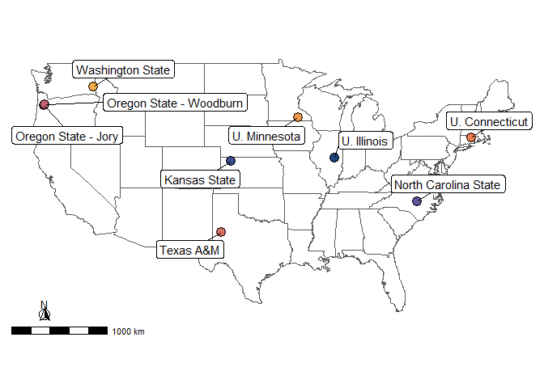

esm_manuscript_revision2
================
Katy Dynarski
2026-07-27

# Overview

## Calculation method comparison

I calculated SOC stocks in 0-5 cm, 5-10 cm, 10-30 cm, and 30-60 cm depth
increments via fixed depth and ESM methods. For the ESM calculations, I
tested six different reference mass options:

- Minimum soil mass in an individual DSP4SH project (ESM project, min)
- Mean soil mass in an individual DSP4SH project (ESM project, mean)
- Maximum soil mass in an individual DSP4SH project (ESM project, max)
- Minimum soil mass in the control group (Ref) in an individual DSP4SH
  project (ESM control, min)
- Mean soil mass in the control group (Ref) in an individual DSP4SH
  project (ESM control, mean)
- Maximum soil mass in the control group (Ref) in an individual DSP4SH
  project (ESM control, max)

# Climate and soils data for each project

``` r
# need to rename OSU projects in "project" dataframe and calculate mean MAT/MAP for all projects
project_renamed <- project |>
  mutate(project = case_when(
    project=="OregonState" & soil=="Jory" ~ "OregonStateJory",
    project=="OregonState" & soil=="Woodburn" ~ "OregonStateWoodburn", 
    .default = project))

project_avg_climate <- project_renamed |>
  group_by(project) |>
  dplyr::summarize(avg_mat = round(mean(mat, na.rm=TRUE), 1),
         avg_ppt = round(mean(map, na.rm=TRUE), 0)) |>
  arrange(factor(project, levels=project_plotting_order))

# write_csv(project_avg_climate, here("figs", "revision_figs", "tablesupp1_site_clim.csv"))
```

## Make map

``` r
# calculate average lat and long for each project
proj_loc <- project_renamed |> 
  filter(project!="UTRGV", project !="TexasA&MPt-2") |> 
  group_by(project) |> 
  summarize(mean_x = mean(pedon_x), 
            mean_y = mean(pedon_y)) |> 
  left_join(project_labels_esm_df, by=c("project" = "rowname"))

# Download map of USA from maps() and convert to sf
usa <- st_as_sf(maps::map("state", plot = FALSE, fill = TRUE))

# Make map
ggplot(data=usa) +
  geom_sf(fill=NA) +
  coord_sf(xlim=c(-125.0, -66.93457), ylim=c(23.5, 49.384358)) + # set bounding box around CONUS
  annotation_north_arrow(location="bl", which_north="true", height=unit(.25, "in"), width=unit(.25, "in"),
                         pad_x = unit(0.4, "in"), pad_y = unit(0.25, "in"), style=north_arrow_fancy_orienteering) + # add north arrow
  annotation_scale(location = "bl") +
  geom_point(data=proj_loc, aes(x=mean_x, y=mean_y, fill=project), pch = 21, size = 4) +
  geom_label_repel(data=proj_loc, aes(x=mean_x, y=mean_y, label=project_labels_esm),
                   min.segment.length = 0, seed = 42, box.padding = 0.5) +
  scale_fill_manual(values=pnw_palette("Sunset2", 9)) +
  theme_katy() +
  easy_remove_axes() +
  theme(legend.position="none")
```

    ## Scale on map varies by more than 10%, scale bar may be inaccurate

<!-- -->

``` r
# ggsave(here("figs", "revision3_figs", "figsupp1_map.png"), width=180, height=130, units = "mm")
```

# Number of pedons and sites

``` r
# how many projects
n_distinct(esm$project)
```

    ## [1] 9

``` r
# how many pedons
n_distinct(esm$dsp_pedon_id)
```

    ## [1] 205

``` r
# how many sites
# have to use some regex to extract the site name from the pedon ID since I'm missing the needed column
sites <- esm |>
  dplyr::select(project, label, dsp_pedon_id) |>
  distinct(project, label, dsp_pedon_id) |>
  mutate(dsp_site_id = str_remove(dsp_pedon_id, "-\\d*\\w*$")) |>
  group_by(project, label, dsp_site_id)

# how many pedons per site?
sites |>
  dplyr::summarize(n_pedons_per_site = n())
```

    ## `summarise()` has regrouped the output.
    ## ℹ Summaries were computed grouped by project, label, and dsp_site_id.
    ## ℹ Output is grouped by project and label.
    ## ℹ Use `summarise(.groups = "drop_last")` to silence this message.
    ## ℹ Use `summarise(.by = c(project, label, dsp_site_id))` for per-operation
    ##   grouping (`?dplyr::dplyr_by`) instead.

    ## # A tibble: 69 × 4
    ## # Groups:   project, label [27]
    ##    project  label dsp_site_id     n_pedons_per_site
    ##    <fct>    <fct> <chr>                       <int>
    ##  1 UConn    BAU   PaT2                            1
    ##  2 UConn    SHM   PaH2                            1
    ##  3 UConn    SHM   PaL1                            1
    ##  4 UConn    SHM   PaM2                            1
    ##  5 UConn    Ref   PaU1                            1
    ##  6 UConn    Ref   PaU2                            1
    ##  7 Illinois BAU   IL-115-SW-ETAL                  3
    ##  8 Illinois BAU   IL-115-SW-WDFLD                 3
    ##  9 Illinois BAU   IL-147-SW-CRP                   3
    ## 10 Illinois BAU   IL-147-SW-TS                    3
    ## # ℹ 59 more rows

``` r
# how many total sites  
n_distinct(sites$dsp_site_id)
```

    ## [1] 69

``` r
# how many total pedons
n_distinct(sites$dsp_pedon_id)
```

    ## [1] 205

``` r
# how many total pedons per treatment
esm |>
  dplyr::select(project, label, dsp_pedon_id) |>
  distinct(project, label, dsp_pedon_id) |>
  group_by(label) |>
  dplyr::summarize(n_pedons_per_treatment = n())
```

    ## # A tibble: 3 × 2
    ##   label n_pedons_per_treatment
    ##   <fct>                  <int>
    ## 1 BAU                       76
    ## 2 SHM                       77
    ## 3 Ref                       52

``` r
# table for supplement with number of sites and pedons per treatment in each project
site_table <- sites |>
  distinct(project, label, dsp_site_id) |>
  group_by(project, label) |>
  dplyr::summarize(n_sites_per_treatment = n())
```

    ## `summarise()` has regrouped the output.
    ## ℹ Summaries were computed grouped by project and label.
    ## ℹ Output is grouped by project.
    ## ℹ Use `summarise(.groups = "drop_last")` to silence this message.
    ## ℹ Use `summarise(.by = c(project, label))` for per-operation grouping
    ##   (`?dplyr::dplyr_by`) instead.

``` r
pedon_table <- sites |>
  ungroup() |>
  group_by(project, label) |>
  dplyr::summarize(n_pedons_per_trt = n())
```

    ## `summarise()` has regrouped the output.
    ## ℹ Summaries were computed grouped by project and label.
    ## ℹ Output is grouped by project.
    ## ℹ Use `summarise(.groups = "drop_last")` to silence this message.
    ## ℹ Use `summarise(.by = c(project, label))` for per-operation grouping
    ##   (`?dplyr::dplyr_by`) instead.

``` r
site_pedon_table <- site_table |>
  left_join(pedon_table, by=c("project", "label")) |>
  arrange(factor(project, levels=project_plotting_order), label)

# write_csv(site_pedon_table, here("figs", "revision_figs", "tablesupp2_site_pedon_numbers.csv"))
```

# Range in bulk density and reference masses

Management can influence soil bulk density, which results in different
masses of soil within the same depth increment between treatments. We
can check this by plotting soil bulk density under the different
management treatments in each project.

Plot bulk density:

``` r
# Plot bulk density for each project/treatment
ggplot(bd_depth, aes(x=depth, y=depth_wt_bd, fill=label)) +
  geom_point(aes(color=label), pch = 21, position=position_jitterdodge(), size=0.7) +
  geom_boxplot(median.linewidth = 0.3, lwd=0.25, outlier.size=0.6) +
  facet_wrap(~project, scales="free_y", labeller=labeller(project=project_labels_esm)) +
  scale_fill_manual(values=mgmt_pal,
                    breaks=c("BAU", "SHM", "Ref"), 
                    name="Management") +
  scale_color_manual(values=mgmt_pal,
                     breaks=c("BAU", "SHM", "Ref"), 
                     name="Management") +
  labs(x="Depth", y=expression("Bulk density"~(g ~ cm^-3))) +
  theme_katy(base_size=10) +
  theme(axis.text.x=element_text(hjust=1, angle=45))
```

    ## Warning: Removed 4 rows containing non-finite outside the scale range
    ## (`stat_boxplot()`).

    ## Warning: Removed 4 rows containing missing values or values outside the scale range
    ## (`geom_point()`).

<!-- -->

``` r
# ggsave(here("figs", "revision3_figs", "fig2_bd.png"), width=160, height=120, units="mm", dpi=400)
# ggsave(here("figs", "revision3_figs", "fig2.pdf"), width=160, height=120, units="mm", dpi=400)
```

``` r
bd_min_max <- bd_depth |>
  dplyr::summarize(min = min(depth_wt_bd, na.rm=TRUE),
            max = max(depth_wt_bd, na.rm=TRUE))

# or min max mean bulk density
mean_bd_depth <- bd_depth |> 
  group_by(project, label, depth) |> 
  dplyr::summarize(mean = mean(depth_wt_bd, na.rm=TRUE))
```

    ## `summarise()` has regrouped the output.
    ## ℹ Summaries were computed grouped by project, label, and depth.
    ## ℹ Output is grouped by project and label.
    ## ℹ Use `summarise(.groups = "drop_last")` to silence this message.
    ## ℹ Use `summarise(.by = c(project, label, depth))` for per-operation grouping
    ##   (`?dplyr::dplyr_by`) instead.

``` r
mean_bd_depth |> 
  ungroup() |> 
  dplyr::summarize(min_mean = min(mean, na.rm=TRUE),
                   max_mean = max(mean, na.rm=TRUE))
```

    ## # A tibble: 1 × 2
    ##   min_mean max_mean
    ##      <dbl>    <dbl>
    ## 1    0.632     1.96

## Range of reference masses for different soils:

Full table of reference masses for supplement:

``` r
ref_mass_table <- esm |> 
  filter(method_longest != "fd_fd_fd") |> 
  dplyr::select(project, esm_depth, method_longest, soil_mass) |> 
  distinct() |> 
  mutate(soil_mass = round(soil_mass, 0)) |> 
  pivot_wider(names_from = method_longest,
              values_from = soil_mass) |> 
  arrange(project) |> 
  relocate(project, esm_depth, esm2_min_project, esm2_min_treatment, esm2_mean_project, esm2_mean_treatment)

# write_csv(ref_mass_table, here("figs", "revision3_figs", "ref_masses_table.csv"))
```

Summary table for text:

``` r
# min and max for each depth
esm |> 
  group_by(depth_std) |> 
  dplyr::summarize(min_mass = round(min(soil_mass), 0),
            max_mass = round(max(soil_mass), 0)) 
```

    ## # A tibble: 4 × 3
    ##   depth_std min_mass max_mass
    ##       <dbl>    <dbl>    <dbl>
    ## 1         5      156      915
    ## 2        10      252     1015
    ## 3        30     1569     4911
    ## 4        60     2109     6808

``` r
esm |> 
  group_by(depth_std, method_longest) |> 
  dplyr::summarize(min_mass = round(min(soil_mass), 0),
            max_mass = round(max(soil_mass), 0)) |> 
  filter(method_longest != "fd_fd_fd")
```

    ## `summarise()` has regrouped the output.
    ## ℹ Summaries were computed grouped by depth_std and method_longest.
    ## ℹ Output is grouped by depth_std.
    ## ℹ Use `summarise(.groups = "drop_last")` to silence this message.
    ## ℹ Use `summarise(.by = c(depth_std, method_longest))` for per-operation
    ##   grouping (`?dplyr::dplyr_by`) instead.

    ## # A tibble: 24 × 4
    ## # Groups:   depth_std [4]
    ##    depth_std method_longest      min_mass max_mass
    ##        <dbl> <fct>                  <dbl>    <dbl>
    ##  1         5 esm2_min_project         156      463
    ##  2         5 esm2_min_treatment       156      770
    ##  3         5 esm2_mean_project        449      688
    ##  4         5 esm2_mean_treatment      316      833
    ##  5         5 esm2_max_project         535      915
    ##  6         5 esm2_max_treatment       385      915
    ##  7        10 esm2_min_project         252      638
    ##  8        10 esm2_min_treatment       252      760
    ##  9        10 esm2_mean_project        410      827
    ## 10        10 esm2_mean_treatment      377      816
    ## # ℹ 14 more rows

``` r
# mean reference mass for each method/depth
esm |> 
  filter(method_longest != "fd_fd_fd") |> 
  group_by(depth_std, method_longest) |> 
  dplyr::summarize(mean_mass = round(mean(soil_mass, na.rm=TRUE), 0)) |> 
  pivot_wider(names_from = method_longest, values_from = mean_mass)
```

    ## `summarise()` has regrouped the output.
    ## ℹ Summaries were computed grouped by depth_std and method_longest.
    ## ℹ Output is grouped by depth_std.
    ## ℹ Use `summarise(.groups = "drop_last")` to silence this message.
    ## ℹ Use `summarise(.by = c(depth_std, method_longest))` for per-operation
    ##   grouping (`?dplyr::dplyr_by`) instead.

    ## # A tibble: 4 × 7
    ## # Groups:   depth_std [4]
    ##   depth_std esm2_min_project esm2_min_treatment esm2_mean_project
    ##       <dbl>            <dbl>              <dbl>             <dbl>
    ## 1         5              338                410               557
    ## 2        10              431                495               630
    ## 3        30             2032               2166              2717
    ## 4        60             3390               3673              4172
    ## # ℹ 3 more variables: esm2_mean_treatment <dbl>, esm2_max_project <dbl>,
    ## #   esm2_max_treatment <dbl>

# How does ESM choice influence total calculated SOC stocks?

## Effect of stock calculation method on cumulative SOC stocks

What is the mean SOC stock calculated via each method?

What is the difference between the smallest and largest SOC stocks
calculated for a particular pedon using these different methods?

``` r
# summary of projects with the highest and lowest SOC stocks
esm |>
  group_by(depth_std, project, label) |>
  dplyr::summarize(mean = round(mean(soc_cum),1)) |> 
  filter(depth_std == 60) |> 
  ungroup() |> 
  slice(which.max(mean), which.min(mean))
```

    ## `summarise()` has regrouped the output.
    ## ℹ Summaries were computed grouped by depth_std, project, and label.
    ## ℹ Output is grouped by depth_std and project.
    ## ℹ Use `summarise(.groups = "drop_last")` to silence this message.
    ## ℹ Use `summarise(.by = c(depth_std, project, label))` for per-operation
    ##   grouping (`?dplyr::dplyr_by`) instead.

    ## # A tibble: 2 × 4
    ##   depth_std project         label  mean
    ##       <dbl> <fct>           <fct> <dbl>
    ## 1        60 UnivOfMinnesota Ref    248.
    ## 2        60 TexasA&MPt-1    BAU     17

``` r
soc_method_summary <- esm |>
  group_by(depth_std, method_longest) |>
  dplyr::summarize(mean = round(mean(soc_cum),1))
```

    ## `summarise()` has regrouped the output.
    ## ℹ Summaries were computed grouped by depth_std and method_longest.
    ## ℹ Output is grouped by depth_std.
    ## ℹ Use `summarise(.groups = "drop_last")` to silence this message.
    ## ℹ Use `summarise(.by = c(depth_std, method_longest))` for per-operation
    ##   grouping (`?dplyr::dplyr_by`) instead.

``` r
soc_method_minmaxdiff <- esm |>
  filter(depth_std=="60") |>
  group_by(project, label, dsp_pedon_id, depth_std) |>
  dplyr::summarize(min_soc_cum = min(soc_cum),
            max_soc_cum = max(soc_cum),
            diff_soc_cum = max_soc_cum - min_soc_cum,
            pct_diff_soc_cum = ((max_soc_cum - min_soc_cum) / min_soc_cum)*100)
```

    ## `summarise()` has regrouped the output.
    ## ℹ Summaries were computed grouped by project, label, dsp_pedon_id, and
    ##   depth_std.
    ## ℹ Output is grouped by project, label, and dsp_pedon_id.
    ## ℹ Use `summarise(.groups = "drop_last")` to silence this message.
    ## ℹ Use `summarise(.by = c(project, label, dsp_pedon_id, depth_std))` for
    ##   per-operation grouping (`?dplyr::dplyr_by`) instead.

``` r
mean_diff_project <- soc_method_minmaxdiff |>
  ungroup() |>
  group_by(project) |>
  dplyr::summarize(mean_diff_soc_cum = round(mean(diff_soc_cum), 2),
            min_diff_soc_cum = round(min(diff_soc_cum), 2),
            max_diff_soc_cum = round(max(diff_soc_cum), 2))

mean_diff_project
```

    ## # A tibble: 9 × 4
    ##   project             mean_diff_soc_cum min_diff_soc_cum max_diff_soc_cum
    ##   <fct>                           <dbl>            <dbl>            <dbl>
    ## 1 UConn                            7.79             2.31             12.6
    ## 2 Illinois                        12.3              3.32             57.5
    ## 3 KansasState                     16.8             12.2              27.7
    ## 4 UnivOfMinnesota                 51.3             11.8             128. 
    ## 5 NCState                         15.8              2.54             38.0
    ## 6 OregonStateJory                 38.5             15.1              59.7
    ## 7 OregonStateWoodburn             16.7              2.75             41.2
    ## 8 TexasA&MPt-1                     6.03             3.26             11.5
    ## 9 WashingtonState                 33.8              2.66             85.4

``` r
mean_diff <- soc_method_minmaxdiff |>
  ungroup() |>
  dplyr::summarize(mean_diff_soc_cum = round(mean(diff_soc_cum), 2),
            min_diff_soc_cum = round(min(diff_soc_cum), 2),
            max_diff_soc_cum = round(max(diff_soc_cum), 2),
            max_pct_diff_soc_cum = round(max(pct_diff_soc_cum), 1),
            mean_pct_diff_soc_cum = round(mean(pct_diff_soc_cum), 1))

mean_diff
```

    ## # A tibble: 1 × 5
    ##   mean_diff_soc_cum min_diff_soc_cum max_diff_soc_cum max_pct_diff_soc_cum
    ##               <dbl>            <dbl>            <dbl>                <dbl>
    ## 1              24.0             2.31             128.                 109.
    ## # ℹ 1 more variable: mean_pct_diff_soc_cum <dbl>

## Effect of stock calculation method on incremental SOC stocks

``` r
aov_soc_inc <- esm |>
  group_by(depth_std) |>
  nest() |>
  mutate(aov = purrr::map(data, ~aov(soc ~ method_longest, data = .x)),
         hsd = purrr::map(aov, TukeyHSD),
         letters = purrr::map2(.x = aov, .y = hsd, ~multcompLetters4(.x, .y, reversed=TRUE)),
         letters_df = purrr::map(letters, .f = ~{
           data.frame(.x[[1]]$Letters) |> 
             rownames_to_column() |> 
             rename(method_longest = rowname,
                    letter = 2)
         })
  ) |> 
  dplyr::select(depth_std, letters_df) |> 
  unnest(cols=letters_df)

fig2_inc_letters_position <- esm |>
  group_by(depth_std, method_longest) |>
  dplyr::summarize(max_soc = max(soc)) |>
  left_join(aov_soc_inc, by=c("depth_std", "method_longest"))
```

    ## `summarise()` has regrouped the output.
    ## ℹ Summaries were computed grouped by depth_std and method_longest.
    ## ℹ Output is grouped by depth_std.
    ## ℹ Use `summarise(.groups = "drop_last")` to silence this message.
    ## ℹ Use `summarise(.by = c(depth_std, method_longest))` for per-operation
    ##   grouping (`?dplyr::dplyr_by`) instead.

``` r
ggplot(esm, aes(x=method_longest, y=soc, fill=method_longest)) +
  geom_point(aes(color=method_longest), position = "jitter", alpha=0.8) +
  geom_boxplot(median.linewidth=0.5, lwd=0.25, outlier.shape=NA) +
  geom_text(data=fig2_inc_letters_position, aes(y=max_soc + 30, x=method_longest, label=letter), size=2) +
  labs(x="Calculation method", y=expression("Depth increment SOC stock (Mg ha"^-1*")")) +
  facet_wrap(~depth_std, labeller=labeller(depth_std=inc_depth_labels)) +
  scale_x_discrete(labels=method_labels) +
  scale_color_manual(values = method_pal, name="Calculation method") + 
  scale_fill_manual(values = method_pal, name="Calculation method") + 
  theme_katy() +
  theme(axis.text.x=element_text(angle=45, hjust=1),
        legend.position="none")
```

<!-- -->

``` r
# ggsave(here("figs", "revision3_figs", "figsupp2_soc_inc_all.png"), width=120, height=100, units="mm", dpi=400)
```

# How does calculation method influence management sensitivity?

## Calculate means for all treatments, depths, and calculation methods for results text

``` r
soc_cum_summary <- esm |> 
  group_by(method_longest, esm_depth, label) |> 
  dplyr::summarize(mean = round(mean(soc_cum), 1)) |> 
  arrange(esm_depth, label, method_longest)
```

    ## `summarise()` has regrouped the output.
    ## ℹ Summaries were computed grouped by method_longest, esm_depth, and label.
    ## ℹ Output is grouped by method_longest and esm_depth.
    ## ℹ Use `summarise(.groups = "drop_last")` to silence this message.
    ## ℹ Use `summarise(.by = c(method_longest, esm_depth, label))` for per-operation
    ##   grouping (`?dplyr::dplyr_by`) instead.

``` r
soc_cum_summary |> 
  group_by(esm_depth, label) |> 
  dplyr::summarize(min = min(mean),
            max = max(mean)) 
```

    ## `summarise()` has regrouped the output.
    ## ℹ Summaries were computed grouped by esm_depth and label.
    ## ℹ Output is grouped by esm_depth.
    ## ℹ Use `summarise(.groups = "drop_last")` to silence this message.
    ## ℹ Use `summarise(.by = c(esm_depth, label))` for per-operation grouping
    ##   (`?dplyr::dplyr_by`) instead.

    ## # A tibble: 12 × 4
    ## # Groups:   esm_depth [4]
    ##    esm_depth label   min   max
    ##    <fct>     <fct> <dbl> <dbl>
    ##  1 0-5 cm    BAU     6.9  14.9
    ##  2 0-5 cm    SHM     8.2  16.9
    ##  3 0-5 cm    Ref    15.4  28.8
    ##  4 5-10 cm   BAU    15.9  29.9
    ##  5 5-10 cm   SHM    17.1  29.5
    ##  6 5-10 cm   Ref    28.7  49.1
    ##  7 10-30 cm  BAU    50.3  74.7
    ##  8 10-30 cm  SHM    45    65.5
    ##  9 10-30 cm  Ref    74.1 110. 
    ## 10 30-60 cm  BAU    87.4 108. 
    ## 11 30-60 cm  SHM    73.5  94.5
    ## 12 30-60 cm  Ref   124.  156.

``` r
soc_inc_summary <- esm |> 
  group_by(method_longest, esm_depth, label) |> 
  dplyr::summarize(mean = round(mean(soc), 1)) |> 
    arrange(esm_depth, label, mean)
```

    ## `summarise()` has regrouped the output.
    ## ℹ Summaries were computed grouped by method_longest, esm_depth, and label.
    ## ℹ Output is grouped by method_longest and esm_depth.
    ## ℹ Use `summarise(.groups = "drop_last")` to silence this message.
    ## ℹ Use `summarise(.by = c(method_longest, esm_depth, label))` for per-operation
    ##   grouping (`?dplyr::dplyr_by`) instead.

``` r
soc_inc_summary |> 
  ungroup() |> 
  group_by(esm_depth) |> 
  dplyr::summarize(min_mean = min(mean),
            max_mean = max(mean))
```

    ## # A tibble: 4 × 3
    ##   esm_depth min_mean max_mean
    ##   <fct>        <dbl>    <dbl>
    ## 1 0-5 cm         6.9     28.8
    ## 2 5-10 cm        8.9     20.4
    ## 3 10-30 cm      27.9     61.2
    ## 4 30-60 cm      28.5     51.1

## Management sensitivity of incremental SOC stocks

ANOVA for management sensitivity of incremental SOC stocks using
different calculation methods

``` r
# anova on effect of management on cumulative SOC stocks
mgmt_inc_aov_df <- esm |> 
  group_by(method_longest, depth_std) |> 
  nest() |> 
  mutate(aov = purrr::map(data, ~aov(soc ~ label, data=.x)),
         hsd = purrr::map(aov, TukeyHSD),
         letters = purrr::map2(aov, hsd, ~multcompLetters4(.x, .y, reversed=TRUE)),
         letters_df = purrr::map(letters, .f = ~{
           data.frame(.x[[1]]$Letters) |> 
             rownames_to_column() |> 
             rename(label = rowname,
                    letter = 2)
         }) 
  ) |> 
  dplyr::select(depth_std, method_longest, letters_df) |> 
  unnest(cols=letters_df)

mgmt_inc_aov_letters <- esm |>
  group_by(method_longest, depth_std) |>
  dplyr::summarize(max_soc = max(soc)) |>
  left_join(mgmt_inc_aov_df, by=c("depth_std", "method_longest")) |>
  mutate(label = factor(label, levels=c("BAU", "SHM", "Ref")))
```

    ## `summarise()` has regrouped the output.
    ## ℹ Summaries were computed grouped by method_longest and depth_std.
    ## ℹ Output is grouped by method_longest.
    ## ℹ Use `summarise(.groups = "drop_last")` to silence this message.
    ## ℹ Use `summarise(.by = c(method_longest, depth_std))` for per-operation
    ##   grouping (`?dplyr::dplyr_by`) instead.

``` r
ggplot(esm, aes(x=method_longest, y=soc, fill=label)) +
  geom_point(aes(color=label), pch = 21, position=position_jitterdodge(), size=0.7) +
  geom_boxplot(median.linewidth=0.5, lwd=0.25, outlier.shape=NA) +
  scale_x_discrete(labels=method_labels) +
  facet_wrap(~depth_std, scales="free", labeller=labeller(depth_std=inc_depth_labels)) +
  geom_text(data=mgmt_inc_aov_letters, 
            aes(y=max_soc + 25, label=letter, group=label), 
            color="black", position=position_dodge(width=0.8), size=3) +
  labs(x="Calculation method", y=expression("Depth increment SOC (Mg ha"^-1*")")) +
  scale_fill_manual(values=mgmt_pal,
                    breaks=c("BAU", "SHM", "Ref"), 
                    name="Management") +
  scale_color_manual(values=mgmt_pal,
                     breaks=c("BAU", "SHM", "Ref"), 
                     name="Management") +
  theme_katy(base_size=10) +
  theme(axis.text.x=element_text(angle=45, hjust=1))
```

<!-- -->

``` r
# ggsave(here("figs", "revision3_figs", "figsupp3_soc_mgmt_inc.png"), width=160, height=130, units="mm", dpi=400)
```

# Calculation method influence on SOC sequestration

Calculate the mean SOC in the BAU treatment for each project, and then
calculate the difference between each Ref/SHM pedon and the BAU mean.

This isn’t entirely different from assessing the management sensitivity
of each calculation method, as we did above. However, in this analysis
we are concerned with the magnitude of the difference in SOC stocks
between both Ref and SHM treatments compared to BAU.

``` r
esm_bau <- esm |>
  filter(label=="BAU") |>
  group_by(project, method_long, method_longest, method, ref_stat, ref_data, depth_std) |>
  dplyr::summarize(mean_bau_soil_mass = mean(soil_mass),
            mean_bau_soc = mean(soc),
            mean_bau_soil_mass_cum = mean(soil_mass_cum),
            mean_bau_soc_cum = mean(soc_cum))
```

    ## `summarise()` has regrouped the output.
    ## ℹ Summaries were computed grouped by project, method_long, method_longest,
    ##   method, ref_stat, ref_data, and depth_std.
    ## ℹ Output is grouped by project, method_long, method_longest, method, ref_stat,
    ##   and ref_data.
    ## ℹ Use `summarise(.groups = "drop_last")` to silence this message.
    ## ℹ Use `summarise(.by = c(project, method_long, method_longest, method,
    ##   ref_stat, ref_data, depth_std))` for per-operation grouping
    ##   (`?dplyr::dplyr_by`) instead.

``` r
esm_diff <- esm |>
  filter(!label=="BAU") |>
  left_join(esm_bau, by=c("project", "method_long", "method_longest", "method", "ref_stat", "ref_data", "depth_std")) |>
  mutate(diff_soil_mass = soil_mass - mean_bau_soil_mass,
         diff_soc = soc - mean_bau_soc,
         diff_soil_mass_cum = soil_mass_cum - mean_bau_soil_mass_cum,
         diff_soc_cum = soc_cum - mean_bau_soc_cum)

# Calculate mean sequestration estimates for each treatment, cumulative depth, and method
esm_diff |> 
  group_by(label, depth_std, method_longest) |> 
  dplyr::summarize(mean_diff = round(mean(diff_soc_cum), 1),
            n = n()) 
```

    ## `summarise()` has regrouped the output.
    ## ℹ Summaries were computed grouped by label, depth_std, and method_longest.
    ## ℹ Output is grouped by label and depth_std.
    ## ℹ Use `summarise(.groups = "drop_last")` to silence this message.
    ## ℹ Use `summarise(.by = c(label, depth_std, method_longest))` for per-operation
    ##   grouping (`?dplyr::dplyr_by`) instead.

    ## # A tibble: 56 × 5
    ## # Groups:   label, depth_std [8]
    ##    label depth_std method_longest      mean_diff     n
    ##    <fct>     <dbl> <fct>                   <dbl> <int>
    ##  1 SHM           5 esm2_min_project          2.5    77
    ##  2 SHM           5 esm2_min_treatment        2.9    77
    ##  3 SHM           5 esm2_mean_project         3.7    77
    ##  4 SHM           5 esm2_mean_treatment       3.6    77
    ##  5 SHM           5 esm2_max_project          4.2    77
    ##  6 SHM           5 esm2_max_treatment        3.9    77
    ##  7 SHM           5 fd_fd_fd                  3.3    77
    ##  8 SHM          10 esm2_min_project          4.2    77
    ##  9 SHM          10 esm2_min_treatment        4.6    77
    ## 10 SHM          10 esm2_mean_project         4.4    77
    ## # ℹ 46 more rows

``` r
# Calculate mean sequestration estimates for each treatment, incremental depth, and method
esm_diff |> 
  group_by(label, depth_std, method_longest) |> 
  dplyr::summarize(mean_dsoc_inc = round(mean(diff_soc), 1)) |> 
  arrange(label, depth_std, mean_dsoc_inc)
```

    ## `summarise()` has regrouped the output.
    ## ℹ Summaries were computed grouped by label, depth_std, and method_longest.
    ## ℹ Output is grouped by label and depth_std.
    ## ℹ Use `summarise(.groups = "drop_last")` to silence this message.
    ## ℹ Use `summarise(.by = c(label, depth_std, method_longest))` for per-operation
    ##   grouping (`?dplyr::dplyr_by`) instead.

    ## # A tibble: 56 × 4
    ## # Groups:   label, depth_std [8]
    ##    label depth_std method_longest      mean_dsoc_inc
    ##    <fct>     <dbl> <fct>                       <dbl>
    ##  1 SHM           5 esm2_min_project              2.5
    ##  2 SHM           5 esm2_min_treatment            2.9
    ##  3 SHM           5 fd_fd_fd                      3.3
    ##  4 SHM           5 esm2_mean_treatment           3.6
    ##  5 SHM           5 esm2_mean_project             3.7
    ##  6 SHM           5 esm2_max_treatment            3.9
    ##  7 SHM           5 esm2_max_project              4.2
    ##  8 SHM          10 esm2_max_project              0.1
    ##  9 SHM          10 esm2_max_treatment            0.5
    ## 10 SHM          10 esm2_mean_project             0.7
    ## # ℹ 46 more rows

## Incremental SOC sequestration with different calculation methods

``` r
dsoc_inc_aov_df <- esm_diff |> 
  group_by(depth_std) |> 
  nest() |> 
  mutate(aov = purrr::map(data, ~aov(diff_soc ~ (label+method_longest)^2, data=.x)),
         tidy_aov = purrr::map(aov, broom::tidy),
         hsd = purrr::map(aov, TukeyHSD),
         letters = purrr::map2(aov, hsd, ~multcompLetters4(.x, .y, reversed=TRUE)),
         letters_df = purrr::map(letters, .f = ~{
           data.frame(.x[[3]]$Letters) |> 
             rownames_to_column() |> 
             rename(letter = 2) |> 
             separate_wider_delim(rowname, ":", names = c("label", "method_longest"))
         }) 
  )

dsoc_inc_aov_tidy <- dsoc_inc_aov_df |> 
  dplyr::select(depth_std, tidy_aov) |> 
  unnest(cols=tidy_aov) |> 
  mutate(comparison = "dsoc_inc") |> 
  relocate(comparison)

dsoc_inc_letters_df <- dsoc_inc_aov_df |> 
  dplyr::select(depth_std, letters_df) |> 
  unnest(cols=letters_df)
# significant differences mostly due to management 

# calculate position for letters on figures
dsoc_inc_quant <- esm_diff |> 
  group_by(depth_std, method_longest, label) |> 
  summarize(quant25 = quantile(diff_soc, probs = 0.25), 
            quant75 = quantile(diff_soc, probs = 0.75)) |> 
  mutate(iqr = quant75-quant25,
         upr = (quant75 + (1.5*iqr))*2.5)
```

    ## `summarise()` has regrouped the output.
    ## ℹ Summaries were computed grouped by depth_std, method_longest, and label.
    ## ℹ Output is grouped by depth_std and method_longest.
    ## ℹ Use `summarise(.groups = "drop_last")` to silence this message.
    ## ℹ Use `summarise(.by = c(depth_std, method_longest, label))` for per-operation
    ##   grouping (`?dplyr::dplyr_by`) instead.

``` r
dsoc_inc_letters2 <- dsoc_inc_letters_df |> 
  left_join(dsoc_inc_quant, by=c("method_longest", "depth_std", "label")) |> 
  mutate(label = factor(label, levels = c("SHM", "Ref")))
```

``` r
ggplot(esm_diff, aes(x=method_longest, y=diff_soc, fill=method_longest)) +
  geom_point(aes(color=method_longest), pch=21, position="jitter", alpha=0.8, size=0.8) +
  geom_boxplot(median.linewidth=0.5, lwd=0.25, outlier.shape=NA) +
  geom_abline(intercept=0, slope=0, linetype="dashed", linewidth=0.3) +
  geom_text(data=dsoc_inc_letters2, aes(y=upr, label=letter), size=10/.pt) +
  labs(x="Calculation method", y=expression(Delta*"SOC vs BAU (Mg ha"^-1*")")) +
  facet_grid(depth_std~label, scales="free", labeller=labeller(depth_std=inc_depth_labels)) +
  scale_x_discrete(labels=method_labels) +
  scale_fill_manual(values = method_pal, name="Calculation method") + 
  scale_color_manual(values = method_pal, name="Calculation method") + 
  theme_katy(base_size=12) +
  theme(axis.text.x=element_text(angle=45, hjust=1),
        legend.position="none")
```

<!-- -->

``` r
# ggsave(here("figs", "revision3_figs", "fig3_dsoc_inc.png"), width=180, height=160, units="mm", dpi=400)
# ggsave(here("figs", "revision3_figs", "fig3.pdf"), width=180, height=160, units="mm", dpi=400)
```

Plot for each project:

``` r
# aov for each project 
dsoc_inc_each_aov <- esm_diff |> 
  group_by(project, depth_std) |> 
  nest() |> 
  mutate(aov = purrr::map(data, ~aov(diff_soc ~ (label+method_longest)^2, data=.x)),
         tidy_aov = purrr::map(aov, broom::tidy),
         hsd = purrr::map(aov, TukeyHSD),
         letters = purrr::map2(aov, hsd, ~multcompLetters4(.x, .y, reversed=TRUE)),
         letters_df = purrr::map(letters, .f = ~{
           data.frame(.x[[3]]$Letters) |> 
             rownames_to_column() |> 
             rename(label.method_longest = rowname,
                    letter = 2) |> 
             separate_wider_delim(label.method_longest, ":", names = c("label", "method_longest"))
         }) 
  )

# anova table
dsoc_inc_each_aov_tidy <- dsoc_inc_each_aov |> 
  dplyr::select(project, depth_std, tidy_aov) |> 
  unnest(cols=tidy_aov) |> 
  mutate(comparison = "dsoc_inc") |> 
  relocate(comparison)

# tukey's HSD letters
dsoc_inc_each_letters <- dsoc_inc_each_aov |> 
  dplyr::select(project, depth_std, letters_df) |> 
  unnest(cols=letters_df) |> 
  group_by(project, depth_std) |> 
  mutate(keep = n_distinct(letter) > 1) |> 
  filter(keep == TRUE)
# very few significant differences

# calculate position for letters on figures
dsoc_inc_each_quant <- esm_diff |> 
  group_by(project, depth_std, method_longest, label) |> 
  summarize(quant25 = quantile(diff_soc, probs = 0.25), 
            quant75 = quantile(diff_soc, probs = 0.75)) |> 
  mutate(iqr = quant75-quant25,
         upr = (quant75 + (1.5*iqr))*1.2)
```

    ## `summarise()` has regrouped the output.
    ## ℹ Summaries were computed grouped by project, depth_std, method_longest, and
    ##   label.
    ## ℹ Output is grouped by project, depth_std, and method_longest.
    ## ℹ Use `summarise(.groups = "drop_last")` to silence this message.
    ## ℹ Use `summarise(.by = c(project, depth_std, method_longest, label))` for
    ##   per-operation grouping (`?dplyr::dplyr_by`) instead.

``` r
dsoc_inc_each_letters2 <- dsoc_inc_each_letters |> 
  left_join(dsoc_inc_each_quant, by=c("project","method_longest", "depth_std", "label")) |> 
  mutate(label = factor(label, levels = c("SHM", "Ref")))

purrr::map(.x = projects, 
           .f = ~{
             esm_diff |> 
               filter(project==.x) |> 
               ggplot(aes(x=method_longest, y=diff_soc, fill=method_longest)) +
               geom_point(aes(color=method_longest), pch=21, position="jitter", alpha=0.8, size=0.8) +
               geom_boxplot(median.linewidth=0.5, lwd=0.25, outlier.shape=NA) +
               geom_abline(intercept=0, slope=0, linetype="dashed", linewidth=0.3) +
               geom_text(data=dsoc_inc_each_letters2 |> filter(project == .x), 
                         aes(y=upr, label=letter), size=8/.pt) +
               labs(x="Calculation method", y=expression(Delta*"SOC vs BAU (Mg/ha)"),
                    title=glue::glue("\u0394SOC by calculation method - {project_labels_esm[.x]}")) +
               facet_grid(depth_std~label, scales="free", labeller=labeller(depth_std=inc_depth_labels)) +
               scale_x_discrete(labels=method_labels) +
               scale_fill_manual(values = method_pal, name="Calculation method") + 
               scale_color_manual(values = method_pal, name="Calculation method") + 
               theme_classic() +
               theme(axis.text.x=element_text(angle=45, hjust=1),
                     axis.line = element_line(colour = 'black', linewidth = 0.25),
                     strip.background = element_rect(colour = "black", linewidth = 0.35),
                     legend.position="none")
             
             # ggsave(here("figs", "revision3_figs", "proj_dsoc_inc", glue::glue("suppfig_dsoc_inc_", .x, ".png")),
             #                                  width=160, height=140, units="mm", dpi=400)
           })
```

    ## [[1]]

<!-- -->

    ## 
    ## [[2]]

<!-- -->

    ## 
    ## [[3]]

<!-- -->

    ## 
    ## [[4]]

<!-- -->

    ## 
    ## [[5]]

<!-- -->

    ## 
    ## [[6]]

<!-- -->

    ## 
    ## [[7]]

<!-- -->

    ## 
    ## [[8]]

<!-- -->

    ## 
    ## [[9]]

<!-- -->

# Calculate error in the delta SOC associated with different methods

First, need to calculate dSOC for ESM1 method. We’re considering dSOC
calculated with ESM1 to be the “true” value - it was calculated by
incrementally going down 1 mm into the soil profile until the reference
mass was reached, instead of via cubic spline. So this gets us to the
error associated with the cubic spline estimation for each reference
mass.

``` r
esm1_bau <- esm1 |>
  filter(label=="BAU") |>
  group_by(project, method_long, method_longest, method, ref_stat, ref_data, depth_std) |>
  dplyr::summarize(mean_bau_soil_mass = mean(soil_mass),
            mean_bau_soc = mean(soc),
            mean_bau_soil_mass_cum = mean(soil_mass_cum),
            mean_bau_soc_cum = mean(soc_cum))
```

    ## `summarise()` has regrouped the output.
    ## ℹ Summaries were computed grouped by project, method_long, method_longest,
    ##   method, ref_stat, ref_data, and depth_std.
    ## ℹ Output is grouped by project, method_long, method_longest, method, ref_stat,
    ##   and ref_data.
    ## ℹ Use `summarise(.groups = "drop_last")` to silence this message.
    ## ℹ Use `summarise(.by = c(project, method_long, method_longest, method,
    ##   ref_stat, ref_data, depth_std))` for per-operation grouping
    ##   (`?dplyr::dplyr_by`) instead.

``` r
esm1_diff <- esm1 |>
  filter(!label=="BAU") |>
  left_join(esm1_bau, by=c("project", "method_long", "method_longest", "method", "ref_stat", "ref_data", "depth_std")) |>
  mutate(diff_soil_mass = soil_mass - mean_bau_soil_mass,
         diff_soc = soc - mean_bau_soc,
         diff_soil_mass_cum = soil_mass_cum - mean_bau_soil_mass_cum,
         diff_soc_cum = soc_cum - mean_bau_soc_cum)
```

``` r
esm_diff_all <- bind_rows(esm_diff, esm1_diff) |> 
  unite("stat_data", ref_stat:ref_data, remove = FALSE)

# ESM1 and ESM2 look very similar to each other
ggplot(esm_diff_all, aes(x=stat_data, y=diff_soc, fill=method)) +
  geom_point(aes(color=method), pch=21, position="jitter", alpha=0.8, size=0.8) +
  geom_boxplot(median.linewidth=0.5, lwd=0.25, outlier.shape=NA) +
  geom_abline(intercept=0, slope=0, linetype="dashed", linewidth=0.3) +
  labs(x="Calculation method", y=expression(Delta*"SOC vs BAU (Mg ha"^-1*")")) +
  facet_grid(depth_std~label, scales="free", labeller=labeller(depth_std=inc_depth_labels)) +
  scale_fill_manual(values = pnw_palette("Starfish", 3), name="Calculation method") + 
  scale_color_manual(values = pnw_palette("Starfish", 3), name="Calculation method") + 
  theme_katy() +
  theme(axis.text.x=element_text(angle=45, hjust=1),
        legend.position="none")
```

<!-- -->

``` r
# calculate error for ESM methods
esm_inc_error <- esm_diff_all |> 
  dplyr::select(project, stat_data:method, depth_std:diff_soc_cum) |> 
  filter(method!="fd") |> 
  pivot_wider(names_from = method, values_from = mean_bau_soil_mass:diff_soc_cum) |> 
  mutate(inc_delta_soc_error = diff_soc_esm2 - diff_soc_esm1,
         abs_error = abs(inc_delta_soc_error),
         pct_error = abs((diff_soc_esm2 - diff_soc_esm1)/diff_soc_esm1)) |> 
  rename(true_inc_delta_soc = diff_soc_esm1,
         calc_inc_delta_soc = diff_soc_esm2)

# calculate error for FD method
# considering the "true" dSOC for fd method to be dSOC for ESMmean, control
true_dsoc_fd <- esm_diff_all |> 
  dplyr::select(project, stat_data:method, depth_std:diff_soc_cum) |> 
  filter(stat_data == "mean_treatment") |> 
  distinct() |> 
  dplyr::select(project, dsp_pedon_id, layer, depth_std, diff_soc) |> 
  rename(true_inc_delta_soc = diff_soc)
  
esm_inc_error_fd <- esm_diff_all |> 
  dplyr::select(project, stat_data:method, depth_std:diff_soc_cum) |> 
  filter(method == "fd") |> 
  left_join(true_dsoc_fd, by = c("project", "dsp_pedon_id", "layer", "depth_std")) |> 
  mutate(inc_delta_soc_error = diff_soc - true_inc_delta_soc,
         abs_error = abs(inc_delta_soc_error),
         pct_error = abs((diff_soc - true_inc_delta_soc)/true_inc_delta_soc)) |> 
  rename(calc_inc_delta_soc = diff_soc) |> 
  dplyr::select(project:layer, depth_std, calc_inc_delta_soc, true_inc_delta_soc:pct_error)

# join fd error to esm error
esm_inc_error_all <- esm_inc_error |> 
  dplyr::select(project:depth_std, calc_inc_delta_soc, true_inc_delta_soc, inc_delta_soc_error:pct_error) |> 
  bind_rows(esm_inc_error_fd) |> 
  mutate(stat_data = factor(stat_data, levels = method_factor_order2))
```

## Plot at meta-project level

### ANOVA for meta-project

``` r
# determine iqr to remove outliers
dsoc_inc_error_quant <- esm_inc_error_all |> 
  group_by(depth_std, stat_data, label) |> 
  summarize(quant25 = quantile(pct_error, probs = 0.25), 
            quant75 = quantile(pct_error, probs = 0.75)) |> 
  mutate(iqr = quant75-quant25,
         upr = quant75 + (1.5*iqr),
         lwr = quant25 - (1.5*iqr),
         upr_label = (quant75 + (1.5*iqr))*2)
```

    ## `summarise()` has regrouped the output.
    ## ℹ Summaries were computed grouped by depth_std, stat_data, and label.
    ## ℹ Output is grouped by depth_std and stat_data.
    ## ℹ Use `summarise(.groups = "drop_last")` to silence this message.
    ## ℹ Use `summarise(.by = c(depth_std, stat_data, label))` for per-operation
    ##   grouping (`?dplyr::dplyr_by`) instead.

``` r
# filter outliers out
esm_inc_error_sub <- esm_inc_error_all |> 
  left_join(dplyr::select(dsoc_inc_error_quant, upr, lwr, depth_std, stat_data, label), 
            by=c("label","depth_std", "stat_data")) |> 
  filter(pct_error<=upr, pct_error>=lwr) |> 
  mutate(stat_data = factor(stat_data, levels = method_factor_order2))

# anova on effect of method on percent error
dsoc_inc_error_aov_df <- esm_inc_error_sub |> 
  group_by(depth_std) |> 
  nest() |> 
  mutate(aov = purrr::map(data, ~aov(pct_error ~ (label+stat_data)^2, data=.x)),
         tidy_aov = purrr::map(aov, broom::tidy),
         glance_aov = purrr::map(aov, broom::glance),
         hsd = purrr::map(aov, TukeyHSD),
         letters = purrr::map2(aov, hsd, multcompLetters4),
         letters_df = purrr::map(letters, .f = ~{
           data.frame(.x[[3]]$Letters) |> 
             rownames_to_column() |> 
             rename(letter = 2) |> 
             separate_wider_delim(rowname, ":", names = c("label", "stat_data"))
         }) 
  )

dsoc_inc_error_aov_tidy <- dsoc_inc_error_aov_df |> 
  dplyr::select(depth_std, tidy_aov) |> 
  unnest(cols=tidy_aov) |> 
  mutate(comparison = "dsoc_inc_error") |> 
  relocate(comparison)

# pull out significant depths
dsoc_inc_error_sig <- dsoc_inc_error_aov_tidy |>
  filter(term == "stat_data" | term == "label") |> 
  filter(p.value < 0.05) |> 
  distinct(depth_std) |> 
  pull()

dsoc_inc_error_letters_df <- dsoc_inc_error_aov_df |> 
  dplyr::select(depth_std, letters_df) |> 
  unnest(cols=letters_df) |> 
  group_by(depth_std) |> 
  mutate(keep = n_distinct(letter) > 1) |> 
  filter(keep == TRUE)

dsoc_inc_error_letters_df2 <- dsoc_inc_error_letters_df |> 
  left_join(dsoc_inc_error_quant, by=c("stat_data", "depth_std", "label")) |> 
  mutate(label = factor(label, levels = c("SHM", "Ref")))
```

### Plot at meta project level

``` r
ggplot(esm_inc_error_sub, aes(x=stat_data, y=pct_error, fill=stat_data)) +
  geom_point(aes(color=stat_data), pch=21, position="jitter", alpha=0.8, size=0.8) +
  geom_boxplot(median.linewidth = 0.5, lwd=0.25, outliers=FALSE) +
  geom_text(data=dsoc_inc_error_letters_df2, aes(y=upr, label=letter), vjust = -0.4, size=10/.pt) +
  labs(x="Calculation method", y=expression(Delta*"SOC error (%)")) +
  facet_grid(depth_std~label, scales="free", labeller=labeller(depth_std=inc_depth_labels)) +
  scale_x_discrete(labels = stat_data_labels) +
  scale_y_continuous(labels = scales::percent,
                     expand = expansion(mult = c(.05, .2))) +
  scale_fill_manual(values = method_pal2, name="Calculation method") +
  scale_color_manual(values = method_pal2, name="Calculation method") +
  theme_katy(base_size=12) +
  theme(axis.text.x=element_text(angle=45, hjust=1),
        legend.position="none")
```

<!-- -->

``` r
# ggsave(here("figs", "revision3_figs", "fig4_dsoc_inc_error.png"), width=180, height=160, units="mm", dpi=400)
# ggsave(here("figs", "revision3_figs", "fig4.pdf"), width=180, height=160, units="mm", dpi=400)
```

### ANOVA table

``` r
anova_inc_table <- bind_rows(dsoc_inc_aov_tidy, dsoc_inc_error_aov_tidy) |> 
  dplyr::select(-sumsq, -meansq) |> 
  mutate(statistic = round(statistic, 2),
         p.value = if_else(p.value < 0.001, "<0.001", as.character(round(p.value, 3)))) 
  
anova_inc_table
```

    ## # A tibble: 32 × 6
    ## # Groups:   depth_std [4]
    ##    comparison depth_std term                    df statistic p.value
    ##    <chr>          <dbl> <chr>                <dbl>     <dbl> <chr>  
    ##  1 dsoc_inc           5 label                    1    115.   <0.001 
    ##  2 dsoc_inc           5 method_longest           6      2.57 0.018  
    ##  3 dsoc_inc           5 label:method_longest     6      1.53 0.165  
    ##  4 dsoc_inc           5 Residuals              889     NA    <NA>   
    ##  5 dsoc_inc          10 label                    1    100.   <0.001 
    ##  6 dsoc_inc          10 method_longest           6      1.63 0.137  
    ##  7 dsoc_inc          10 label:method_longest     6      1.51 0.172  
    ##  8 dsoc_inc          10 Residuals              889     NA    <NA>   
    ##  9 dsoc_inc          30 label                    1    144.   <0.001 
    ## 10 dsoc_inc          30 method_longest           6      0.46 0.835  
    ## # ℹ 22 more rows

``` r
# write_csv(anova_inc_table, here("figs", "revision3_figs", "dsoc_inc_anova_table.csv"))
```

### Table of means for text

``` r
esm_inc_error_sub |> 
  group_by(depth_std, stat_data) |> 
  summarize(mean_pct_error = round(mean(pct_error), 3) * 100) |> 
  arrange(depth_std, mean_pct_error)
```

    ## `summarise()` has regrouped the output.
    ## ℹ Summaries were computed grouped by depth_std and stat_data.
    ## ℹ Output is grouped by depth_std.
    ## ℹ Use `summarise(.groups = "drop_last")` to silence this message.
    ## ℹ Use `summarise(.by = c(depth_std, stat_data))` for per-operation grouping
    ##   (`?dplyr::dplyr_by`) instead.

    ## # A tibble: 28 × 3
    ## # Groups:   depth_std [4]
    ##    depth_std stat_data      mean_pct_error
    ##        <dbl> <fct>                   <dbl>
    ##  1         5 max_project               4.3
    ##  2         5 mean_project              5.2
    ##  3         5 mean_treatment            6.4
    ##  4         5 max_treatment             6.4
    ##  5         5 min_treatment            13.3
    ##  6         5 min_project              20.2
    ##  7         5 fd_fd                    42.3
    ##  8        10 min_project              13.8
    ##  9        10 min_treatment            13.9
    ## 10        10 mean_project             14.1
    ## # ℹ 18 more rows

## Incremental error for each project

### ANOVA for each project

``` r
dsoc_inc_error_each_aov_df <- esm_inc_error_all |> 
  group_by(project, depth_std) |> 
  nest() |> 
  mutate(aov = purrr::map(data, ~aov(abs_error ~ (label+stat_data)^2, data=.x)),
         tidy_aov = purrr::map(aov, broom::tidy),
         glance_aov = purrr::map(aov, broom::glance),
         hsd = purrr::map(aov, TukeyHSD),
         letters = purrr::map2(aov, hsd, multcompLetters4),
         letters_df = purrr::map(letters, .f = ~{
           data.frame(.x[[3]]$Letters) |> 
             rownames_to_column() |> 
             rename(letter = 2) |> 
             separate_wider_delim(rowname, ":", names = c("label", "stat_data"))
         }) 
  )

dsoc_inc_error_each_letters_df <- dsoc_inc_error_each_aov_df |> 
  dplyr::select(project, depth_std, letters_df) |> 
  unnest(cols=letters_df) |> 
  group_by(project, depth_std) |> 
  mutate(keep = n_distinct(letter) > 1) |> 
  filter(keep == TRUE)

# calculate position
dsoc_inc_error_each_quant <- esm_inc_error_all |> 
  group_by(project, depth_std, stat_data, label) |> 
  summarize(quant25 = quantile(abs_error, probs = 0.25), 
            quant75 = quantile(abs_error, probs = 0.75)) |> 
  mutate(iqr = abs(quant75-quant25),
         upr = (quant75 + (1.5*iqr))+1)
```

    ## `summarise()` has regrouped the output.
    ## ℹ Summaries were computed grouped by project, depth_std, stat_data, and label.
    ## ℹ Output is grouped by project, depth_std, and stat_data.
    ## ℹ Use `summarise(.groups = "drop_last")` to silence this message.
    ## ℹ Use `summarise(.by = c(project, depth_std, stat_data, label))` for
    ##   per-operation grouping (`?dplyr::dplyr_by`) instead.

``` r
dsoc_inc_error_each_letters_df2 <- dsoc_inc_error_each_letters_df |> 
  left_join(dsoc_inc_error_each_quant, by=c("project", "stat_data", "depth_std", "label")) |> 
  mutate(label = factor(label, levels = c("SHM", "Ref")))
```

### Plot for each project

``` r
purrr::map(.x = projects, 
           .f = ~{
             esm_inc_error_all |> 
               filter(project==.x)  |> 
               ggplot(aes(x=stat_data, y=abs_error, fill=stat_data)) +
               geom_point(aes(color=stat_data), pch=21, position="jitter", alpha=0.8, size=1.3) +
               geom_boxplot(median.linewidth = 0.5, lwd=0.25, outliers=FALSE) +
               geom_abline(intercept=0, slope=0, linetype="dashed", linewidth=0.3) +
               geom_text(data=dsoc_inc_error_each_letters_df2 |> filter(project == .x), 
                         aes(y=upr, label=letter), size=8/.pt) +
               labs(x="Calculation method", y=expression(Delta*"SOC error (Mg/ha)"),
                    title=glue::glue("\u0394SOC error by calculation method - {project_labels_esm[.x]}")) +
               facet_grid(depth_std~label, scales="free", labeller=labeller(depth_std=inc_depth_labels)) +
               scale_x_discrete(labels = stat_data_labels) +
               scale_fill_manual(values = method_pal2, name="Calculation method") + 
               scale_color_manual(values = method_pal2, name="Calculation method") + 
               theme_classic() +
               theme(axis.text.x=element_text(angle=45, hjust=1),
                     axis.line = element_line(colour = 'black', linewidth = 0.25),
                     strip.background = element_rect(colour = "black", linewidth = 0.35),
                     legend.position="none")
             
             # ggsave(here("figs", "revision3_figs", "proj_dsoc_error_inc", glue::glue("suppfig_dsoc_error_inc_", .x, ".png")),
             #                                  width=160, height=140, units="mm", dpi=400)
           })
```

    ## [[1]]

<!-- -->

    ## 
    ## [[2]]

<!-- -->

    ## 
    ## [[3]]

<!-- -->

    ## 
    ## [[4]]

<!-- -->

    ## 
    ## [[5]]

<!-- -->

    ## 
    ## [[6]]

<!-- -->

    ## 
    ## [[7]]

<!-- -->

    ## 
    ## [[8]]

<!-- -->

    ## 
    ## [[9]]

<!-- -->

# Drivers of dSOC error

## Relationship between bulk density variability and dSOC error

Try calculating the percent difference between an individual pedon’s BD
in each depth increment and the mean BAU depth increment BD for that
project:

``` r
# first need to calculate pct difference in bulk density between treatments for each depth increment
bd_mean_bau <- bd_depth |> 
  dplyr::select(-depth) |> 
  rename(depth_std = layer) |> 
  group_by(project, label, depth_std) |> 
  summarize(bd_mean_bau = mean(depth_wt_bd)) |> 
  filter(label=="BAU") |> 
  ungroup() |> 
  dplyr::select(-label)
```

    ## `summarise()` has regrouped the output.
    ## ℹ Summaries were computed grouped by project, label, and depth_std.
    ## ℹ Output is grouped by project and label.
    ## ℹ Use `summarise(.groups = "drop_last")` to silence this message.
    ## ℹ Use `summarise(.by = c(project, label, depth_std))` for per-operation
    ##   grouping (`?dplyr::dplyr_by`) instead.

``` r
bd_error <- bd_depth |> 
  dplyr::select(-depth) |> 
  rename(depth_std = layer) |> 
  filter(label!="BAU") |> 
  left_join(bd_mean_bau, by=c("project", "depth_std")) |> 
  mutate(bd_diff = depth_wt_bd - bd_mean_bau,
         abs_bd_error = abs(depth_wt_bd - bd_mean_bau),
         pct_error_bd = abs_bd_error / bd_mean_bau)
```

### dSOC error vs BD regression

``` r
esm_inc_error_bd_error <- esm_inc_error_sub |> 
  left_join(dplyr::select(bd_error, dsp_pedon_id, depth_std, bd_diff, abs_bd_error, pct_error_bd), 
            by=c("dsp_pedon_id", "depth_std")) |> 
  mutate(abs_true_inc_delta_soc = abs(true_inc_delta_soc))

# all regressions
dsoc_bd_error_lm <- esm_inc_error_bd_error |> 
  group_by(stat_data, depth_std) |> 
  nest() |> 
  mutate(lm = purrr::map(data, ~lm(inc_delta_soc_error ~ bd_diff, data=.x)),
         lm_glance = purrr::map(lm, broom::glance),
         lm_tidy = purrr::map(lm, .f = ~{
           broom::tidy(.x) |> 
             filter(term != "(Intercept)") |> 
             select(estimate)
           })
         )

dsoc_bd_error_lm_table <- dsoc_bd_error_lm |> 
  dplyr::select(stat_data, depth_std, lm_tidy, lm_glance) |> 
  unnest(cols=c(lm_glance, lm_tidy)) |> 
  dplyr::select(stat_data, depth_std, estimate, statistic, df, df.residual, p.value, r.squared) |> 
  mutate(estimate = round(estimate, 2),
         statistic = round(statistic, 2),
         r.squared = round(r.squared, 2),
         p.value = ifelse(p.value < 0.001, "<0.001", as.character(round(p.value, 3)))) |> 
  arrange(stat_data, depth_std) |> 
  relocate(stat_data, depth_std, df, df.residual, statistic, p.value, r.squared)
dsoc_bd_error_lm_table
```

    ## # A tibble: 28 × 8
    ## # Groups:   stat_data, depth_std [28]
    ##    stat_data    depth_std    df df.residual statistic p.value r.squared estimate
    ##    <fct>            <dbl> <dbl>       <int>     <dbl> <chr>       <dbl>    <dbl>
    ##  1 min_project          5     1         117      0.42 0.518        0        0.17
    ##  2 min_project         10     1         115      0.07 0.798        0        0.06
    ##  3 min_project         30     1         104      5.12 0.026        0.05     2.06
    ##  4 min_project         60     1         111      1.49 0.225        0.01    -2.79
    ##  5 min_treatme…         5     1         114      0.03 0.861        0       -0.05
    ##  6 min_treatme…        10     1         112      0.45 0.505        0        0.18
    ##  7 min_treatme…        30     1         110      6.48 0.012        0.06     2.28
    ##  8 min_treatme…        60     1         108      3.48 0.065        0.03    -2.7 
    ##  9 mean_project         5     1         112     15.7  <0.001       0.12    -0.74
    ## 10 mean_project        10     1         113      0.82 0.366        0.01    -0.37
    ## # ℹ 18 more rows

``` r
# write_csv(dsoc_bd_error_lm_table, here("figs", "revision3_figs", "dsoc_bd_regression_table.csv"))
```

``` r
fd_error <- esm_inc_error_bd_error |> 
  filter(stat_data == "fd_fd") |> 
  unite("method_depth", c("stat_data", "depth_std"), remove=FALSE)

# first figure out which regressions are significant
fd_reg <- fd_error |>
  group_by(stat_data, depth_std) |>
  nest() |>
  mutate(lm = purrr::map(data, ~lm(inc_delta_soc_error ~ bd_diff, data=.x)),
         lm_tidy = purrr::map(lm, tidy),
         lm_adjr2 = purrr::map(lm, .f = ~{
           glance(.x) |>
             dplyr::select(adj.r.squared)
           }))

fd_sig_reg <- fd_reg |>
  unnest(cols=c(lm_tidy, lm_adjr2)) |>
  filter(term=="bd_diff") |>
  filter(p.value < 0.05) |>
  unite("method_depth", c("stat_data", "depth_std"), remove=FALSE) |>
  mutate(p_print = if_else(p.value < 0.001, "<0.001", paste0("=='", format(round(p.value, 3), nsmall = 3), "'"))) |>
  mutate(reg_lab = paste0("~R^{2} == ", round(adj.r.squared, 2), "*`,`~p", p_print))
```

``` r
ggplot(fd_error, aes(x=bd_diff, y=inc_delta_soc_error)) +
  geom_abline(slope=0, intercept=1, linetype="dashed") +
  geom_vline(xintercept=0, linetype="dashed") +
  geom_point(aes(color=project, shape=label), size = 2) +
  geom_smooth(data=fd_error |>  filter(method_depth %in% fd_sig_reg$method_depth),
              method="lm", se=FALSE, color="black") +
  geom_text(data=fd_sig_reg,
           aes(label = reg_lab, y=50, x=-0.7),
           size = 8/.pt, parse=TRUE) +
  facet_wrap(~depth_std, labeller=labeller(depth_std = inc_depth_labels)) +
  labs(x =expression("Management bulk density difference (g cm"^-3*")"), 
       y = expression("Fixed depth"~Delta*"SOC error (Mg ha"^-1*")")) +
  scale_color_manual(values=pnw_palette("Sunset2", 9), name="Project",
                     labels = project_labels_esm) +
  scale_shape_manual(values = c(16, 17), name="Management") + 
  theme_katy(base_size=10)
```

    ## `geom_smooth()` using formula = 'y ~ x'

<!-- -->

``` r
# ggsave(here("figs", "revision3_figs", "fig5_fd_dsoc_error_vs_bd_error.png"), width=160, height=120, units="mm", dpi=400)
# ggsave(here("figs", "revision3_figs", "fig5.pdf"), width=160, height=120, units="mm", dpi=400)
```

Also show dSOC error vs BD error for ESM methods:

``` r
# other methods - fig for supplement

# first figure out which regressions are significant
regressions <- esm_inc_error_bd_error |>
  filter(stat_data!="fd_fd") |>
  group_by(stat_data, depth_std) |>
  nest() |>
  mutate(lm = purrr::map(data, ~lm(inc_delta_soc_error ~ bd_diff, data=.x)),
         lm_tidy = purrr::map(lm, tidy),
         lm_adjr2 = purrr::map(lm, .f = ~{
           glance(.x) |>
             dplyr::select(adj.r.squared)
           }))

sig_pos_reg <- regressions |>
  unnest(cols=c(lm_tidy, lm_adjr2)) |>
  filter(term=="bd_diff") |>
  filter(estimate > 0) |> 
  filter(p.value < 0.05) |>
  unite("method_depth", c("stat_data", "depth_std"), remove=FALSE) |>
  mutate(p_print = if_else(p.value < 0.001, "<0.001", paste0("=='", format(round(p.value, 3), nsmall = 3), "'"))) |>
  mutate(reg_lab = paste0("~R^{2} == ", round(adj.r.squared, 2), "*`,`~p", p_print))

error_methods_to_plot <- esm_inc_error_bd_error |> 
  filter(stat_data!="fd_fd") |> 
  unite("method_depth", c("stat_data", "depth_std"), remove=FALSE)

ggplot(error_methods_to_plot, aes(x=bd_diff, y=inc_delta_soc_error)) +
  geom_abline(slope=0, intercept=1, linetype="dashed") +
  geom_vline(xintercept=0, linetype="dashed") +
  geom_point(aes(color=project)) +
  geom_smooth(data=error_methods_to_plot |>  filter(method_depth %in% sig_pos_reg$method_depth),
                           method="lm", color="black", lwd=0.5, se=FALSE) +
  geom_text(data=sig_pos_reg,
           aes(label = reg_lab, y=25, x=-0.4),
           size = 7.5/.pt, parse=TRUE) +
  facet_grid(stat_data~depth_std,
             labeller=labeller(depth_std = inc_depth_labels,
                               stat_data = stat_data_labels2)) +
  labs(x =expression("Management bulk density difference (g cm"^-3*")"), 
       y = expression(Delta*"SOC error (Mg ha"^-1*")")) +
  scale_color_manual(values=pnw_palette("Sunset2", 9), name="Project",
                     labels = project_labels_esm) +  
  theme_katy()
```

    ## `geom_smooth()` using formula = 'y ~ x'

<!-- -->

``` r
# ggsave(here("figs", "revision3_figs", "figsupp22_all_methods_dsoc_error_vs_bd_error.png"), width=180, height=160, units="mm", dpi=400)
```

Error in FD dSOC compared to ESM(mean) dSOC is significantly correlated
with the difference between sample BD and mean BAU bd - in other words,
when bulk density changes between treatments, FD results are more biased
compared to ESM.

## What drives cubic spline interpolation error?

Compare linear interpolation to cubic spline interpolation

``` r
# for a single profile, plot linear vs cubic spline interpolation

linear <- horizon_data |> 
  mutate(hrzdepth = hrzdep_b - hrzdep_t,
         mass = hrzdepth * bd_hybrid * 100,
         soc_stock = soc_fill * bd_hybrid * hrzdepth) |> 
  group_by(dsp_pedon_id) |> 
  mutate(cum_mass = cumsum(mass),
         cum_soc = cumsum(soc_stock))

# one example with large error - CeH1-3 from the NC State project, which had 1400% error in the 30-60 ESM depth

# filter data
ceh13_pts <- linear |> 
  select(dsp_pedon_id, cum_mass, cum_soc) |> 
  filter(dsp_pedon_id == "CeH1-3") 

ceh13_line <- ceh13_pts |> 
  ungroup() |> 
  add_row(dsp_pedon_id = "CeH1-3", cum_mass = 0, cum_soc = 0, .before = 1)

ceh13_esm <- esm |> 
  filter(dsp_pedon_id == "CeH1-3")

# make plots
min_error_plot2 <- ggplot() +
  geom_point(data = ceh13_esm |>  filter(method_longest == "esm2_min_project"), 
             aes(x = soc_cum, y = soil_mass_cum, color = method_longest),
             size = 2) +
  geom_line(data = ceh13_esm |>  filter(method_longest == "esm2_min_project"), 
            aes(x = soc_cum, y = soil_mass_cum, color = method_longest),
            linewidth = 1) +
  geom_point(data = ceh13_pts, aes(y = cum_mass, x = cum_soc, color = dsp_pedon_id), 
             size = 2, pch = 8) +
  geom_line(data = ceh13_line, aes(y = cum_mass, x = cum_soc, color = dsp_pedon_id), 
            linewidth = 0.8, linetype = "dashed") +
    ylim(c(19000,0)) +
  labs(x = expression("Cumulative SOC (Mg ha"^-1*")"),
       y = expression("Cumulative soil mass (Mg ha"^-1*")"),
       title = "SHM",
       subtitle = expression("ESM"["project, min"])) +
  scale_color_manual(values = c("esm2_min_project" = "#4a9152",
                                "CeH1-3" = "black"), 
                     labels = c("esm2_min_project" = "Cubic spline interpolation",
                                "CeH1-3" = "Linear interpolation"),
                     name = "") + 
  theme_classic()

mean_error_plot2 <- ggplot() +
  geom_point(data = ceh13_esm |>  filter(method_longest == "esm2_mean_treatment"), 
             aes(x = soc_cum, y = soil_mass_cum, color = method_longest),
             size = 2) +
  geom_line(data = ceh13_esm |>  filter(method_longest == "esm2_mean_treatment"), 
            aes(x = soc_cum, y = soil_mass_cum, color = method_longest),
            linewidth = 1) +
  geom_point(data = ceh13_pts, aes(y = cum_mass, x = cum_soc, color = dsp_pedon_id), 
             size = 2, pch = 8) +
  geom_line(data = ceh13_line, aes(y = cum_mass, x = cum_soc, color = dsp_pedon_id), 
            linewidth = 0.8, linetype = "dashed") +
    ylim(c(19000,0)) +
  labs(x = expression("Cumulative SOC (Mg ha"^-1*")"),
       y = expression("Cumulative soil mass (Mg ha"^-1*")"),
       subtitle = expression("ESM"["control, mean"])) +
  scale_color_manual(values = c("esm2_mean_treatment" = "#4a9152",
                                "CeH1-3" = "black"), 
                     labels = c("esm2_mean_treatment" = "Cubic spline interpolation",
                                "CeH1-3" = "Linear interpolation"),
                     name = "") + 
  theme_classic()

max_error_plot2 <- ggplot() +
  geom_point(data = ceh13_esm |>  filter(method_longest == "esm2_max_project"), 
             aes(x = soc_cum, y = soil_mass_cum, color = method_longest),
             size = 2) +
  geom_line(data = ceh13_esm |>  filter(method_longest == "esm2_max_project"), 
            aes(x = soc_cum, y = soil_mass_cum, color = method_longest),
            linewidth = 1) +
  geom_point(data = ceh13_pts, aes(y = cum_mass, x = cum_soc, color = dsp_pedon_id), 
             size = 2, pch = 8) +
  geom_line(data = ceh13_line, aes(y = cum_mass, x = cum_soc, color = dsp_pedon_id), 
            linewidth = 0.8, linetype = "dashed") +
  ylim(c(19000,0)) +
  labs(x = expression("Cumulative SOC (Mg ha"^-1*")"),
       y = expression("Cumulative soil mass (Mg ha"^-1*")"),
       subtitle = expression("ESM"["project, max"])) +
  scale_color_manual(values = c("esm2_max_project" = "#4a9152",
                                "CeH1-3" = "black"), 
                     labels = c("esm2_max_project" = "Cubic spline interpolation",
                                "CeH1-3" = "Linear interpolation"),
                     name = "") + 
  theme_classic()

# another row - pick a soil profile in Ref
# Ref - KeN1-1
ken1_pts <- linear |> 
  select(dsp_pedon_id, cum_mass, cum_soc) |> 
  filter(dsp_pedon_id == "KeN1-1")

ken1_line <- ken1_pts |> 
  ungroup() |> 
  add_row(dsp_pedon_id = "KeN1-1", cum_mass = 0, cum_soc = 0, .before = 1)

ken1_esm <- esm |> 
  filter(dsp_pedon_id == "KeN1-1")

# make plots
min_error_plot3 <- ggplot() +
  geom_point(data = ken1_esm |>  filter(method_longest == "esm2_min_project"), 
             aes(x = soc_cum, y = soil_mass_cum, color = method_longest),
             size = 2) +
  geom_line(data = ken1_esm |>  filter(method_longest == "esm2_min_project"), 
            aes(x = soc_cum, y = soil_mass_cum, color = method_longest),
            linewidth = 1) +
  geom_point(data = ken1_pts, aes(y = cum_mass, x = cum_soc, color = dsp_pedon_id), 
             size = 2, pch = 8) +
  geom_line(data = ken1_line, aes(y = cum_mass, x = cum_soc, color = dsp_pedon_id), 
            linewidth = 0.8, linetype = "dashed") +
    ylim(c(12000,0)) +
  labs(x = expression("Cumulative SOC (Mg ha"^-1*")"),
       y = expression("Cumulative soil mass (Mg ha"^-1*")"),
       title = "Ref",
       subtitle = expression("ESM"["project, min"])) +
  scale_color_manual(values = c("esm2_min_project" = "#4a9152",
                                "KeN1-1" = "black"), 
                     labels = c("esm2_min_project" = "Cubic spline interpolation",
                                "KeN1-1" = "Linear interpolation"),
                     name = "") + 
  theme_classic()

mean_error_plot3 <- ggplot() +
  geom_point(data = ken1_esm |>  filter(method_longest == "esm2_mean_treatment"), 
             aes(x = soc_cum, y = soil_mass_cum, color = method_longest),
             size = 2) +
  geom_line(data = ken1_esm |>  filter(method_longest == "esm2_mean_treatment"), 
            aes(x = soc_cum, y = soil_mass_cum, color = method_longest),
            linewidth = 1) +
  geom_point(data = ken1_pts, aes(y = cum_mass, x = cum_soc, color = dsp_pedon_id), 
             size = 2, pch = 8) +
  geom_line(data = ken1_line, aes(y = cum_mass, x = cum_soc, color = dsp_pedon_id), 
            linewidth = 0.8, linetype = "dashed") +
    ylim(c(12000,0)) +
  labs(x = expression("Cumulative SOC (Mg ha"^-1*")"),
       y = expression("Cumulative soil mass (Mg ha"^-1*")"),
       subtitle = expression("ESM"["control, mean"])) +
  scale_color_manual(values = c("esm2_mean_treatment" = "#4a9152",
                                "KeN1-1" = "black"), 
                     labels = c("esm2_mean_treatment" = "Cubic spline interpolation",
                                "KeN1-1" = "Linear interpolation"),
                     name = "") + 
  theme_classic()

max_error_plot3 <- ggplot() +
  geom_point(data = ken1_esm |>  filter(method_longest == "esm2_max_project"), 
             aes(x = soc_cum, y = soil_mass_cum, color = method_longest),
             size = 2) +
  geom_line(data = ken1_esm |>  filter(method_longest == "esm2_max_project"), 
            aes(x = soc_cum, y = soil_mass_cum, color = method_longest),
            linewidth = 1) +
  geom_point(data = ken1_pts, aes(y = cum_mass, x = cum_soc, color = dsp_pedon_id), 
             size = 2, pch = 8) +
  geom_line(data = ken1_line, aes(y = cum_mass, x = cum_soc, color = dsp_pedon_id), 
            linewidth = 0.8, linetype = "dashed") +
  ylim(c(12000,0)) +
  labs(x = expression("Cumulative SOC (Mg ha"^-1*")"),
       y = expression("Cumulative soil mass (Mg ha"^-1*")"),
       subtitle = expression("ESM"["project, max"])) +
  scale_color_manual(values = c("esm2_max_project" = "#4a9152",
                                "KeN1-1" = "black"), 
                     labels = c("esm2_max_project" = "Cubic spline interpolation",
                                "KeN1-1" = "Linear interpolation"),
                     name = "") + 
  theme_classic()

# put plots together
min_error_plot2 + mean_error_plot2 + max_error_plot2 +
min_error_plot3 + mean_error_plot3 + max_error_plot3 +
  plot_layout(axes = "collect", guides = "collect")
```

<!-- -->

``` r
# ggsave(here("figs", "revision3_figs", "fig6_interpolation_profiles.png"), width = 190, height = 140, units = "mm")
```

The thicker, purple line shows the results of linear interpolation, aka
“classical” ESM in which the soil profile is discretized and 1 mm layers
are summed in order to reach the reference mass. Looks here like most of
the “errors” associated with the cubic spline interpolation occur in the
big jump in SOC mass in the deeper depths…honestly the cubic spline is
more likely to be correct.

Also plot the soil profiles:

``` r
# need to connect to database and get colors from data description

# Connect to database
db <- dbConnect(RSQLite::SQLite(), here("..", "dsp4sh_shiny", "data", "dsp4sh6.db"))

pedons <- c("CeH1-3", "KeN1-1")

# sql query
sql <- sprintf("SELECT
    desg.dsp_pedon_id, desg.dsp_sample_id, desg.hzdesg, desg.hrzdep_t, desg.hrzdep_b,
    descr.color_moist_hue, descr.color_moist_value, descr.color_moist_chroma
  FROM layerdesignation AS desg
  JOIN layerdescription AS descr ON descr.dsp_sample_id = desg.dsp_sample_id
  WHERE desg.dsp_pedon_id in %s
  ", format_SQL_in_statement(pedons)
)

pedon_data <- dbGetQuery(db, sql) |> 
  clean_names()

hex_colors <- munsell2rgb(pedon_data$color_moist_hue, pedon_data$color_moist_value, pedon_data$color_moist_chroma)

pedons_w_color <- pedon_data |> 
  mutate(soil_color = hex_colors)

# done with connection
dbDisconnect(db)
```

``` r
cecil <- pedons_w_color |> 
  filter(dsp_pedon_id == "CeH1-3")

depths(cecil) <- dsp_pedon_id ~ hrzdep_t + hrzdep_b
cecil$soil_series <- "Cecil"

plotSPC(cecil, name = "hzdesg", label = "soil_series", cex.names = 1, cex.id = 1.2)
```

<!-- -->

``` r
keith <- pedons_w_color |> 
  filter(dsp_pedon_id == "KeN1-1")

depths(keith) <- dsp_pedon_id ~ hrzdep_t + hrzdep_b
keith$soil_series <- "Keith"

plotSPC(keith, name = "hzdesg", label = "soil_series", cex.names = 1, cex.id = 1.2)
```

<!-- -->

# Check that ESM calculations worked and make sense

## Plot mean cumulative SOC vs depth, and cumulative SOC vs cumulative soil mass

These plots are just to check that the ESM calculations worked and
nothing looks too crazy - for example, wild fluctuations in SOC content
with depth, impossible numbers, etc.

Cumulative mass vs depth:

``` r
ggplot(esm, aes(x=depth_std, y=soil_mass_cum, linetype=method_longest, color=project)) +
  stat_summary(geom="line", fun="mean", linewidth=1.3) +
  coord_flip() +
  xlim(c(60,0)) +
  labs(x="ESM Depth (cm)", y="Cumulative mass (Mg/ha)", 
       title="Cumulative mass with depth") +
  scale_color_manual(values=pnw_palette("Sunset2", 9), name="Project",
                     labels = project_labels_esm) +  
  theme_classic()
```

<!-- -->

Cumulative SOC vs depth:

``` r
purrr::map(.x = projects, 
           .f = ~{
             esm |>
               filter(project==.x) |>
               ggplot(aes(x=depth_std, y=soc_cum, color=method_longest)) +
               stat_summary(geom="line", fun="mean", linewidth=1.3) +
               coord_flip() +
               xlim(c(60,0)) +
               facet_grid(~label, scales="free") +
               labs(x="ESM Depth (cm)", y="Cumulative SOC (Mg/ha)", 
                    title=glue::glue("Cumulative SOC with depth - ", .x)) +
               scale_color_manual(values = method_pal, name="Calculation method", labels=method_labels) + 
               theme_classic()
           })
```

    ## [[1]]

<!-- -->

    ## 
    ## [[2]]

<!-- -->

    ## 
    ## [[3]]

<!-- -->

    ## 
    ## [[4]]

<!-- -->

    ## 
    ## [[5]]

<!-- -->

    ## 
    ## [[6]]

<!-- -->

    ## 
    ## [[7]]

<!-- -->

    ## 
    ## [[8]]

<!-- -->

    ## 
    ## [[9]]

<!-- -->

These aren’t the easiest to interpret, but I think that everything looks
good here. It doesn’t look like SOC estimates take a crazy left turn at
any depth for any of the methods, and they are all in relative agreement
with each other. The plot of cumulative mass vs cumulative SOC shows
that using the minimum reference mass for ESM results in a lower
cumulative soil mass overall, but that’s no surprise. Fixed depth
results look pretty identical to ESM mean.

## How does ESM choice influence soil mass in each depth increment?

This is another way to check that nothing is getting wonky with the ESM
calculations - making sure that the soil mass in each depth increment
makes sense for each project.

Plot soil mass in each depth increment:

``` r
# Soil mass in each depth increment
purrr::map(.x = projects, 
           .f = ~{
             esm |>
               filter(project==.x) |>
               ggplot(aes(x=esm_depth, y=soil_mass, fill=method_longest)) +
               stat_summary(geom="bar", fun=mean, position="dodge2", color="black") +
               stat_summary(geom="errorbar", fun.data = mean_cl_normal, color="black",
                            width=0.4, position=position_dodge(width=0.9)) +
               coord_flip() +
               scale_x_discrete(limits=rev) +
               facet_wrap(~label) +
               labs(x="ESM Depth", y="Depth Increment Soil Mass (Mg/ha)", 
                    title=glue::glue("Depth increment soil mass by calculation method - ", .x)) +
               scale_fill_manual(values = method_pal,
                                 name="Calculation method",
                                 labels=method_labels) + 
               theme_classic()
           })
```

    ## [[1]]

<!-- -->

    ## 
    ## [[2]]

<!-- -->

    ## 
    ## [[3]]

<!-- -->

    ## 
    ## [[4]]

<!-- -->

    ## 
    ## [[5]]

<!-- -->

    ## 
    ## [[6]]

<!-- -->

    ## 
    ## [[7]]

<!-- -->

    ## 
    ## [[8]]

<!-- -->

    ## 
    ## [[9]]

<!-- -->

Plot cumulative soil mass in each depth increment:

``` r
# Cumulative soil mass in each depth increment
purrr::map(.x = projects, 
           .f = ~{
             esm |>
               filter(project==.x) |>
               ggplot(aes(x=factor(depth_std), y=soil_mass_cum, fill=method_longest)) +
               stat_summary(geom="bar", fun=mean, position="dodge2", color="black") +
               stat_summary(geom="errorbar", fun.data=mean_cl_normal, color="black",
                            width=0.4, position=position_dodge(width = 0.9)) +
               coord_flip() +
               scale_x_discrete(limits=rev) +
               facet_wrap(~label) +
               labs(x="ESM Depth (cm)", y="Cumulative Soil Mass (Mg/ha)", 
                    title=glue::glue("Cumulative soil mass by calculation method - ", .x)) +
               scale_fill_manual(values = method_pal, 
                                 name="Calculation method",
                                 labels=method_labels) + 
               theme_classic()
           })
```

    ## [[1]]

<!-- -->

    ## 
    ## [[2]]

<!-- -->

    ## 
    ## [[3]]

<!-- -->

    ## 
    ## [[4]]

<!-- -->

    ## 
    ## [[5]]

<!-- -->

    ## 
    ## [[6]]

<!-- -->

    ## 
    ## [[7]]

<!-- -->

    ## 
    ## [[8]]

<!-- -->

    ## 
    ## [[9]]

<!-- -->

These plots are a check to see how using ESM methods influence the mass
of soil in a given depth increment. They show that, unsurprisingly,
fixed depth and ESM(max) calculations result in the greatest soil mass
in each depth increment. Fixed depth soil masses are most comparable to
ESM(mean) masses.
